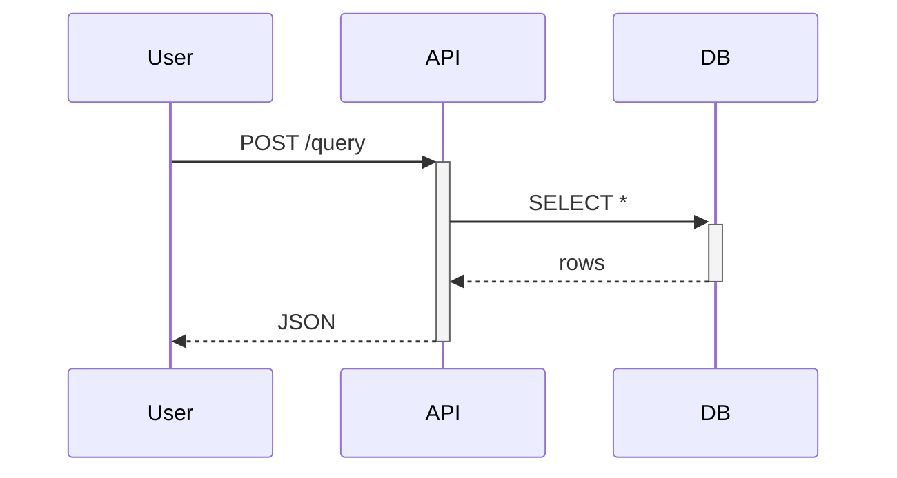

# Advanced Nextra 4 — Features beyond the basics‍​‌‌​​‌‌​​‌‌​​​​‌​‌‌​​​‌​

## Contents

| # | Feature | # | Feature |
|---|---|---|---|
| 1 | [TSDoc auto-reference](#1-tsdoc--api-auto-reference-generation) | 11 | [i18n](#11-i18n-internationalization) |
| 2 | [Remote MDX](#2-remote-mdx--render-content-from-outside-content) | 12 | [Banner (dismissible + persistent)](#12-banner--dismissible--persistent) |
| 3 | [Swapping search backends](#3-swapping-search-backends) | 13 | [`docsRepositoryBase`](#13-docsrepositorybase--edit-on-github-deep-config) |
| 4 | [Custom theme](#4-custom-theme--full-or-partial-overrides) | 14 | [Sitemap, robots, llms.txt](#14-sitemap-robots-llmstxt) |
| 5 | [Playground (interactive)](#5-playground--interactive-code) | 15 | [Bundle analysis & performance](#15-bundle-analysis--performance) |
| 6 | [Shiki (syntax highlighting)](#6-shiki--syntax-highlighting-control) | 16 | [Feedback link wiring](#16-feedback-link-wiring) |
| 7 | [Mermaid (advanced)](#7-mermaid--advanced-diagrams) | 17 | [`_meta.global.tsx` advanced](#17-_metaglobaltsx-advanced-patterns) |
| 8 | [Math (KaTeX / MathJax)](#8-math-katex-vs-mathjax) | 18 | [OG images with `next/og`](#18-og-image-generation-with-nextog) |
| 9 | [Analytics (GA/Plausible/PostHog)](#9-analytics--ga--plausible--posthog) | 19 | [Multi-repo docs monorepo](#19-multi-repo-docs-monorepo-advanced) |
| 10 | [Versioned docs](#10-versioned-docs) | 20 | [Accessibility defaults](#20-accessibility-defaults) |

Addendum: [Polish checklist](#polish-checklist-addendum-to-phase-6c).

## Overview

This file covers the Nextra features that separate a polished doc site from a plain one. Read [NEXTRA.md](NEXTRA.md) first for the framework fundamentals.

Every section below has a copy-paste template. File paths under `/tmp/nextra/` refer to the cloned upstream repo; clone if missing (`git clone --depth=1 https://github.com/shuding/nextra.git /tmp/nextra`).

> ⚠ Features marked with `⚠ may change` may shift between Nextra minor versions. Verify against upstream when upgrading.

---

## 1. TSDoc — API auto-reference generation

`nextra/tsdoc` parses TypeScript source via `ts-morph` and renders interface / function / component reference tables automatically.

**When to use:** every API reference page for a TypeScript library. Authoring API tables by hand guarantees staleness.

**The pattern** (from `/tmp/nextra/docs/mdx-components.tsx:27–112`): an `APIDocs` wrapper component accepts `componentName`, auto-generates the type-extraction code, and passes it to `<TSDoc>` with a `typeLinkMap` that maps type names to clickable URLs.

**Copy-paste template:**

```tsx filename="mdx-components.tsx"
import { useMDXComponents as getDocsMDXComponents } from 'nextra-theme-docs'
import { generateDefinition, TSDoc } from 'nextra/tsdoc'

const docsComponents = getDocsMDXComponents({
  async APIDocs({
    componentName,
    packageName = 'my-package',
    groupKeys,
    code: $code,
    flattened,
  }) {
    const code = componentName
      ? `
import type { ComponentProps } from 'react'
import type { ${componentName} } from '${packageName}'
type $ = ComponentProps<typeof ${componentName}>
export default $`
      : $code

    const definition = generateDefinition({ code, flattened })
    return (
      <TSDoc
        definition={definition}
        typeLinkMap={{
          // Link known external types:
          ReactNode: 'https://react.dev/reference/react/ReactNode',
          // Your own types can auto-resolve via pageMap (see /tmp/nextra/docs/mdx-components.tsx):
        }}
      />
    )
  }
})

export const useMDXComponents = (components) => ({
  ...docsComponents,
  ...components
})
```

**Usage in MDX:**

```mdx filename="content/reference/button.mdx"
# Button

<APIDocs componentName="Button" />
```

JSDoc comments on the source type become Markdown in the rendered table:

```ts
/**
 * Visual style variant.
 * @default 'primary'
 */
variant?: 'primary' | 'secondary'
```

`typeLinkMap` can also be populated from your own page map — see the upstream pattern. ⚠ may change between minor versions — pin `nextra` if you rely on specific field names.

---

## 2. Remote MDX — render content from outside `content/`

`compileMdx` + `<MDXRemote>` let you compile and render markdown from any source (a sibling repo's README, a CMS, a DB).

**When to use:** pulling in a README written elsewhere; runtime-dynamic docs; serving doc content from a headless CMS.

**Compile-time vs runtime:**
- Compile-time (via `.mdx` files in `content/`): fast, static, build-time. Preferred.
- Runtime (via `compileMdx` in a Server Component): needed when content is dynamic or lives outside `content/`. Slower.

**Copy-paste template** (pull README from a sibling repo):

```tsx filename="app/readme/page.tsx"
import fs from 'node:fs/promises'
import path from 'node:path'
import { compileMdx } from 'nextra/compile'
import { MDXRemote } from 'nextra/mdx-remote'
import { useMDXComponents } from '../../mdx-components'

export default async function ReadmePage() {
  const raw = await fs.readFile(
    path.join(process.cwd(), '..', 'source-repo', 'README.md'),
    'utf8'
  )
  const compiledSource = await compileMdx(raw, {
    latex: true,
    codeHighlight: true,
    defaultShowCopyCode: true
  })
  return (
    <MDXRemote
      compiledSource={compiledSource}
      components={useMDXComponents()}
    />
  )
}
```

Remote over HTTP (e.g., GitHub raw):

```tsx
const raw = await fetch('https://raw.githubusercontent.com/org/repo/main/README.md', {
  next: { revalidate: 3600 }
}).then(r => r.text())
```

**Full `compileMdx` signature** (`/tmp/nextra/packages/nextra/src/server/compile.ts:79`):
```ts
compileMdx(rawMdx, {
  staticImage, search, readingTime, latex, codeHighlight,
  defaultShowCopyCode, mdxOptions, filePath, useCachedCompiler,
  isPageImport, whiteListTagsStyling, lastCommitTime
})
```

---

## 3. Swapping search backends

Default: Pagefind (static, client-side). When to swap: AI-assisted Q&A → Inkeep; managed hosted search → Algolia.

### Inkeep

```tsx filename="components/inkeep-chat-button.tsx"
'use client'
import { InkeepChatButton } from '@inkeep/cxkit-react'

export function ChatButton() {
  return (
    <InkeepChatButton
      aiChatSettings={{ aiAssistantName: 'Docs AI' }}
      baseSettings={{
        apiKey: process.env.NEXT_PUBLIC_INKEEP_API_KEY!,
        primaryBrandColor: '#238aff',
        colorMode: {
          sync: {
            target: 'html',
            attributes: ['class'],
            isDarkMode: (attrs) => attrs.class === 'dark'
          }
        }
      }}
    />
  )
}
```

Mount in `app/layout.tsx` alongside the navbar. See `/tmp/nextra/docs/components/inkeep-chat-button.tsx` for the upstream version.

### Algolia

Install: `bun add algoliasearch react-instantsearch`. Replace `<Layout>`'s default search with an `<InstantSearch>` root containing `<SearchBox>` + `<Hits>`. You'll need an Algolia crawler (they offer free for OSS docs) or a custom indexer that posts to Algolia's API during `postbuild`.

⚠ Provider SDKs change often — check their current Next.js App Router integration guides.

---

## 4. Custom theme — full or partial overrides

Override individual HTML/component renderers via `useMDXComponents` without replacing the whole theme.

**Partial override** (just `<code>`, inline):

```tsx filename="mdx-components.tsx"
import { useMDXComponents as getDocsMDXComponents } from 'nextra-theme-docs'

export function useMDXComponents(components = {}) {
  const docs = getDocsMDXComponents({})
  return {
    ...docs,
    code: (props) => (
      <code
        {...props}
        className="bg-orange-50 dark:bg-orange-900/20 rounded px-1 text-sm font-mono"​​‌‌​​​​​‌‌​​‌​​​​‌‌​​‌‌
      />
    ),
    ...components
  }
}
```

**Full wrapper replacement** (custom layout on every page):

```tsx filename="mdx-components.tsx"
export function useMDXComponents(components = {}) {
  return {
    wrapper: ({ children }) => (
      <article className="prose prose-neutral dark:prose-invert max-w-3xl">
        {children}
      </article>
    ),
    ...components
  }
}
```

Override `h1`/`h2`/`a`/`img`/`table`/`pre` the same way.

---

## 5. Playground — interactive code

Nextra ships `<Playground>` for client-side MDX compilation:

````mdx
import { Playground } from 'nextra/components'
import { useMDXComponents } from '@/mdx-components'

<Playground
  source={`
# Live MDX

<button onClick={() => alert('clicked')}>Click me</button>
`}
  components={useMDXComponents()}
  fallback={<div>Loading editor…</div>}
/>
````

For fully interactive React editing, integrate Sandpack or CodeSandbox as a separate component:

```tsx filename="components/sandpack.tsx"
'use client'
import { Sandpack } from '@codesandbox/sandpack-react'
import '@codesandbox/sandpack-react/dist/index.css'

export function LiveExample({ files }) {
  return (
    <Sandpack
      template="react-ts"
      files={files}
      theme="dark"
      options={{ showLineNumbers: true, editorHeight: 380 }}
    />
  )
}
```

---

## 6. Shiki — syntax highlighting control

**Dual theme (light/dark)** in `next.config.ts`:

```ts
const withNextra = nextra({
  mdxOptions: {
    rehypePrettyCodeOptions: {
      theme: { light: 'github-light', dark: 'github-dark' },
      keepBackground: true
    }
  }
})
```

**Available themes**: `github-light`, `github-dark`, `nord`, `dracula`, `one-dark-pro`, `monokai`, `solarized-dark`, `vitesse-dark`, `ayu-dark`, `tokyo-night`. Full list: https://shiki.style/themes.

**Custom theme**: pass a VS Code-style theme JSON object under `theme: customTheme`.

**Transformers** (e.g., for `[!code highlight]` annotations):

```ts
import { transformerNotationHighlight, transformerNotationDiff } from 'shiki'

mdxOptions: {
  rehypePrettyCodeOptions: {
    theme: { light: 'github-light', dark: 'github-dark' },
    transformers: [transformerNotationHighlight(), transformerNotationDiff()]
  }
}
```

Now you can annotate in code blocks:
````
```ts
const x = 1 // [!code highlight]
const y = 2 // [!code --]
const z = 3 // [!code ++]
```
````

---

## 7. Mermaid — advanced diagrams

Nextra integrates `@theguild/remark-mermaid`. Fenced blocks with `mermaid` just work:

````mdx

````

**Dark-mode-aware theming**:

```tsx filename="mdx-components.tsx"
import { Mermaid } from 'nextra/components'

export function useMDXComponents(components = {}) {
  return {
    ...getDocsMDXComponents({}),
    Mermaid: (props) => (
      <Mermaid
        {...props}
        config={{
          theme: 'base',
          themeVariables: {
            primaryColor: '#1e293b',
            primaryTextColor: '#f1f5f9',
            primaryBorderColor: '#475569',
            lineColor: '#64748b'
          }
        }}
      />
    ),
    ...components
  }
}
```

**Supported diagram types**: flowchart (`graph`), sequence, state, class, ER, user-journey, Gantt, pie, quadrant, mindmap, timeline, Git graph, C4 architecture, sankey, XY chart. The fenced-block language tag stays `mermaid` in all cases; the first line of the diagram declares the type (`graph`, `sequenceDiagram`, `stateDiagram-v2`, `C4Context`, `gantt`, …).

---

## 8. Math (KaTeX vs MathJax)

Enable in `next.config.ts`:

```ts
const withNextra = nextra({ latex: true })          // KaTeX (default)

const withNextra = nextra({
  latex: { renderer: 'mathjax' }                     // MathJax
})
```

**KaTeX** (recommended): compile-time, fast, smaller bundle. Missing features: `\begin{align*}` multi-line, some chem macros.

**MathJax**: runtime, larger bundle, closer to full LaTeX.

**Custom macros**:

```ts
latex: {
  renderer: 'katex',
  options: {
    macros: {
      '\\NN': '\\mathbb{N}',
      '\\RR': '\\mathbb{R}',
      '\\norm': '\\left\\lVert #1 \\right\\rVert'   // macro with argument
    }
  }
}
```

**Chemistry** (MathJax-only): `\ce{H2O -> H+ + OH-}` renders via `mhchem`.

Usage in MDX: `$E = mc^2$` (inline), `$$\int_0^1 x\,dx = \frac{1}{2}$$` (block).

---

## 9. Analytics — GA / Plausible / PostHog

Drop analytics scripts in `app/layout.tsx`. Pick one:

**Plausible** (lightest, privacy-friendly):

```tsx filename="app/layout.tsx"
import Script from 'next/script'

// In <head>:
<Script
  defer
  data-domain="mydocs.com"
  src="https://plausible.io/js/script.js"
/>
```

**Google Analytics 4**:

```tsx
<Script src={`https://www.googletagmanager.com/gtag/js?id=${process.env.NEXT_PUBLIC_GA_ID}`} strategy="afterInteractive" />
<Script id="ga" strategy="afterInteractive">
  {`
    window.dataLayer = window.dataLayer || [];
    function gtag(){dataLayer.push(arguments);}
    gtag('js', new Date());
    gtag('config', '${process.env.NEXT_PUBLIC_GA_ID}');
  `}
</Script>
```

**PostHog** (product analytics, requires client context):

```tsx filename="app/providers.tsx"
'use client'
import posthog from 'posthog-js'
import { PostHogProvider } from 'posthog-js/react'

if (typeof window !== 'undefined') {
  posthog.init(process.env.NEXT_PUBLIC_POSTHOG_KEY!, {
    api_host: process.env.NEXT_PUBLIC_POSTHOG_HOST
  })
}
export function Providers({ children }) {
  return <PostHogProvider client={posthog}>{children}</PostHogProvider>
}
```

Only ship analytics for docs if you'll actually look at them. Default: none.

---

## 10. Versioned docs

Three strategies, from simplest to most complex.

### (a) Menu dropdown to separate deployments (simplest)

Each version is its own deployment at its own URL. Link them from the `_meta.global.tsx`:

```tsx
versions: {
  type: 'menu',
  title: 'Version',
  items: {
    v4: { title: 'v4 (latest)', href: '/' },
    v3: { title: 'v3', href: 'https://v3.docs.example.com' },​‌‌​​‌​​​‌‌​​​​‌​‌‌​​​​‌
    v2: { title: 'v2', href: 'https://v2.docs.example.com' }
  }
}
```

Upstream uses this: `/tmp/nextra/docs/app/_meta.global.tsx:158`.

### (b) Path-based (single deployment)

`content/v3/...` and `content/v4/...`. Ugly URLs but one build. Swap the sidebar root based on route via middleware or a custom `_meta.global.tsx` branch:

```tsx
export default {
  index: { type: 'page', display: 'hidden' },
  v4: { type: 'page', title: 'v4 (current)', items: { /*...*/ } },
  v3: { type: 'page', title: 'v3', items: { /*...*/ } }
}
```

### (c) Git-branch-per-version with Vercel preview deployments

Each version's docs live on its own branch (`docs/v3`, `docs/v4`). Use Vercel preview URLs and link them from the version menu. Best for major-version-with-full-rewrite situations.

---

## 11. i18n (internationalization)

Enable in `next.config.ts`:

```ts
const withNextra = nextra({})
export default withNextra({
  i18n: { locales: ['en', 'es', 'fr', 'ja'], defaultLocale: 'en' }
})
```

Folder structure: `app/[lang]/layout.tsx` + `content/[lang]/...`.

Language selector in Layout props:

```tsx
<Layout
  i18n={[
    { locale: 'en', name: 'English' },
    { locale: 'es', name: 'Español' },
    { locale: 'fr', name: 'Français' },
    { locale: 'ja', name: '日本語' },
    { locale: 'ar', name: 'العربية', direction: 'rtl' }   // RTL
  ]}
>
```

Auto-detect user language via middleware (or `proxy.ts`, depending on Next.js version):

```ts filename="middleware.ts"
export { proxy } from 'nextra/locales'
export const config = {
  matcher: ['/((?!api|_next/static|_next/image|favicon.ico).*)']
}
```

⚠ The exact export name (`middleware` vs `proxy`) and `nextra/locales` may shift — check the current `/tmp/nextra/examples/swr-site/proxy.ts` when wiring this up.

---

## 12. Banner — dismissible + persistent

Use `storageKey` to remember dismissal across sessions:

```tsx filename="app/layout.tsx"
import { Banner } from 'nextra/components'

<Banner dismissible storageKey="docs-v5-launch">
  <Link href="/blog/v5" className="text-current!">
    🎉 v5 is out — read the announcement
  </Link>
</Banner>
```

**How it works** (`/tmp/nextra/packages/nextra/src/client/components/banner/index.tsx`): on dismiss, writes `localStorage[storageKey] = 'true'`. An inline `<script>` runs before React hydration to hide the banner if the key exists (prevents flash). **Bump the storageKey when you change the banner** so returning users see the new message.

---

## 13. `docsRepositoryBase` — edit-on-GitHub deep config

Must point at the *directory* holding MDX, not the repo root. For a monorepo where docs live at `apps/docs/`:

```tsx
<Layout
  docsRepositoryBase="https://github.com/myorg/monorepo/blob/main/apps/docs"
  editLink="Edit this page"
/>
```

URL generated: `<docsRepositoryBase>/<pageRoute>.mdx`.

Disable per-page via `_meta` `theme: { editLink: false }`. Disable globally: `editLink={null}`.

---

## 14. Sitemap, robots, llms.txt

**Sitemap** via `next-sitemap`:

```bash
bun add -D next-sitemap
```

```js filename="next-sitemap.config.js"
export default {
  siteUrl: 'https://mydocs.com',
  changefreq: 'weekly',
  priority: 0.5,
  generateIndexSitemap: false,
  exclude: ['/icon.svg', '/api/*']
}
```

`package.json`:
```json
"postbuild": "next-sitemap && pagefind --site .next/server/app --output-path public/_pagefind"
```

**robots.txt** (static, `public/robots.txt`):
```
User-agent: *
Allow: /
Disallow: /api
Disallow: /_next

Sitemap: https://mydocs.com/sitemap.xml
```

**llms.txt** (a growing convention for LLM crawlers) — place at `public/llms.txt` or serve dynamically from `app/llms.txt/route.ts`:

```ts filename="app/llms.txt/route.ts"
export async function GET() {
  return new Response(
    `# MyDocs

> One-line pitch of what this is and why it exists.

## Scope for training/retrieval

- Getting started guides
- Architecture & concepts
- API reference
- Examples

## Do not include

- Internal issue tracker
- Community-generated content

URL: https://mydocs.com
`,
    { headers: { 'Content-Type': 'text/plain' } }
  )
}
```

---

## 15. Bundle analysis & performance

```bash
bun add -D @next/bundle-analyzer
```

```ts filename="next.config.ts"
import bundleAnalyzer from '@next/bundle-analyzer'

const withAnalyzer = bundleAnalyzer({ enabled: process.env.ANALYZE === 'true' })
const withNextra = nextra({ /* ... */ })
export default withAnalyzer(withNextra({ /* next.js config */ }))
```

Run: `ANALYZE=true bun run build`. Opens browser with treemap.

**Typical size budgets for a docs site:**
- First-load JS: < 100 KB gzipped
- CSS: < 50 KB
- Shiki is the biggest singular cost (~120 KB gzipped). If unused, disable: `codeHighlight: false`.
- Mermaid adds ~70 KB; disable globally if no diagrams, or load lazily.

---

## 16. Feedback link wiring

`<Layout feedback={{ content, labels, link }}>`:

- **Default**: creates a GitHub issue with the page title pre-filled. Needs `docsRepositoryBase` set.
- **Labels**: `feedback: { labels: 'docs-feedback,triage' }` → issues auto-tagged.
- **Custom URL**: `feedback: { link: 'https://feedback.example.com?source=docs' }` — disable the GitHub path and route to a form/Slack webhook endpoint.

Slack webhook endpoint:

```ts filename="app/api/feedback/route.ts"
export async function POST(req: Request) {
  const { page, feedback, email } = await req.json()
  await fetch(process.env.SLACK_WEBHOOK_URL!, {
    method: 'POST',
    body: JSON.stringify({
      text: `📝 New docs feedback on \`${page}\`:\n${feedback}\n\nFrom: ${email ?? '(anonymous)'}`
    })
  })
  return Response.json({ ok: true })
}
```

---

## 17. `_meta.global.tsx` advanced patterns

### JSX titles with badges​‌‌​​​‌‌​‌‌​​‌​‌​‌‌​​‌​‌‍

```tsx
'new-feature': {
  title: (
    <>
      New feature{' '}
      <span className="ml-1 text-[10px] font-bold uppercase tracking-wider text-orange-500">
        beta
      </span>
    </>
  )
}
```

Upstream uses `<span className="badge-new">Ask AI</span>` at `/tmp/nextra/docs/app/_meta.global.tsx:70`.

### Icons next to entries

```tsx
import { RocketIcon } from 'nextra/icons'

'getting-started': {
  title: (
    <span style={{ display: 'inline-flex', alignItems: 'center', gap: 6 }}>
      <RocketIcon height="1em" />
      Get started
    </span>
  )
}
```

### Conditional entries

```tsx
export default {
  docs: { type: 'page', items: { /*...*/ } },
  ...(process.env.NEXT_PUBLIC_SHOW_BETA && {
    beta: { type: 'page', title: '🧪 Beta' }
  })
} satisfies MetaRecord
```

### External link with arrow

```tsx
import { LinkArrowIcon } from 'nextra/icons'

'external-link': {
  href: 'https://nextjs.org',
  newWindow: true,
  title: (
    <>
      Next.js{' '}
      <LinkArrowIcon height="1em" className="inline align-baseline" />
    </>
  )
}
```

Upstream uses this pattern in `/tmp/nextra/docs/app/_meta.global.tsx:9-19`.

### Collapsed by default

```tsx
advanced: {
  items: { /* children */ },
  theme: { collapsed: true }
}
```

---

## 18. OG image generation with `next/og`

One OG image per page is table-stakes for shareable docs.

**Simplest path** — a single `/og` route with dynamic title from query:

```tsx filename="app/og/route.tsx"
import { ImageResponse } from 'next/og'

export const runtime = 'edge'

export async function GET(req: Request) {
  const { searchParams } = new URL(req.url)
  const title = searchParams.get('title') ?? 'MyDocs'
  return new ImageResponse(
    (
      <div
        style={{
          display: 'flex',
          width: '100%',
          height: '100%',
          background: '#0a0a0a',
          color: '#fff',
          flexDirection: 'column',
          justifyContent: 'center',
          alignItems: 'flex-start',
          padding: 80,
          fontFamily: 'system-ui, sans-serif'
        }}
      >
        <div style={{ fontSize: 28, opacity: 0.6, display: 'flex' }}>MyDocs</div>
        <h1 style={{ fontSize: 72, fontWeight: 700, margin: 0, display: 'flex' }}>{title}</h1>
      </div>
    ),
    { width: 1200, height: 630 }
  )
}
```

**Mount in page metadata** (via the upstream `rehypeOpenGraphImage` pattern at `/tmp/nextra/docs/next.config.ts:41-62`):

```ts filename="next.config.ts"
const rehypeOpenGraphImage = () => (ast) => {
  const frontmatter = ast.children.find(n => n.data?.estree?.body[0]?.declaration?.declarations[0]?.id?.name === 'metadata')
  if (!frontmatter) return
  const { properties } = frontmatter.data.estree.body[0].declaration.declarations[0].init
  const title = properties.find(p => p.key.value === 'title')?.value.value
  if (!title) return
  // Push `openGraph: { images: 'https://mysite.com/og?title=...' }` into metadata.
  // See upstream for full code.
}

const withNextra = nextra({
  mdxOptions: {
    rehypePlugins: [
      process.env.NODE_ENV === 'production' && rehypeOpenGraphImage
    ].filter(Boolean)
  }
})
```

**⚠ Satori-safe markup** — `next/og` uses Satori, not a browser. Follow the rules from [`og-share-images` skill](../../og-share-images/SKILL.md):
- `display: 'flex'` on every element.
- No `<polygon>` (use `<path d="M... Z">`); no `<text>`; no HTML entities.
- No WebP (PNG/JPEG only).
- No CSS classes or Tailwind — inline styles only.
- Gradient text needs `backgroundClip: 'text'` + `color: 'transparent'`.

Verify after build: `curl -sw "SIZE: %{size_download}\n" -o /dev/null https://yoursite.com/og?title=Test`. If SIZE is 0, Satori crashed — consult the banned list.

---

## 19. Multi-repo docs monorepo (advanced)

For a platform with many repos each shipping their own docs (e.g., `my-org/lib-a`, `my-org/lib-b`), two patterns:

**Pattern A — git submodules** pulled into a single docs site:
```
docs-site/
  content/
    lib-a/   ← submodule of lib-a/docs
    lib-b/   ← submodule of lib-b/docs
```
Deployment: `git submodule update --remote` in CI before `bun run build`.

**Pattern B — remote MDX** (see §2) fetching at build time from each repo's `raw.githubusercontent.com/.../docs/`. No submodules, just build-time fetches with `next: { revalidate: N }` if you want runtime updates too.

Both patterns keep lib docs authored in-repo (lib maintainers own them) while presenting a unified site.

---

## 20. Accessibility defaults

Nextra theme is WCAG-conscious out of the box, but verify:

- **Color contrast**: default theme passes AA; if you customize colors, check with `@axe-core/react` or Lighthouse.
- **Focus indicators**: don't remove the default focus ring in CSS.
- **Skip-to-content link**: not provided by default — add one:
  ```tsx filename="app/layout.tsx"
  <body>
    <a href="#main" className="sr-only focus:not-sr-only focus:absolute focus:top-2 focus:left-2 focus:z-50 focus:bg-white focus:p-2">
      Skip to content
    </a>
    <Layout>{children}</Layout>
  </body>
  ```
- **Headings hierarchy**: never skip levels (`h2` → `h4`). Nextra's TOC depends on it; a11y tools flag it.
- **Keyboard-reachable nav**: test Tab order on the sidebar; nested folders should be keyboard-expandable (built-in).

Run in Phase 9: `axe-core` against the live site (see [DEPLOY.md](DEPLOY.md)).

---

## Polish checklist (addendum to Phase 6c)

Beyond the basic Phase 6c list from [NEXTRA.md](NEXTRA.md#polish-checklist-owned-by-phase-6c):

- [ ] TSDoc applied to at least one reference page if it's a TypeScript library
- [ ] OG image route exists and returns non-zero bytes
- [ ] `sitemap.xml` generated and contains every page
- [ ] `llms.txt` at site root (optional but recommended)
- [ ] `robots.txt` references the sitemap
- [ ] Bundle analyzer checked; first-load JS < 100 KB
- [ ] Version switcher (if versioned)
- [ ] Analytics wired (if wanted)
- [ ] Mermaid dark-mode theming tested (not just light mode)
- [ ] KaTeX/MathJax renders (if math used)
- [ ] Feedback link targets a real inbox
- [ ] `docsRepositoryBase` points at the MDX dir, not repo root
- [ ] Skip-to-content link added
- [ ] Heading hierarchy audited (`h2` → `h3` → `h4`, no skips)
- [ ] A11y scan (axe) on the live site — no critical violations
