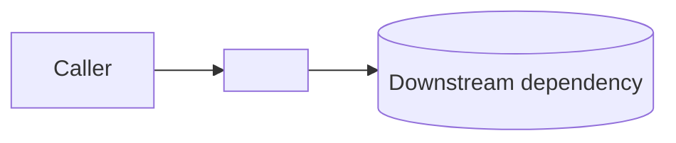
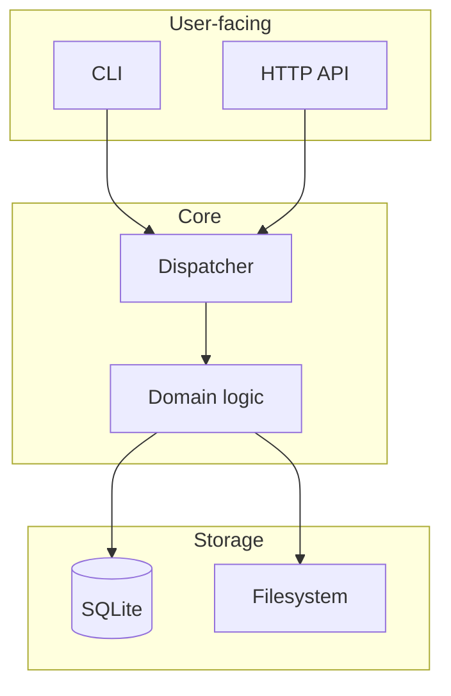

# Content Templates + Rubric‍​‌‌​​‌‌​​‌‌​​​​‌​‌‌​​​‌​

Per-page-type skeletons and the rubric `scripts/content-lint.mjs` enforces. Use as starting structure; don't ship verbatim — prose should be custom to the project.

---

## The Polish Bar rubric (enforced)

Every page must pass:

| ID | Check | How `content-lint.mjs` tests |
|----|-------|------------------------------|
| P1 | **Intro paragraph** is ≥40 words before any heading | first non-frontmatter block length |
| P2 | **Motivation** stated before how-to | presence of one of: "why", "because", "motivated", "exists to", "solves", "we need", in first 300 words |
| P3 | **Mental model** present | at least one of: mermaid code fence, ASCII diagram in code block, `<FileTree>` / `<Cards>`, image |
| P4 | **Concrete example** present | at least one ``` fenced code block with a language tag |
| P5 | **Pitfalls / gotchas** present on any non-overview page | regex for `Callout type="warning\|error\|important"`, or heading containing "gotcha\|pitfall\|caveat\|common mistake" |
| P6 | **Cross-links** ≥2 internal (`](/...)` or relative `](../...)`) | count matches |
| P7 | **No TODO/placeholder** | no literal `TODO`, `XXX`, `FIXME`, `{{`, `lorem` |
| P8 | **Ends cleanly** (not mid-sentence, not trailing whitespace) | last non-empty line ends with `.`, `!`, `?`, `>`, `)`, `` ` ``, `|`, `]` |

Pages failing P1–P7 are flagged for Phase 4 rework.

---

## Template: Section overview (`content/<section>/overview.mdx`)

```mdx
---
title: <Section human name> — Overview
description: <one-sentence pitch pulled from phase1 executive summary>
---

# <Section human name>

<ONE OPENING PARAGRAPH (40-80 words): what this section covers, who it's for,
and how it fits into the rest of the project. Assume the reader has just landed
here from a Google search and has zero prior context.>

## Why it exists

<MOTIVATION: 2-4 sentences on the problem this part of the codebase solves.
Refer to life *before* this section existed, or to the alternative approach
that was rejected. Make it feel like a choice was made, not a default.>

## Mental model



Think of <section> as <analogy>. The key moving parts are:

- **<Concept 1>** — <one-sentence role>
- **<Concept 2>** — <one-sentence role>
- **<Concept 3>** — <one-sentence role>

## A worked example

Here's a concrete scenario. <Describe a realistic input / command / request>:

```<lang>
<runnable code or command>
```

What happens under the hood:

1. <step 1 referencing `file.rs:line`>
2. <step 2>
3. <step 3>

## Where to go next

- [<Page A>](./<page-a>) — <why you'd read it>
- [<Page B>](./<page-b>) — <why you'd read it>
- [Architecture overview](../overview/architecture) — how this section fits into the whole

<Callout type="info">
  Reading tip: start with *<Page A>* if you're integrating this module; start
  with *<Page B>* if you're debugging it.
</Callout>
```

---

## Template: Module / concept deep-dive (`content/<section>/<module>.mdx`)

```mdx
---
title: <Module name>
description: <one-sentence description>
---

# <Module name>

<OPENING PARAGRAPH: what this module is, its public surface, and when you'd
reach for it (vs. sibling modules). Cite `file:line` to the entry point.>

## Responsibility

<2-3 sentences on the module's single responsibility. If it's hard to state in
2-3 sentences, the module probably has too many responsibilities — flag it for
Phase 10 improvement queue.>

## Public API

<Prefer a table over a dump. If you have lots of methods, group them.>

| Item | Signature | Purpose |
|------|-----------|---------|
| `foo()` | `fn foo(x: &str) -> Result<Bar>` | <one-line> |
| `Baz`   | `pub struct Baz { ... }` | <one-line> |

## How it works

<NARRATIVE walk-through of the interesting code path. Not a repeat of the
source — an explanation of the *decisions*. Why is there a retry? Why is the
index a BTreeMap and not a HashMap? What would break if you changed it?>

### Step-by-step

<Use ### headings here; Phase 6 wraps them in `<Steps>`.>

### The tricky part

<Every module has one. Spell it out.>

## Example

```<lang>
<concrete, copy-pasteable example>
```

<Callout type="warning">
  Common mistake: <the foot-gun you'd warn a new hire about>.
</Callout>

## When to reach for it — and when not to

- **Use when:** <scenario>
- **Don't use when:** <scenario> — prefer [<alternative>](./<alternative>) instead

## Gotchas

- <gotcha 1>
- <gotcha 2>

## See also

- [<related page>](./<related>)
- Source: [`<path>`](<repo-url>/<path>)
```

---

## Template: CLI command (`content/cli/<command>.mdx`)

```mdx
---
title: <tool> <command>
description: <one-sentence description>
---

# `<tool> <command>`

<OPENING PARAGRAPH: what this command does in plain English, and the one
scenario where you'd most commonly reach for it.>

## Synopsis

```sh
<tool> <command> [OPTIONS] <ARG>
```

## Example

```sh
<tool> <command> --flag value input.json
```

<Describe what the user sees: output format, exit code, side effects.>

## Flags

<GFM table, sorted by importance not alphabetically>

| Flag | Type | Default | Purpose |
|------|------|---------|---------|
| `--flag` | `string` | `""` | <why you'd set it> |
| `--verbose` | `bool` | `false` | Adds `DEBUG`-level logs |

## Common workflows

### <workflow 1 name>

```sh
<commands, possibly multi-step>
```

### <workflow 2 name>

```sh
<commands>
```

## Exit codes

| Code | Meaning |
|------|---------|
| 0 | Success |
| 1 | Generic failure (see stderr) |
| 2 | Bad arguments |

## Troubleshooting

- **"<error message>"** — <cause, fix>
- **<symptom>** — <cause, fix>

## See also

- [`<sibling command>`](./<sibling>) — <relation>
- [Configuration reference](../reference/config)
```

---

## Template: Tutorial / how-to (`content/guides/<guide>.mdx`)

```mdx
---
title: <Task-oriented title, e.g. "Add a custom exporter">
description: <one-sentence description>
---

# <Title>

<OPENING PARAGRAPH: what you'll accomplish, how long it'll take, what
prerequisites.>

<Callout type="info">
  **Prerequisites:** <list>. **Est. time:** <X> minutes.
</Callout>

<!-- Phase 6 wraps this in `<Steps>` -->

### 1. <first action>

<explanation>

```<lang>
<code>
```

### 2. <second action>

<explanation>

```<lang>
<code>
```

### 3. Verify

```sh
<verification command and expected output>
```

## What you built

<1-paragraph recap: what now works, and what the user can do next.>

## Extend it

- <natural next step 1>
- <natural next step 2>

## Troubleshooting

- **<symptom>** — <fix>
```

---

## Template: Architecture / design doc (`content/overview/architecture.mdx`)

```mdx
---
title: Architecture
description: How <project>'s pieces fit together.
---

# Architecture

<OPENING PARAGRAPH: the project's architectural approach in one or two sentences
(e.g. "<project> is a layered CLI: a thin command parser that dispatches to a
core library, which persists state through a SQLite adapter."). Why this shape​​‌‌​​​​​‌‌​​‌​​​​‌‌​​‌‌
and not another.>

## The big picture



## Components

### <Component 1>
<paragraph: what it is, why it's its own component, key file:line refs>

### <Component 2>
<paragraph>

### <Component 3>
<paragraph>

## Cross-cutting concerns

### Configuration

<Where does config live? What's the precedence order? How is it tested?>

### Observability

<Logging conventions, structured events, metrics>

### Error handling

<Result types, error taxonomy, failure modes>

### Concurrency

<Runtime model, locking discipline, ordering guarantees>

## Non-goals

<Things <project> explicitly does NOT try to do. This is load-bearing for
onboarders — it stops them from looking for features that were never meant
to exist.>

## Further reading

- [Data flow](./data-flow) — end-to-end trace
- [Contributing](./contributing) — dev setup, conventions
```

---

## Template: Glossary (`content/overview/glossary.mdx`)

```mdx
---
title: Glossary
description: Project-specific terms, defined.
---

# Glossary

<ONE PARAGRAPH: scope of the glossary. Whose vocabulary is this? When should
a reader come here?>

---

### <Term A>

<one-sentence technical definition>. In <project>, <one-sentence note on how
it's used locally — which module owns it, whether it's renamed from a
general-industry term>. See [<most-canonical page>](../<section>/<page>).

### <Term B>

<definition>. <project-specific note>. See [...](...).

...

## Abbreviations

| Short | Long |
|-------|------|
| CLI | Command-line interface |
| ... | ... |
```

---

## Template: Contributing (`content/overview/contributing.mdx`)

```mdx
---
title: Contributing
description: How to set up, run, test, and ship changes to <project>.
---

# Contributing

<OPENING PARAGRAPH: the spirit of contributions. Are PRs from strangers
welcome? Is this company-internal? What kinds of contributions are
actively sought, and what kinds are politely declined.>

## Dev setup

### Prerequisites

- <lang toolchain version>
- <any external deps: postgres, redis, etc.>

### One-time setup

```sh
git clone <repo-url>
cd <repo>
<install deps>
<build>
```

### Run tests

```sh
<test command>
```

### Run locally

```sh
<dev server or repl>
```

## Repository layout

<FileTree showing the top-level directories with a one-liner each.>

## Code conventions

- <convention 1: e.g. formatting tool>
- <convention 2: naming>
- <convention 3: module boundaries>

<Callout type="important">
  Before opening a PR, run <pre-commit / linters>. CI will reject anything
  that doesn't pass locally.
</Callout>

## Commit style

<Conventional commits? Subject-line length? Ticket linking convention?>

## Filing issues

<Where bugs go (GitHub issues? linear? beads?). Template/labels. SLA if any.>

## Where to start

- Easy first issues: <link>
- High-impact areas: <link>
- Architecture overview: [Architecture](./architecture)
```

---

## Template: Changelog / Release notes (`content/releases.mdx` or per-version)

```mdx
---
title: Release notes
description: What changed, and why it matters.
theme:
  typesetting: article
  toc: false
---

# Release notes

<ONE PARAGRAPH: versioning policy (semver? calver?), deprecation approach.>

---

## <x.y.z> — <date>

### Highlights

<3-5 bullets: the one-line "what changed that matters to you" for each
noteworthy change. Group by user impact, not by commit.>

### Added
- ...

### Changed
- ...

### Fixed
- ...

### Deprecated
- ...

### Migration notes

<Only if users need to do something. Be explicit: what to change, before/after
code snippets.>
```

---

## Template: FAQ (`content/faq.mdx`)

```mdx
---
title: FAQ
description: Questions we hear a lot.
---

# Frequently asked questions

### Why <X> instead of <Y>?

<honest answer — reference the tradeoff, not marketing>

### How do I <common task>?

<answer with link to the authoritative how-to page>

### Is <project> production ready?

<honest answer including known limits>

### How does <project> compare to <competitor>?

<straight comparison table or prose; no dunking>

### Where do I file <bug / feature / security issue>?

<with links>
```

---

## Template: Plugin / extension guide (`content/guides/plugins/<plugin>.mdx`)

For projects with an extension mechanism (VS Code extensions, webpack loaders, Cargo plugins, browser add-ons, etc.).

```mdx
---
title: <Plugin name> plugin
description: <What the plugin does, one sentence>.
---

# <Plugin name> plugin

<OPENING PARAGRAPH: what this plugin adds, who publishes it, official or community.>

## Install

```sh npm2yarn
npm install <plugin-package>
```

## Register

<Show the minimal registration code. Include `filename=` on the fence.>

```ts filename="config.ts"
import { <Plugin> } from '<plugin-package>'

export default {
  plugins: [<Plugin>({ /* options */ })]
}
```

## Options

| Option | Type | Default | Purpose |
|--------|------|---------|---------|

## Example

<A concrete scenario end-to-end: what user does, what they see.>

## Extension points it exposes

<If the plugin provides hooks for further extension, document them here.>

## Troubleshooting

<Plugin-specific gotchas.>

## See also

- [Plugin API reference](../../reference/plugin-api) — for plugin authors
- [<similar plugin>](./<similar>)
```

---

## Template: Debugging guide (`content/guides/debugging.mdx`)

For projects complex enough that users will need to debug problems.

```mdx
---
title: Debugging
description: Diagnose and fix the most common issues with <project>.
---

# Debugging

<OPENING PARAGRAPH: the debugging approach this project encourages — verbose flags, structured logs, debug builds, breakpoints.>

## Step 1: Enable verbose output

```sh
<command to turn on debug logging>
```

<What additional information appears.>

## Step 2: Read the logs

<Where logs are written. What key fields mean.>

<Callout type="info">
  Structured JSON logs (when `--json` flag is set) pair well with `jq`:
  ```sh
  <tool> run --json | jq 'select(.level == "error")'
  ```
</Callout>

## Step 3: Reproduce locally

<How to build a minimal reproduction outside of production config.>

## Common issues

### Issue: <symptom>

**Cause**: <root cause>.

**Fix**:
```<lang>
<diff or code>
```

### Issue: <another symptom>

**Cause**: <...>.
**Fix**: <...>.

## When to reach for a debugger

<Scenarios where inserting `dbg!()` / `console.log` / `pdb.set_trace()` is the fastest path.>

## Getting help

- [File an issue](<repo>/issues/new) — include reproduction steps.
- [<community link>](...) — community support channel.
```

---

## Template: Performance guide (`content/guides/performance.mdx`)

For projects where performance matters.

```mdx
---
title: Performance
description: How to measure and improve performance with <project>.
---

# Performance

<OPENING PARAGRAPH: the performance philosophy — what matters, what doesn't, typical baseline.>

## Measuring

<Explicit: don't optimize without measuring.>

```sh
<benchmarking command>
```

## Typical baseline

| Scenario | Throughput | p50 | p95 | p99 |
|----------|-----------|-----|-----|-----|

<Numbers from the project's own benchmarks. Include hardware note.>

## Common optimizations

### <Optimization name>​‌‌​​‌​​​‌‌​​​​‌​‌‌​​​​‌

<What it does, when it helps, when it hurts.>

```<lang>
<before / after snippet>
```

**Measured improvement**: <specific number on specific benchmark>.

### <Next optimization>

...

## When the bottleneck is elsewhere

<project> can only be as fast as <external constraint — network, disk, GC, etc.>. If you're hitting that ceiling, options:

- <alternative approach 1>
- <alternative approach 2>

## See also

- [Architecture](../overview/architecture) — why certain things are slow/fast
- [<external resource>](...) — authoritative profiling tutorial
```

---

## Template: Security guide (`content/guides/security.mdx`)

For projects where security posture matters to users.

```mdx
---
title: Security
description: <Project>'s security model, threat boundaries, and what you need to know.
---

# Security

<OPENING PARAGRAPH: who the system is defending against, what it explicitly does NOT defend against.>

## Threat model

| Threat | In-scope? | Mitigation |
|--------|-----------|-----------|
| SQL injection | Yes | Parameterized queries throughout; see <reference> |
| XSS | Yes | All user input escaped by default |
| CSRF | Yes | Double-submit cookie pattern |
| Replay attacks | No | Out of scope; use application-level nonces |

## Secrets handling

<How the project handles API keys, tokens, encryption keys. Include rotation guidance.>

## Input validation

<What's validated, what isn't, where the boundary is.>

## Dependency hygiene

```sh
<audit command>
```

<Project's approach to dependency updates, CVE response.>

## Reporting vulnerabilities

<Specific responsible-disclosure channel. NOT the public issue tracker.>

- Contact: <security@example.com> (PGP: <fingerprint>)
- Expected response time: <e.g., 48 hours>

<Callout type="important">
  Never open public issues for security bugs — they'll be seen before a fix can ship.
</Callout>

## Known limitations

<List security limitations users should know.>
```

---

## Template: Integration guide (`content/guides/integrations/<service>.mdx`)

For projects that integrate with third-party services (OAuth providers, payment processors, databases, etc.).

```mdx
---
title: <Service> integration
description: Integrate <project> with <service>.
---

# <Service> integration

<OPENING: what the integration unlocks, whether it's official or community, maintained by whom.>

## Prerequisites

- A <Service> account (<free-tier note if applicable>).
- <Project> version <X.Y>+.

## Step 1: Obtain credentials

<Where to get the API key / OAuth app credentials in <Service>.>

1. Go to <Service> dashboard → <location>.
2. Create a new <credential type>.
3. Copy the value; store it as an env var:
   ```sh
   export <ENV_VAR_NAME>=<value>
   ```

## Step 2: Configure <project>

```<lang>
<configuration>
```

## Step 3: Verify

```sh
<test command>
```

Expected output:
```
<success output>
```

## Features enabled by this integration

- <feature 1>
- <feature 2>

## Limitations

<What this integration doesn't do; rate limits; quotas.>

## Troubleshooting

### `<error message>`

**Cause**: <likely root cause>.
**Fix**: <specific action>.

## See also

- [<Service> official docs](<url>)
- [<Related integration>](./<related>)
```

---

## Template: Client library / SDK page (`content/clients/<language>.mdx`)

For services that ship SDKs for multiple languages.

```mdx
---
title: <Language> client
description: Use <project> from <language>.
---

# <Language> client

<OPENING: SDK maturity level, what's supported, what's not.>

## Install

```sh npm2yarn
npm install <package>
```

Or equivalent for <language>:
```sh
<language-specific install>
```

## Authenticate

<How to pass credentials. Show both env-var and explicit-config patterns.>

## First call

<Minimal end-to-end example of calling the service.>

## Feature parity

| Feature | JavaScript | Python | Go | Rust |
|---------|:---------:|:------:|:--:|:----:|
| Create | ✓ | ✓ | ✓ | ✓ |
| Update | ✓ | ✓ | ✓ | — |
| Streaming | ✓ | ✓ | — | — |

## Error handling

<Language-idiomatic error handling. Does the SDK throw, return Result, etc.?>

## Advanced usage

- [Streaming API](./streaming)
- [Custom retry logic](./retries)

## Troubleshooting

<Common issues specific to this language/SDK.>
```

---

## Template: Webhook / event reference (`content/reference/webhooks/<event>.mdx`)

For projects that emit webhooks or event streams.

```mdx
---
title: <Event name> webhook
description: Payload shape and behavior of <event>.
---

# `<event.name>` webhook

<OPENING: when this event fires, under what conditions.>

## Trigger

<Specific conditions that cause this event to be emitted.>

## Payload

```json
{
  "type": "event.name",
  "data": {
    "id": "abc123",
    ...
  },
  "created_at": "2026-04-22T12:00:00Z"
}
```

## Field reference

| Field | Type | Description |
|-------|------|-------------|
| `type` | string | Always `"<event.name>"` |
| `data.id` | string | Identifier of the resource |
| ... | | |

## Delivery guarantees

<At-least-once? Exactly-once? Ordering guarantees? Retry policy?>

## Idempotency

<How the receiver should handle duplicates.>

## Example handler

```<lang>
<minimal signed-verification + handling example>
```

## Related events

- [`<related.event>`](./<related>) — fires before/after this one
```

---

## Template: Config reference (`content/reference/config.mdx`)

For projects with non-trivial configuration.

```mdx
---
title: Configuration reference
description: Every configuration option for <project>.
---

# Configuration

<OPENING: where config is loaded from (priority order), override mechanism.>

## Sources (precedence, highest first)

1. Command-line flags (`--flag value`)
2. Environment variables (`PROJECT_SETTING_NAME`)
3. Config file (`./<project>.toml` or user-level)
4. Built-in defaults

## Complete reference

### `<section>`

#### `<section.key>`

- **Type**: `<type>`
- **Default**: `<default-value>`
- **Env var**: `<ENV_NAME>`
- **CLI flag**: `--<flag>`

<One-line purpose.>

**Example**:
```toml
[<section>]
<key> = <value>
```

<Repeat for every option.>

## Examples

### Minimal config

```toml
<just the required options>
```

### Production config​‌‌​​​‌‌​‌‌​​‌​‌​‌‌​​‌​‌‍

```toml
<sensible production defaults>
```

## Validation

```sh
<validation command>
```
```

---

## Anti-templates (things to NOT write)

- **Walls of autogen API** — put those in a sibling reference file under `<details>` or a collapsible section, keep the narrative page lean.
- **"Getting started" that's just "run this command"** — expand into 3 steps minimum, show the output, show what success looks like.
- **"Welcome to our docs"** home pages — hero with a one-line pitch + `<Cards>` beats a welcome paragraph every time.
- **Empty "Introduction" pages** — if `<section>/index.mdx` would just list its own children, use the section's `_meta.js` + a `<Cards>` grid on the parent index instead.
- **AI tells**: "In this comprehensive guide, we will explore...", "Let's dive in!", "It's important to note that...". The de-slopify skill catches these if run in Phase 4.

---

## Template: Recipe / cookbook entry (`content/recipes/<slug>.mdx`)

See [SHOWCASE-GALLERY.md §Recipes](SHOWCASE-GALLERY.md) for the full pattern.

```mdx
---
title: <Goal in user's voice — "Debounce a search input">
description: <One-line — when and why>
audience: daily-integrator
quadrant: how-to
---

import { Callout, Steps } from 'nextra/components'

# <Goal>

<Callout type="info">
  **When you want this**: <1 sentence describing the trigger situation>.
  **Not this**: if you need <adjacent thing>, use [<other recipe>](<other-recipe>) instead.
</Callout>

## Ingredients

- <Dependency A at version>
- <Dependency B at version>

## Recipe

<Steps>
### Step 1 — <short action>

<prose>

```ts filename="app/search.tsx"
<minimal code>
```

### Step 2 — <next action>
...
</Steps>

## Why it works

<2–4 sentences on the mechanism, not just the code>

## Variations

- **<Variation A>**: <1 line + link to fuller doc>
- **<Variation B>**: <…>

## See also

- [<Related concept>](<link>)
- [<Related recipe>](<link>)
```

---

## Template: ADR — Architecture Decision Record (`content/adr/NNNN-<slug>.mdx`)

See [ADR-PATTERNS.md](ADR-PATTERNS.md) for the full MADR pattern and lifecycle.

```mdx
---
title: ADR NNNN — <decision title>
status: proposed | accepted | superseded | deprecated
date: YYYY-MM-DD
deciders: [<names or roles>]
supersedes: <ADR-NNNN or empty>
superseded_by: <ADR-NNNN or empty>
---

# ADR NNNN — <decision title>

## Context

<2–4 paragraphs: the problem we're solving, the forces at play,
constraints that narrow the solution space>

## Decision

<1 paragraph stating the decision, unambiguously. "We will X because Y.">

## Consequences

### Positive
- <consequence>

### Negative
- <consequence>

### Neutral / follow-up
- <consequence>

## Alternatives considered

### Option A — <name>

<description>

Rejected because: <reason>

### Option B — <name>

<description>

Rejected because: <reason>

## References

- <link to design doc, proposal, RFC, issue>
- <link to related ADRs>
```

---

## Template: Case study (`content/case-studies/<slug>.mdx`)

See [SHOWCASE-GALLERY.md §Case-Studies](SHOWCASE-GALLERY.md).

```mdx
---
title: <Company> — <1-line result>
description: <Metric-bearing summary>
audience: curious-evaluator
quadrant: explanation
---

# How <Company> achieved <outcome>

<Hero paragraph with the outcome and the headline metric.>

## About <Company>

<2–3 sentences. Industry, scale, geography.>

## The challenge

<1–2 paragraphs: what was hard before our tool entered the picture>

## The approach

<How they used us. Include 1 code snippet or architecture diagram.>

## Results

| Metric | Before | After |
|---|---|---|
| <metric> | <n> | <n> |

## In their words

> <Pull quote from an engineer / PM at the company. 1–3 sentences.>
>
> — <Name, Title>

## See also

- [<Similar case study>](<link>)
- [<Relevant concept>](<link>)
```

---

## Template: Benchmark / performance report (`content/benchmarks/<slug>.mdx`)

```mdx
---
title: <Benchmark name>
description: <One-line result>
audience: operator
quadrant: reference
last_run: YYYY-MM-DD
hardware: <hardware spec>
---

# <Benchmark name>

<1–2 paragraph summary of the result, with the headline number.>

## Methodology

- **Hardware**: <CPU, RAM, storage, network>
- **Workload**: <description, link to harness code>
- **Metric**: <p50/p95/p99 latency, throughput, resource use>
- **Iterations**: <n>
- **Warmup**: <n>

Reproduce:

```sh
git clone <repo> && cd <dir>
./bench/run.sh
```

## Results

<chart or table>

## Interpretation

<2–4 paragraphs. What the numbers mean, how they compare to prior releases,
how they compare to peer tools, caveats.>

## Limitations

- <caveat 1>
- <caveat 2>

## See also

- [<Relevant concept>](<link>)
- [<Prior benchmark>](<link>)
```

---

## Template: Community page (`content/community.mdx`)

```mdx
---
title: Community
description: Where to find help, contribute, and connect with maintainers.
audience: contributor
---

# Community

## Get help

- **<Discord / Slack server>** — [join](<invite-link>) — fastest for quick questions.
- **GitHub Discussions** — [link](<url>) — async + searchable.
- **Stack Overflow** — tag [`<tag>`](<url>).

## Contribute

Before opening a PR, read [CONTRIBUTING.md](<link>) and consider a
[good first issue](<url>).

## Connect

- **Monthly office hours** — <when + how to join>
- **Conferences** — <where we'll be>
- **Newsletter** — [subscribe](<url>)

## Governance

<1 paragraph: BDFL / steering committee / company-backed, with link to
GOVERNANCE.md.>
```

---

## Template: Team / About (`content/team.mdx`)

```mdx
---
title: Team
description: The humans behind <project>.
---

# Team

<2–4 sentence intro.>

## Maintainers

### <Name>
*<Role>*

<2–3 sentences. Background, focus area, one personal note.>
Find them on [GitHub](<url>), [X](<url>).

### <Name>
*<Role>*
...

## Emeritus

- **<Name>** — <one-line contribution>, active <years>.

## Sponsors

<A plain statement of who funds the project's work, or "independently
maintained". Include GitHub Sponsors / Open Collective links.>
```

---

## Template: Video / walkthrough (`content/videos/<slug>.mdx`)

```mdx
---
title: <Video title>
description: <One-line>
audience: first-time-user
quadrant: tutorial
duration: <mm:ss>
---

import { YouTube } from '@/components/YouTube'

# <Video title>

<YouTube id="<youtube-id>" title="<Video title>" />

## What you'll learn

- <Bullet 1>
- <Bullet 2>
- <Bullet 3>

## Transcript

<Full transcript, chaptered by H3s matching video chapters.>

### <00:00> Intro

<transcript prose>

### <01:23> <Section name>

<transcript prose>

## Related

- [<Matching text tutorial>](<link>) — same material, reading-pace.
- [<Next video>](<link>)
```

Always ship a written transcript alongside the video — doubles accessibility *and* search reach.
