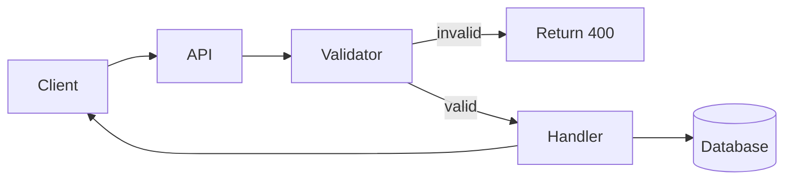
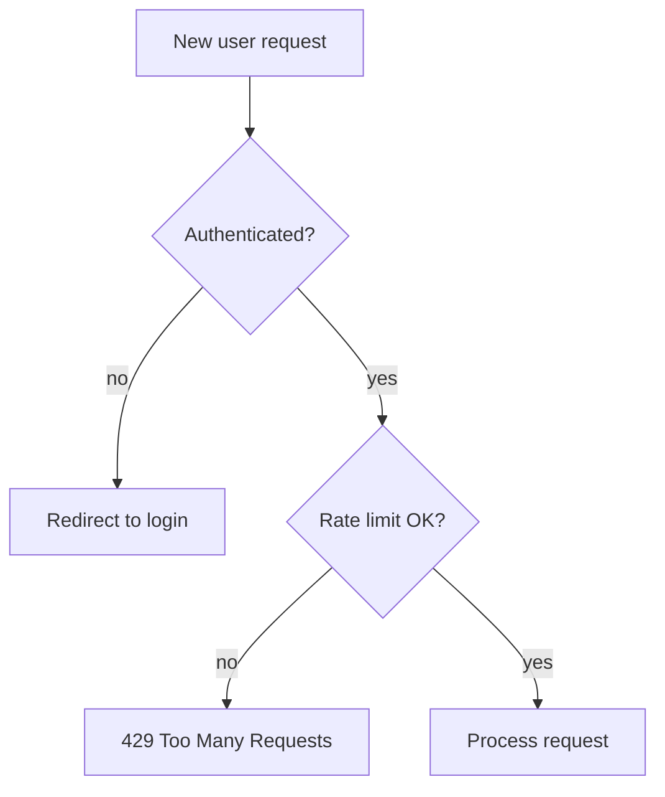
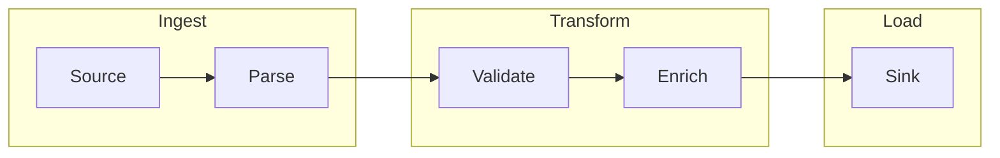
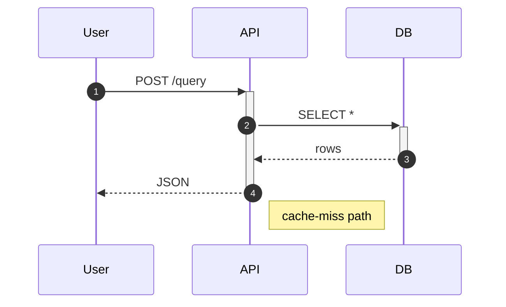
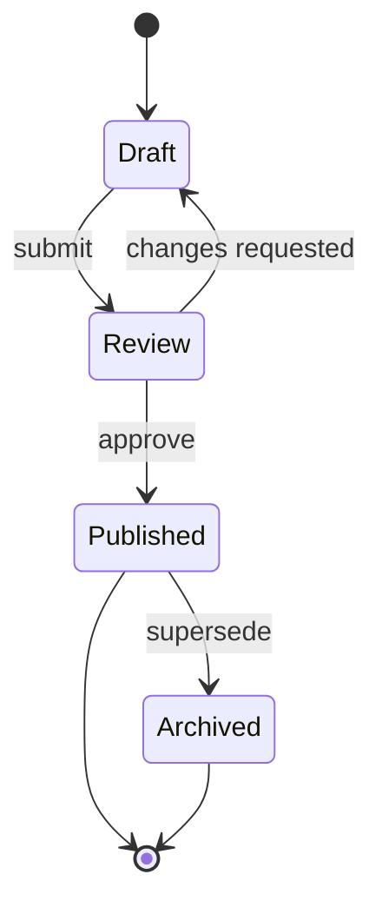
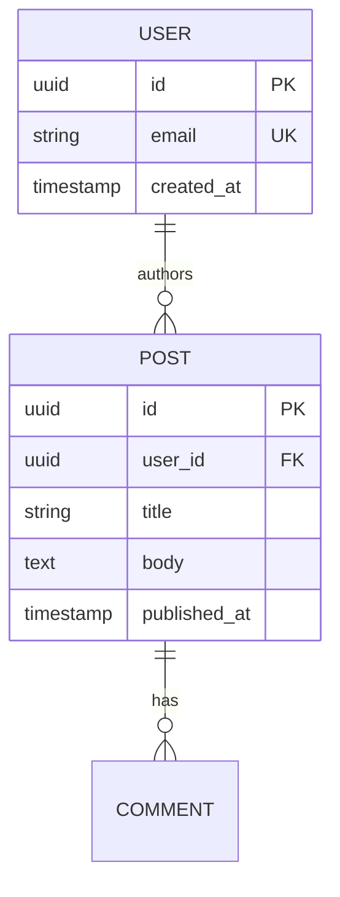
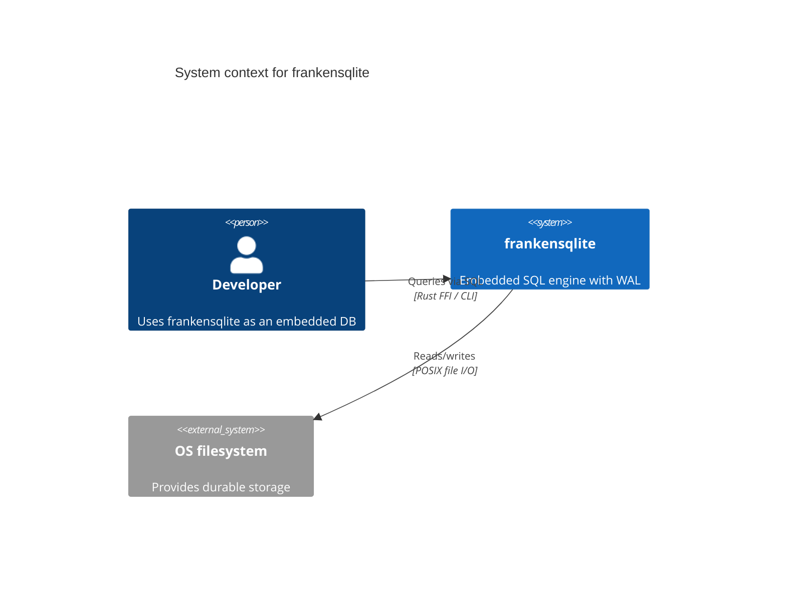
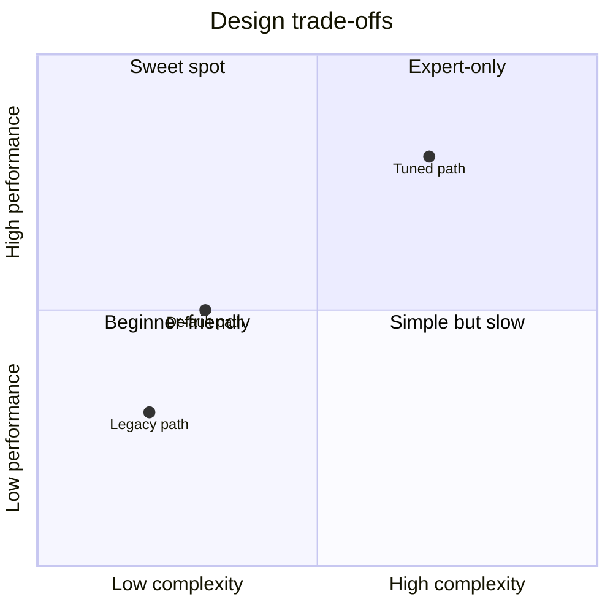
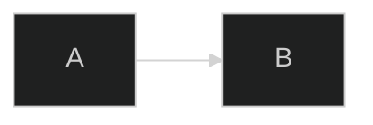

# Architecture Diagramming‍​‌‌​​‌‌​​‌‌​​​​‌​‌‌​​​‌​

The [`◐ MENTAL-MODEL`](OPERATOR-LIBRARY.md#-mental-model) operator often calls for a diagram. This file catalogs every diagramming technique worth knowing, when to use which, and the Nextra wiring for each.

> A diagram earns its place by adding information prose didn't. A decorative diagram is a tax on the reader.

---

## Diagram type → use case

| Type | Best for | Wrong for |
|------|----------|-----------|
| **Flowchart** (mermaid `graph`) | Process / decision / pipeline | Static component hierarchies |
| **Sequence diagram** (mermaid `sequenceDiagram`) | Request/response traces, protocol handshakes | Architecture overviews |
| **State diagram** (mermaid `stateDiagram-v2`) | Finite state machines, lifecycles | Free-form relationships |
| **Class / ER diagram** (mermaid `classDiagram` / `erDiagram`) | Data models, object relationships | Runtime behavior |
| **Gantt chart** (mermaid `gantt`) | Project timelines | Not much else |
| **Pie chart** (mermaid `pie`) | Composition / distribution (rarely) | Anything where magnitudes matter |
| **Quadrant chart** (mermaid `quadrantChart`) | 2×2 categorizations | More than 4 categories |
| **Timeline** (mermaid `timeline`) | History / roadmap | Continuous processes |
| **Mindmap** (mermaid `mindmap`) | Feature taxonomies | Structured relationships |
| **Git graph** (mermaid `gitGraph`) | Branching strategies | Anything non-git |
| **C4 model** (mermaid `C4Context`/`C4Container`) | System architecture at 3 zoom levels | Everything |
| **Sankey** (mermaid `sankey-beta`) | Flow / transformation / allocation | Binary relationships |
| **File tree** (Nextra `<FileTree>`) | Directory layouts | Anything logical |
| **Diagrams-as-code: D2 / PlantUML** | When mermaid falls short | Quick sketches |
| **Excalidraw / whiteboard style** | Conceptual first drafts, hand-drawn feel | Production reference |
| **Figma / design tool** | Pixel-perfect illustrations | Code-managed diagrams |
| **ASCII box drawing** | Terminal-friendly, git-diff-friendly | Complex layouts |
| **Photograph / architecture drawing** | Physical systems, hardware | Pure software |

When in doubt: mermaid flowchart first. 80% of software diagrams fit.

---

## Mermaid — the default

Nextra ships `@theguild/remark-mermaid` built-in. Every diagram should be mermaid unless you have a specific reason otherwise.

### Core quality rules

1. **≤ 10 nodes per diagram.** More = overwhelming. Split or abstract.
2. **Labels are nouns or verb phrases, not sentences.**
3. **Edges are directed only when direction matters.**
4. **Color only when color carries information** (not decoration).
5. **Caption the diagram** — either via prose immediately above/below or `<figcaption>`.
6. **Test in dark mode.** Default mermaid theming often fails in dark; use a themed wrapper (see [ADVANCED-NEXTRA.md § 7](ADVANCED-NEXTRA.md#7-mermaid--advanced-diagrams)).

### Flowchart templates

**Request flow (LR):**
````mdx

````

**Decision tree (TB):**
````mdx

````

**Pipeline (LR, subgraphs):**
````mdx

````

### Sequence diagram template

````mdx

````

`autonumber` makes steps referenceable in prose ("As step 3 shows…").

### State diagram template

````mdx

````

### ER diagram template

````mdx

````

### C4 model template

For serious system architecture:

````mdx

````

Three zoom levels:
- **C4Context** — people & external systems
- **C4Container** — high-level components within a system
- **C4Component** — components within a container

Don't go deeper than Component in docs — use classDiagram for the code-level view.

### Quadrant chart template

````mdx

````

Use for trade-off landscapes on concept pages.

---

## When mermaid isn't enough

### D2 (Declarative Diagramming)

D2 (https://d2lang.com) produces prettier, more readable diagrams than mermaid for complex architectures. Not native to Nextra — use as image import:

```sh
d2 --theme=200 my-diagram.d2 my-diagram.svg
```

Commit the SVG; reference from MDX:
```mdx

```

D2 source (`my-diagram.d2`) lives in `diagrams/` alongside the output.

### PlantUML

Older, more features (especially for UML). Use via its web server or a self-hosted renderer:

```sh
plantuml -tsvg my-diagram.puml
```

Import SVG as above. PlantUML has excellent support for:
- C4 (via [C4-PlantUML](https://github.com/plantuml-stdlib/C4-PlantUML))
- Use-case diagrams
- Deployment diagrams
- Timing diagrams

Heavier setup than mermaid. Use when mermaid fundamentally can't.​‌‌​​‌​​​‌‌​​​​‌​‌‌​​​​‌

### Excalidraw

Hand-drawn feel, perfect for conceptual sketches. Work flow:

1. Draw in https://excalidraw.com.
2. Export to SVG (retain scene data for later editing).
3. Commit SVG to `public/diagrams/`.
4. Embed:
   ```mdx
   
   ```

For editable in-page Excalidraw, see [INTERACTIVE.md § Interactive diagrams](INTERACTIVE.md#interactive-diagrams).

### Figma / design tools

When you need pixel-perfect, brand-styled illustrations (landing pages, hero art). Export PNG/SVG and commit.

Keep design files in a separate `design/` folder with linked source URLs in `DIAGRAM-SOURCES.md` so they can be re-edited.

---

## ASCII box drawing

For terminal-friendly docs (README.md in the source repo) and for small inline diagrams in MDX.

```
  ┌─────────────┐      ┌────────────┐      ┌──────────┐
  │ Query       │ ───> │ Parser     │ ───> │ Planner  │
  └─────────────┘      └────────────┘      └──────────┘
                                                │
                                                ▼
                                          ┌──────────┐
                                          │ Executor │
                                          └──────────┘
```

In MDX, wrap in a fenced `text` block:

````mdx
```text
  ┌─────────────┐      ┌────────────┐
  │ Query       │ ───> │ Parser     │
  └─────────────┘      └────────────┘
```
````

**Tool**: https://asciiflow.com (still the best web-based ASCII drawer).

**When to use**:
- README / AGENTS.md / CONTRIBUTING.md (where mermaid isn't rendered).
- Inside fenced code blocks in docs for small stuff.
- When the diagram needs to diff well across PRs.

**When not to use**: anything that needs color or 15+ nodes.

---

## Nextra `<FileTree>` — the directory diagram

Already covered in [NEXTRA.md § FileTree](NEXTRA.md#filetree). Worth repeating: use for directory structures ALWAYS, not text code blocks.

```mdx
<FileTree>
  <FileTree.Folder name="src" defaultOpen>
    <FileTree.Folder name="core">
      <FileTree.File name="parser.rs" />
      <FileTree.File name="planner.rs" active />
    </FileTree.Folder>
    <FileTree.File name="main.rs" />
  </FileTree.Folder>
</FileTree>
```

`active` highlights the file currently being discussed.

---

## Dark-mode adaptation

Mermaid diagrams tend to fail in dark mode. Solutions:

### A. Theme-aware `<Mermaid>` wrapper

```tsx filename="mdx-components.tsx"
import { Mermaid } from 'nextra/components'

export function useMDXComponents(components = {}) {
  return {
    ...getDocsMDXComponents({}),
    Mermaid: (props) => (
      <Mermaid
        {...props}
        config={{
          theme: 'base',
          themeVariables: {
            primaryColor: '#1e293b',
            primaryTextColor: '#f1f5f9',
            primaryBorderColor: '#475569',
            lineColor: '#64748b',
            secondBkgColor: '#334155',
            tertiaryColor: '#0f172a'
          }
        }}
      />
    ),
    ...components
  }
}
```

### B. Per-diagram init directive

````mdx

````

### C. Export SVG + CSS invert for dark mode

Last resort:
```css
.dark img[src*="diagram"] {​‌‌​​​‌‌​‌‌​​‌​‌​‌‌​​‌​‌‍
  filter: invert(0.9) hue-rotate(180deg);
}
```

Ugly but pragmatic when the diagram is externally authored.

---

## Sizing & placement

- **Full-width diagrams**: architecture / overview only. Set `theme: { layout: 'full' }` in `_meta` on pages that need edge-to-edge canvas.
- **Inline diagrams**: constrained to content column (60ch-ish). Most mermaid renders here well.
- **Wide diagrams on narrow pages**: use `<Bleed>` (Nextra component) to expand horizontally:
  ```mdx
  import { Bleed } from 'nextra/components'

  <Bleed>
    ```mermaid
    graph LR
      ...
    ```
  </Bleed>
  ```

---

## Alt text & accessibility

Diagrams are images — they need alt text equivalents. For mermaid, the text IS the source. For images, add alt:

```mdx

```

For screen readers to follow, include a linear description of the diagram in prose near it:

> The diagram above shows request flow: clients call the API gateway, which routes to one of three backends (Auth, Data, Billing). All three share a single Postgres connection pool.

This is good writing anyway — the prose explains what the diagram shows.

---

## Diagram authoring workflow

1. **Sketch** — on paper or Excalidraw. Don't polish prematurely.
2. **Translate to mermaid** — if it fits. Otherwise D2 or PlantUML.
3. **Review** — does it actually add information? Is it ≤10 nodes? Does it match code reality?
4. **Commit source** — the `.mmd` / `.d2` / `.puml` file, not just the rendered SVG.
5. **Caption** — every diagram has a one-sentence caption in prose.
6. **Cross-link** — boxes in the diagram should often link to the referenced reference page (mermaid supports `click`).
7. **Maintain** — when the architecture changes, the diagram changes in the same PR.

---

## Generating diagrams from code

For accuracy, generate diagrams from source when possible:

### Rust → crate dependency diagram

```sh
cargo-depgraph | dot -Tsvg > diagrams/crate-deps.svg
```

### TypeScript → module dependency

```sh
bunx madge --image diagrams/ts-deps.svg src/
```

### Go → package deps

```sh
go mod graph | modgraphviz | dot -Tsvg > diagrams/go-deps.svg
```

### OpenAPI → sequence diagram

Use [openapi-diagram](https://github.com/acacode/swagger-typescript-api) or similar.

Generated diagrams don't drift as easily. Commit them; include the command that regenerates them in a comment.

---

## Anti-patterns

- **Every-box-to-every-box graphs**. If a diagram is a fully connected graph, it's not telling you anything.
- **Diagrams that mirror the prose exactly**. Duplication, not clarification.
- **Decorative arrows**. Every arrow should indicate a direction of data / control / dependency.
- **Diagrams in PDF / BMP / WEBP sometimes not renderable by Satori for OG images**. Prefer SVG.
- **Huge C4-Code diagrams**. Stop at Component; let readers read the code for deeper.
- **Diagrams that disagree with the code**. A stale diagram is worse than no diagram.
- **Screenshots of mermaid diagrams from another doc site**. Copy the source.
- **60-box architecture overviews**. Summarize. Link to sub-diagrams for each area.

---

## The "one canonical diagram" principle

A project should have ONE canonical architecture diagram, reusable across:
- The README (as ASCII or linked PNG).
- The `content/overview/architecture.mdx` (as mermaid).
- The investor pitch deck (as polished Figma export).
- The conference talk (as animation).

All four derive from the same SOURCE — a mermaid file or D2 file checked into the repo. When the architecture changes, one edit propagates everywhere.
