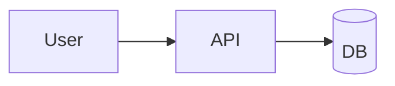

# Interactive & Rich-Media Documentation‍​‌‌​​‌‌​​‌‌​​​​‌​‌‌​​​‌​

Static docs are table stakes. The sites in [EXEMPLARS.md](EXEMPLARS.md) that stand out — Tailwind, SvelteKit, tRPC — earned their status partly through interactivity. This file covers the full range of interactive doc mechanisms, when to use each, and the exact Nextra wiring.

---

## Interactivity decision tree

```
  Reader needs:
  │
  ├─ to see the result of code before running it
  │   → screenshot or GIF  (lowest lift, high payoff)
  │
  ├─ to modify code and see the effect live
  │   → Sandpack or StackBlitz embed  (medium lift)
  │
  ├─ to experience the actual UI
  │   → iframe to the live app  (low lift, narrow applicability)
  │
  ├─ to follow a multi-step flow visually
  │   → screen recording (VHS / asciinema for CLI; gif / mp4 for GUI)
  │
  ├─ to try the real API
  │   → in-page API explorer (like Stripe's API ref "Try it")  (high lift)
  │
  └─ to navigate a large data structure / config
      → JSON viewer component or search-filtered table  (medium lift)
```

Pick the lowest-lift mechanism that solves the reader's need. Rich media has a cost: bundle size, flakiness, accessibility concerns, and maintenance.

---

## Screenshots — the underrated baseline

Before reaching for any embed, try a screenshot. A well-captioned image beats a broken Sandpack every time.

### Conventions

- Store in `public/images/<section>/<name>.png` (not `.webp`; [see NEXTRA.md](NEXTRA.md) for OG image constraints, but for regular images, PNG/AVIF/WebP all work).
- Use `next/image` via Nextra's static import:
  ```mdx
  
  ```
- Alt text is **required** — a11y + search ranking.
- Captions via `<figure>` for accessibility:
  ```mdx
  <figure>
    
    <figcaption>The query editor (dark mode) flagging a table scan.</figcaption>
  </figure>
  ```

### Tool choice

| Tool | Good for | OS |
|------|----------|----|
| macOS Preview + Cmd-Shift-4 | Basic crops | macOS |
| [Shottr](https://shottr.cc) | Dev screenshots with markup | macOS |
| [CleanShot X](https://cleanshot.com) | Polished screenshots + GIFs | macOS |
| [Flameshot](https://flameshot.org) | Cross-platform | Linux / Win |
| Playwright | Automated, reproducible | all |

Automated screenshots via Playwright (see `scripts/screenshot-all.sh` in [the scripts directory](#automated-screenshot-capture)) give you reproducible visual golden artifacts and catch UI drift.

### Automated screenshot capture

The skill ships `scripts/screenshot-all.sh`:

```bash
./scripts/screenshot-all.sh <base-url> <output-dir>
```

Walks the site's sitemap, takes a screenshot of each page, saves to `phase9_screenshots/`. Re-run on every deploy; diff against the previous run's images to detect visual regressions.

---

## GIFs & short screen recordings

For workflows ("click here, then here, then here").

### Size budget

- GIF: 500 KB soft cap (readers on mobile).
- MP4: 1 MB soft cap, set `<video loop autoplay muted playsinline>` for GIF-like playback.

### Tools

- **[Gifski](https://gif.ski)** — best quality GIF encoder on macOS.
- **[Peek](https://github.com/phw/peek)** — Linux GIF recorder.
- **[LICEcap](https://www.cockos.com/licecap/)** — cross-platform, small.
- **Playwright video** — for reproducible doc-site recordings.

### Strong preference for MP4 over GIF

MP4 is smaller, plays scrubbable, doesn't bloat page weight. Wrap in:

```mdx
<video autoPlay loop muted playsInline controls
       style={{ maxWidth: '100%', borderRadius: 8 }}>
  <source src="/videos/query-flow.mp4" type="video/mp4" />
</video>
```

For large videos (>5 MB), host externally (YouTube / Vimeo embed) rather than inline.

---

## VHS — deterministic terminal recordings

For CLI docs. VHS (charmbracelet) scripts terminal interactions into SVG or GIF.

### Install

```sh
brew install charmbracelet/tap/vhs  # macOS
# Or: go install github.com/charmbracelet/vhs@latest
```

### `.tape` file

```
# query-demo.tape
Output query-demo.gif
Set FontSize 16
Set Width 800
Set Height 400
Set Theme "Dracula"

Type "frankensqlite open demo.db"
Enter
Sleep 1
Type "SELECT * FROM users LIMIT 3;"
Enter
Sleep 2
```

Render:
```sh
vhs query-demo.tape
```

### Embed

```mdx

```

The skill ships `scripts/vhs-record-all.sh` which walks `recordings/*.tape` and re-renders, so CLI docs don't drift from reality.

### Why VHS beats manual recording

- Deterministic (same output every time).​​‌‌​​​​​‌‌​​‌​​​​‌‌​​‌‌
- Checked into git (text, not binary).
- Re-runnable when the CLI output changes.
- No shell timing artifacts.

---

## Asciinema — live terminal sessions

For longer CLI sessions where a GIF is too big. Produces scrubbable terminal recordings hosted at asciinema.org (or self-hosted).

```sh
asciinema rec recording.cast
# ... demo ...
# Ctrl-D to stop
asciinema upload recording.cast
```

Embed:
```mdx
<iframe src="https://asciinema.org/a/XXXXXX/iframe"
        width="100%" height="400"
        style={{ border: 'none' }}></iframe>
```

---

## Nextra `<Playground>` — client-side MDX compilation

For toy interactive MDX demos. Already built in. See [ADVANCED-NEXTRA.md § 5](ADVANCED-NEXTRA.md#5-playground--interactive-code).

Not suitable for real code execution — the `source` is compiled MDX only.

---

## Sandpack — full React playgrounds

Sandpack (codesandbox/sandpack-react) runs a full npm project in the browser via an in-browser bundler.

### Install

```sh
bun add @codesandbox/sandpack-react
```

### Component

```tsx filename="components/sandpack-demo.tsx"
'use client'

import { Sandpack } from '@codesandbox/sandpack-react'
import '@codesandbox/sandpack-react/dist/index.css'

export function SandpackDemo({ files, template = 'react-ts' }: {
  files: Record<string, string>
  template?: 'react' | 'react-ts' | 'vite' | 'vite-react' | 'nextjs' | 'node' | 'vanilla' | 'static'
}) {
  return (
    <Sandpack
      template={template}
      files={files}
      theme="dark"
      options={{
        showNavigator: false,
        showTabs: true,
        showLineNumbers: true,
        editorHeight: 420,
        editorWidthPercentage: 55
      }}
    />
  )
}
```

### Use in MDX

```mdx
import { SandpackDemo } from '@/components/sandpack-demo'

<SandpackDemo
  files={{
    '/App.tsx': `
import { MyComponent } from 'my-package'
export default () => <MyComponent name="World" />
    `.trim()
  }}
/>
```

### Bundle size & lazy loading

Sandpack ships ~140 KB. Don't load on every page — lazy-load:

```tsx
import dynamic from 'next/dynamic'

const SandpackDemo = dynamic(
  () => import('@/components/sandpack-demo').then(m => m.SandpackDemo),
  { loading: () => <div>Loading playground…</div>, ssr: false }
)
```

### When Sandpack breaks

- Dependencies need to be in Sandpack's registry (or specified in `customSetup.dependencies`).
- Native node modules don't work (it's a browser bundler).
- Network calls from user code require CORS.

For dependencies your Sandpack needs:
```tsx
<Sandpack
  template="react"
  customSetup={{
    dependencies: {
      'my-package': 'latest',
      'zod': '^3.22.0'
    }
  }}
/>
```

---

## StackBlitz embeds

Alternative to Sandpack, runs on WebContainers (full Node in the browser for most cases).

### Inline embed

```mdx
<iframe
  src="https://stackblitz.com/edit/my-demo?embed=1&file=src/App.tsx"
  style={{ width: '100%', height: 500, border: 'none', borderRadius: 8 }}
></iframe>
```

### Pros

- Supports more node-ish code than Sandpack.
- Users can fork and keep.

### Cons

- Your demo lives on stackblitz.com — moves if the URL breaks.
- Doesn't embed cleanly in offline docs.

---

## CodeSandbox embeds

Similar to StackBlitz. Mostly eclipsed by Sandpack for doc use-cases.

```mdx
<iframe
  src="https://codesandbox.io/embed/my-demo?fontsize=14&hidenavigation=1&theme=dark"
  style={{ width: '100%', height: 500, border: 0, borderRadius: 4 }}
></iframe>
```

---

## "Try it" API explorers (Stripe/Twilio style)

For HTTP APIs, embed a request-builder UI directly. Options:

### Option A: Swagger UI / Redoc (from OpenAPI)

If the project has an OpenAPI spec:

```tsx filename="components/api-explorer.tsx"
'use client'
import SwaggerUI from 'swagger-ui-react'
import 'swagger-ui-react/swagger-ui.css'

export function APIExplorer({ url }: { url: string }) {
  return <SwaggerUI url={url} tryItOutEnabled={true} />
}
```

In MDX:
```mdx
import { APIExplorer } from '@/components/api-explorer'​‌‌​​‌​​​‌‌​​​​‌​‌‌​​​​‌

<APIExplorer url="/openapi.json" />
```

### Option B: custom fetch-against-live-API widget

For small APIs, hand-roll it:

```tsx filename="components/api-try.tsx"
'use client'
import { useState } from 'react'

export function APITry({ method, url, sampleBody }) {
  const [response, setResponse] = useState(null)
  async function run() {
    const res = await fetch(url, {
      method, body: method !== 'GET' ? sampleBody : undefined,
      headers: { 'Content-Type': 'application/json' }
    })
    setResponse(await res.text())
  }
  return (
    <div>
      <button onClick={run}>Try it: {method} {url}</button>
      {response && <pre>{response}</pre>}
    </div>
  )
}
```

Use for small, free APIs. For production APIs requiring auth, route through a demo-key endpoint you control.

---

## Iframe to the live app

If your app has a public demo URL, embed it:

```mdx
<iframe
  src="https://demo.example.com?tour=1"
  style={{ width: '100%', height: 600, border: 0, borderRadius: 8 }}
  title="Live demo of <project>"
></iframe>
```

Use when:
- The app is read-only OR the demo endpoint is isolated.
- You control the iframe-d URL (or it declares `X-Frame-Options: ALLOW-FROM` / CSP `frame-ancestors`).

Don't use when:
- The embedded app can't handle a 600-px-tall viewport.
- The app needs user auth (embedded auth flows are fraught).

---

## JSON / YAML viewers

For config-heavy docs. Show a full config with collapsible sections:

```tsx filename="components/config-viewer.tsx"
'use client'
import { JsonView, allExpanded, defaultStyles } from 'react-json-view-lite'
import 'react-json-view-lite/dist/index.css'

export function ConfigViewer({ data }) {
  return <JsonView data={data} shouldExpandNode={allExpanded} style={defaultStyles} />
}
```

Usage:
```mdx
import config from '@/examples/production-config.json'
import { ConfigViewer } from '@/components/config-viewer'

<ConfigViewer data={config} />
```

---

## Jupyter notebook → MDX conversion

For scientific/ML projects. Notebooks can become doc pages.

### Pattern A: render at build time

```sh
bun add -D @bpasero/mdx-nb
```

Or use `nbconvert`:
```sh
pip install nbconvert
jupyter nbconvert --to markdown examples/demo.ipynb \
  --output-dir=content/tutorials/
# Then rename .md → .mdx
```

Plots are exported as PNG images; cell output is inlined as preformatted text.

### Pattern B: link out to a rendered notebook viewer

Cheaper but less integrated:
```mdx
See the [full notebook on nbviewer](https://nbviewer.org/github/you/project/blob/main/examples/demo.ipynb).
```

---

## Interactive diagrams

Beyond mermaid, for diagrams that respond to clicks.

### Pattern A: mermaid click handlers

Mermaid supports `click` interactions:

````mdx

````

### Pattern B: SVG with inline links

Author an SVG where boxes are `<a href>`-wrapped. Use tools like Excalidraw (export with "Embed scene" to re-edit later) or [Figma](https://figma.com).

### Pattern C: Embed Excalidraw

For editable diagrams on a page:
```tsx
import { Excalidraw } from '@excalidraw/excalidraw'

export function ArchDiagram({ initialData }) {
  return <Excalidraw initialData={initialData} viewModeEnabled={true} />
}
```

Heavy (~250 KB); lazy-load.

---

## Tab variants of the same content​‌‌​​​‌‌​‌‌​​‌​‌​‌‌​​‌​‌‍

Already covered in [NEXTRA.md § Tabs](NEXTRA.md#tabs). Worth adding here: `storageKey` persists the user's choice across pages.

```mdx
<Tabs items={['Node', 'Python', 'Rust']} storageKey="preferred-lang">
  ...
</Tabs>
```

Every tab with the same `storageKey` on the same site remembers the last selection. Good for multi-language SDK docs.

---

## Inline calculators

For docs where a reader might want to compute something (pricing, capacity, cost).

```tsx filename="components/calculator.tsx"
'use client'
import { useState } from 'react'

export function CostCalculator() {
  const [qps, setQps] = useState(1000)
  const cost = Math.ceil(qps / 1000) * 2
  return (
    <div>
      <label>QPS: <input type="number" value={qps} onChange={e => setQps(+e.target.value)} /></label>
      <p>Estimated cost: ${cost}/mo</p>
    </div>
  )
}
```

Usage:
```mdx
import { CostCalculator } from '@/components/calculator'

<CostCalculator />
```

---

## 3D / WebGL embeds

Rarely needed but occasionally right for game engines / scientific visualizations.

### Model viewer

```mdx
<model-viewer
  src="/models/robot.glb"
  camera-controls
  auto-rotate
  ar
  style={{ width: '100%', height: 400 }}
></model-viewer>
```

Requires Google's `@google/model-viewer` web component (script tag in `app/layout.tsx`).

### Three.js / React Three Fiber

Full custom. Heavy. Use `next/dynamic` with `ssr: false`.

---

## Accessibility

Interactive content is often inaccessible by default:

- **Videos**: captions (`<track kind="captions">`) and transcripts alongside.
- **Sandpack**: keyboard-reachable editor (it's Monaco-based, mostly good out of the box).
- **GIFs**: alt text describes the action, not the visual.
- **Custom widgets**: ARIA labels, visible focus indicators.

Run a11y audit (see [subagents/a11y-auditor.md](../subagents/a11y-auditor.md)) against pages with heavy interactivity — they're the most likely to fail WCAG.

---

## Bundle budget for rich-media

Every interactive component adds to the first-load JS of the page. Budget:

- **Static images**: free (`next/image`).
- **VHS gifs**: free (just images).
- **MP4 videos**: free (browser-native).
- **Nextra `<Playground>`**: ~20 KB (acceptable for a few pages).
- **Sandpack**: ~140 KB (lazy-load; only on tutorials).
- **StackBlitz / CodeSandbox iframe**: ~0 KB direct (iframe loads separately; does add FCP cost).
- **Swagger UI**: ~300 KB (lazy-load; only on `/api` pages).
- **Excalidraw**: ~250 KB (lazy-load; rarely use).
- **Three.js / R3F**: ~600 KB (special-case only).

Total budget per page: **< 100 KB first-load JS**. Anything bigger → `next/dynamic` lazy-loading.

Run `ANALYZE=true bun run build` and watch the treemap.

---

## Which mechanisms for which doc types

| Doc type | Screenshot | GIF/MP4 | VHS | Sandpack | API explorer |
|----------|:----------:|:-------:|:---:|:--------:|:------------:|
| Tutorial | ✓ (checkpoint images) | ✓ (flow) | ✓ (CLI demos) | ✓ (live code) | — |
| Reference | — | — | — | — | ✓ (try-it for APIs) |
| How-to | ✓ (result) | — | — | rare | — |
| Concept | ✓ (architecture) | — | — | — | — |
| CLI guide | — | — | ✓ | — | — |
| Landing | ✓ (hero) | ✓ (10-sec teaser) | — | — | — |

Over-interactivity ruins reference pages. Keep Reference austere.

---

## Integration with Phase 6b (Nextra-uplift)

When Phase 6b is running, the [`⊞ NEXTRA-UPLIFT`](OPERATOR-LIBRARY.md#-nextra-uplift) operator can propose adding interactive content. Rules:

- Only add interactivity when the page is failing the [Polish Bar](../SKILL.md#the-polish-bar-non-negotiable) on EXEMPLIFY or MENTAL-MODEL.
- Prefer cheap mechanisms first (screenshot > GIF > Sandpack).
- Budget gates: if adding a Sandpack pushes first-load JS above 100 KB, skip it.
- Add lazy-load wrappers for anything over 50 KB.

The polisher subagent's prompt should ask: "Does this page need interactivity to meet the Polish Bar? If yes, which mechanism? Is the budget OK?"

---

## Anti-patterns

- **Interactivity theater**: a Sandpack that just renders the same code from the fenced block above. Either make it runnable-and-modifiable or cut it.
- **One giant playground**: an interactive tutorial where all 15 steps live in one Sandpack. Split — each step has its own.
- **Rot-prone embeds**: StackBlitz / CodeSandbox URLs you don't own. They vanish.
- **Video-only tutorials**: some readers can't/won't watch video. Always provide transcript or text-equivalent.
- **Autoplay audio**: never.
- **Blocking JS on page load**: gate rich-media behind interaction (click-to-activate).
