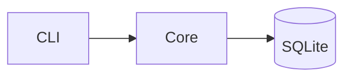

# Nextra 4 Usage Guide (App Router)‍​‌‌​​‌‌​​‌‌​​​​‌​‌‌​​​‌​

> Source of truth: `shuding/nextra` repo at `main`. Clone to `/tmp/nextra` and `/tmp/nextra-docs-template` during Phase 6 for reference. The examples in this file are copy-paste-ready and mirror what `/tmp/nextra/docs/` and `/tmp/nextra/examples/docs/` actually use.

Phase 6 is where this file earns its keep. Everything before is pure markdown; Phase 6 makes it a site.

---

## Which router?

**Use App Router (`app/`) — always, for new sites.** Pages Router (`pages/`) is legacy in Nextra 4.

The official `shuding/nextra-docs-template` on GitHub is a *Pages Router* template — nice one-click Vercel deploy, but outdated. **We do not use it as the template; we use its package name for discoverability only.** Our skill scaffolds an App Router project that mirrors `/tmp/nextra/examples/docs/` and `/tmp/nextra/docs/`.

---

## Minimal App Router layout we scaffold

```
<site>/
├── app/
│   ├── layout.tsx                       # <Layout> + <Navbar> + <Footer>
│   ├── _meta.global.tsx                 # Global sidebar + nav config
│   └── [[...mdxPath]]/
│       └── page.jsx                     # Catch-all that renders content/
├── content/                             # All MDX lives here
│   ├── index.mdx                        # Home page (served at /)
│   ├── overview/
│   │   ├── what-is-this.mdx
│   │   ├── architecture.mdx
│   │   ├── data-flow.mdx
│   │   ├── contributing.mdx
│   │   └── glossary.mdx
│   └── <section>/
│       └── *.mdx
├── mdx-components.tsx                   # Global MDX overrides
├── next.config.ts                       # Nextra + Next.js config
├── tsconfig.json
├── postcss.config.mjs                   # for Tailwind 4 (optional)
├── package.json
└── public/                              # Favicons, OG images, logo
```

Why `content/` instead of MDX-per-route under `app/`? Simpler ergonomics, easy to ship content authored by humans who don't care about Next.js conventions. The catch-all (`[[...mdxPath]]/page.jsx`) handles the routing, and `content/index.mdx` is the home page. Per-folder `_meta.js` files under `content/` are optional — `app/_meta.global.tsx` is authoritative and is what `scripts/generate-meta.mjs` maintains.

---

## `next.config.ts` — our default

```ts
import nextra from 'nextra'

const withNextra = nextra({
  latex: true,                 // KaTeX math rendering
  defaultShowCopyCode: true,   // Every code block gets a copy button
  search: {
    codeblocks: false          // Exclude code from Pagefind index (keep results readable)
  },
  contentDirBasePath: '/'      // Serve content/ from root; use '/docs' if you want /docs/*
})

export default withNextra({
  reactStrictMode: true
  // output: 'export'          // Uncomment for static export (see DEPLOY.md)
})
```

If you want Tailwind 4 (matching the upstream `/tmp/nextra/docs/`):
```bash
bun add -D tailwindcss@^4 @tailwindcss/postcss postcss
```
And `postcss.config.mjs`:
```js
export default {
  plugins: { '@tailwindcss/postcss': {} }
}
```

---

## `app/layout.tsx` — wire the theme

Mirrors `/tmp/nextra/examples/docs/src/app/layout.jsx`, enriched with the polish table-stakes:

```tsx
import { Footer, Layout, Navbar } from 'nextra-theme-docs'
import { Banner, Head } from 'nextra/components'
import { getPageMap } from 'nextra/page-map'
import 'nextra-theme-docs/style.css'

export const metadata = {
  metadataBase: new URL('https://<site-domain>'),
  title: { default: '<Project> Docs', template: '%s — <Project>' },
  description: '<one-line pitch pulled from README>',
  openGraph: { url: './', siteName: '<Project>', locale: 'en_US', type: 'website' }
}

export default async function RootLayout({ children }) {
  const pageMap = await getPageMap()

  const navbar = (
    <Navbar
      logo={<b><Project></b>}
      projectLink="https://github.com/<org>/<repo>"
      // chatLink="https://discord.gg/<invite>"     // optional
    />
  )

  const footer = <Footer>MIT {new Date().getFullYear()} © <Project>.</Footer>

  return (
    <html lang="en" dir="ltr" suppressHydrationWarning>
      <Head faviconGlyph="📘" />  {/* or omit and put real favicons in public/ */}​​‌‌​​​​​‌‌​​‌​​​​‌‌​​‌‌
      <body>
        <Layout
          // Structure
          pageMap={pageMap}
          navbar={navbar}
          footer={footer}

          // Source-repo hooks
          docsRepositoryBase="https://github.com/<org>/<repo>/blob/main/<site-dir>"
          editLink="Edit this page on GitHub"
          feedback={{ content: 'Question? Give us feedback →' }}
          lastUpdated={{ formatOptions: { dateStyle: 'medium' } }}

          // Nav behavior
          sidebar={{ defaultMenuCollapseLevel: 1, autoCollapse: true }}
          toc={{ float: true }}
          navigation={{ prev: true, next: true }}
          darkMode

          // Search label
          search={{ placeholder: 'Search docs…' }}
        >
          {children}
        </Layout>
      </body>
    </html>
  )
}
```

`docsRepositoryBase` MUST point at the directory inside the repo where your MDX lives (not repo root) or "Edit this page" will 404.

---

## `app/[[...mdxPath]]/page.jsx` — catch-all

Verbatim-compatible with `/tmp/nextra/examples/docs/src/app/docs/[[...mdxPath]]/page.jsx`:

```jsx
import { generateStaticParamsFor, importPage } from 'nextra/pages'
import { useMDXComponents as getMDXComponents } from '../../mdx-components'

export const generateStaticParams = generateStaticParamsFor('mdxPath')

export async function generateMetadata(props) {
  const params = await props.params
  const { metadata } = await importPage(params.mdxPath)
  return metadata
}

const Wrapper = getMDXComponents().wrapper

export default async function Page(props) {
  const params = await props.params
  const { default: MDXContent, toc, metadata, sourceCode } =
    await importPage(params.mdxPath)
  return (
    <Wrapper toc={toc} metadata={metadata} sourceCode={sourceCode}>
      <MDXContent {...props} params={params} />
    </Wrapper>
  )
}
```

---

## `mdx-components.tsx` — global overrides

```tsx
import { useMDXComponents as getDocsMDXComponents } from 'nextra-theme-docs'

const docsComponents = getDocsMDXComponents()

export const useMDXComponents = (components) => ({
  ...docsComponents,
  // Add custom components here, e.g.:
  // img: (props) => ,
  ...components
})
```

For narrower overrides (figure captions, API-doc tables, custom hero), copy the richer pattern from `/tmp/nextra/docs/mdx-components.tsx`.

---

## `_meta` file global

Global ordering goes in `app/_meta.global.tsx`. Per-folder ordering goes in `<folder>/_meta.js`. Nextra merges them — global wins on conflicts.

Real example (simplified) from `/tmp/nextra/docs/app/_meta.global.tsx`:

```tsx
import type { MetaRecord } from 'nextra'

export default {
  index: {
    type: 'page',
    display: 'hidden'          // Home tab not in sidebar
  },
  docs: {
    type: 'page',
    title: 'Documentation',
    items: {
      index: '',
      'file-conventions': { items: { /* ... */ } },
      guide: { items: { /* ... */ } },
      advanced: { items: { /* ... */ } },
      _separator: { type: 'separator', title: 'More' },
      'external-link': {
        title: 'Next.js Docs',
        href: 'https://nextjs.org',
        newWindow: true
      }
    }
  },
  api: { type: 'page' },
  versions: {
    type: 'menu',
    title: 'Versions',
    items: {
      v3: { title: 'v3 docs', href: 'https://v3.example.com' },
      v2: { title: 'v2 docs', href: 'https://v2.example.com' }
    }
  },
  blog: {
    type: 'page',
    theme: { typesetting: 'article', toc: false }
  },
  showcase: {
    type: 'page',
    theme: {
      copyPage: false,
      typesetting: 'article',
      layout: 'full',
      timestamp: false,
      toc: false
    }
  }
} satisfies MetaRecord
```

### Per-page theme override keys

```ts
theme: {
  layout: 'default' | 'full' | 'raw'   // 'full' = no sidebar; 'raw' = no chrome
  toc: boolean                          // show floating TOC
  sidebar: boolean                      // show sidebar
  pagination: boolean                   // prev/next links​‌‌​​‌​​​‌‌​​​​‌​‌‌​​​​‌
  timestamp: boolean                    // last-updated footer
  typesetting: 'default' | 'article'    // article = longer-form heading spacing
  copyPage: boolean                     // "Copy page" button
}
```

### Display modes

```ts
display: 'normal' | 'hidden' | 'children'
```
- `hidden`: routable but not in sidebar — good for legal/redirect pages.
- `children`: folder itself isn't a sidebar entry; only its children appear.

### Separators

```ts
_sep_themes: { type: 'separator', title: 'Themes' }
```

### External link in sidebar

```ts
'nextjs-link': { title: 'Next.js', href: 'https://nextjs.org', newWindow: true }
```

### Menu (dropdown)

```ts
versions: {
  type: 'menu',
  title: 'Version',
  items: {
    current: { title: 'Current', href: '/' },
    legacy: { title: 'v1', href: 'https://v1.example.com' }
  }
}
```

---

## Built-in components

All importable from `nextra/components`.

### Callout
```mdx
import { Callout } from 'nextra/components'

<Callout type="info">Informational.</Callout>
<Callout type="warning">Be careful.</Callout>
<Callout type="error">Something broke.</Callout>
<Callout type="important">Required reading.</Callout>
<Callout type="default" emoji="🎯">Custom emoji.</Callout>
```
GitHub-alert syntax also works: `> [!NOTE]`, `> [!TIP]`, `> [!WARNING]`, `> [!CAUTION]`, `> [!IMPORTANT]`.

### Tabs

````mdx
import { Tabs } from 'nextra/components'

<Tabs items={['TypeScript', 'Python', 'Rust']}>
  <Tabs.Tab>
    ```ts
    const x: number = 1
    ```
  </Tabs.Tab>
  <Tabs.Tab>
    ```py
    x = 1
    ```
  </Tabs.Tab>
  <Tabs.Tab>
    ```rust
    let x: i32 = 1;
    ```
  </Tabs.Tab>
</Tabs>
````

`storageKey` optionally persists the selection across pages.

### `npm2yarn` auto-tabs
````mdx
```sh npm2yarn
npm install my-package
```
````
Renders as a Tabs block with npm / yarn / pnpm / bun.

### Steps

````mdx
import { Steps } from 'nextra/components'

<Steps>

### Install
```sh npm2yarn
npm i my-lib
```

### Import
```ts
import { thing } from 'my-lib'
```

### Use
```ts
thing()
```

</Steps>
````

### FileTree
```mdx
import { FileTree } from 'nextra/components'

<FileTree>
  <FileTree.Folder name="app" defaultOpen>
    <FileTree.File name="layout.tsx" />
    <FileTree.File name="page.mdx" />
  </FileTree.Folder>
  <FileTree.Folder name="content">
    <FileTree.File name="index.mdx" active />
  </FileTree.Folder>
</FileTree>
```

### Cards
```mdx
import { Cards } from 'nextra/components'

<Cards num={2}>
  <Cards.Card title="Get started" href="/docs/overview" icon="🚀" arrow />
  <Cards.Card title="API reference" href="/reference" icon="📚" arrow>
    Full command + config reference.
  </Cards.Card>
</Cards>
```

### Bleed
```mdx
import { Bleed } from 'nextra/components'

<Bleed></Bleed>
<Bleed full></Bleed>
```

### Table
```mdx
import { Table } from 'nextra/components'

<Table>
  <Table.Tr><Table.Th>Name</Table.Th><Table.Th>Type</Table.Th></Table.Tr>
  <Table.Tr><Table.Td>timeout_ms</Table.Td><Table.Td>u32</Table.Td></Table.Tr>
</Table>
```
Plain GFM tables also work.

### Mermaid (zero setup)
````mdx

````

### Math (`latex: true` in `next.config.ts`)
```mdx
Inline: $E = mc^2$

Block:

$$
\int_0^\infty e^{-x^2}\,dx = \frac{\sqrt{\pi}}{2}
$$
```

---

## Code-block features

```` ```lang filename="src/foo.rs" {1,3-5} /substring/ /match/1-2 showLineNumbers copy ````

- `filename="..."` — prints a header
- `{1,3-5}` — highlights lines
- `/substring/` — highlights substring occurrences
- `/match/1-2` — highlights specific occurrences (1st–2nd)​‌‌​​​‌‌​‌‌​​‌​‌​‌‌​​‌​‌‍
- `showLineNumbers` — numbers
- `copy` / `copy=false` — override `defaultShowCopyCode`
- GitHub-style diffs: ` ```diff ` with `+`/`-` prefixes

---

## Search (Pagefind)

Built into `nextra-theme-docs`'s search box. We wire it via a `postbuild` step:

`package.json`:
```json
{
  "scripts": {
    "dev": "next",
    "build": "next build",
    "postbuild": "pagefind --site .next/server/app --output-path public/_pagefind",
    "start": "next start"
  },
  "devDependencies": { "pagefind": "^1.3.0" }
}
```

For `output: 'export'`, point `--site` at `out/` and `--output-path` at `out/_pagefind`.

To exclude a page from search:
```mdx
---
searchable: false
---
```

---

## OG image generation

The upstream docs site auto-generates OG images from the page `metadata.title`. Copy the `rehypeOpenGraphImage` rehype plugin pattern from `/tmp/nextra/docs/next.config.ts` — only mount it in production (Turbopack's dev compiler can't serialize rehype callables).

For per-page hero OG images, use the `/og-share-images` skill if available.

---

## i18n (optional)

Nextra 4 supports i18n via the `nextra()` wrapper's `i18n` option and `[lang]`-prefixed content folders. The exact config shape has shifted across Nextra versions, so **consult [nextra.site](https://nextra.site) for the current form** before wiring it up. Example folder layout you'll end up with:

```
content/
  en/
    index.mdx
  es/
    index.mdx
```

We don't enable i18n by default — add only if the user asks.

---

## Versioned docs

Nextra has no built-in versioning. Strategies:

- **Menu dropdown** (easiest): each version lives at its own URL (deployed from a branch); link them via `_meta.global.tsx` `type: 'menu'`.
- **Path-based**: `content/v3/...` and `content/v4/...`; ugly URLs but single deployment.

Prefer menu dropdown for major versions.

---

## Dark mode

`darkMode` on `<Layout>` adds the toggle. `next-themes` is already wired by `nextra-theme-docs`. To provide a light/dark logo swap:

```tsx
import { useTheme } from 'next-themes'

export function Logo() {
  const { resolvedTheme } = useTheme()
  return 
}
```

Verify dark mode in Phase 9 Playwright — color contrast fails are the most common visible polish bug.

---

## Gotchas

| Symptom | Cause | Fix |
|---------|-------|-----|
| Sidebar empty | Forgot `pageMap={await getPageMap()}` | Add in `layout.tsx` |
| 404 on "Edit this page" | Wrong `docsRepositoryBase` | Point at the dir holding MDX, not repo root |
| Build errors in dev but not prod | Non-serializable rehype plugin | Gate with `process.env.NODE_ENV === 'production'` (see docs `next.config.ts`) |
| Search shows no results | Pagefind didn't run | Check `postbuild` script; verify `public/_pagefind/pagefind.js` exists |
| Mermaid block renders as code | No issue — it IS a code fence; ensure you're using ` ```mermaid ` | — |
| `bun dev` 500 on first load | Missing `mdx-components.tsx` at project root | Create it (even trivially) |
| `<Layout>` not styled | Didn't import `nextra-theme-docs/style.css` | Add import to `layout.tsx` |
| Images unoptimized / warnings | Static image import path off | Put images in `public/` and use relative paths in MDX |
| `[[...mdxPath]]` clashes with real route | Two routes for same URL | Pick one: catch-all OR real `app/docs/page.mdx`, not both |
| "Edit on GitHub" button absent | `editLink` prop missing or null | Pass non-null string |

---

## Further reading

The basics are in this file. Advanced features (TSDoc auto-reference, remote MDX, custom search backends, custom themes, Sandpack playgrounds, Shiki transformers, Mermaid theming, KaTeX/MathJax, analytics, versioning, i18n, banner, edit-on-GitHub deep config, sitemap/robots/llms.txt, bundle analysis, feedback pipeline, `_meta` advanced patterns, OG images, multi-repo monorepo patterns, accessibility defaults) live in:

→ **[ADVANCED-NEXTRA.md](ADVANCED-NEXTRA.md)** (20 sections, each with a copy-paste template)

Read the sections that match what you need. Don't read it cover-to-cover unless you're doing Phase 6b polish and want a full menu of possible upgrades.

---

## Polish checklist (owned by Phase 6c)

- [ ] `darkMode` toggle visible; both modes have good contrast
- [ ] `editLink` + `feedback` wired and correct
- [ ] `lastUpdated` enabled
- [ ] `toc.float` enabled on long pages
- [ ] Favicon in place (either `faviconGlyph` or real `/public/favicon.ico` + `apple-icon.png`)
- [ ] OG image renders for a sample page (`curl -I <url>/og?...` returns 200)
- [ ] Home page is a `<Cards>` landing, not a raw TOC
- [ ] `_meta.global.tsx` has sensible section ordering with at least one `separator`
- [ ] Search works; returns ≥1 result for a known term
- [ ] Mermaid + LaTeX both render (if repo uses them)
- [ ] `npm2yarn` on every install-style fence
- [ ] Mobile (375×667) sidebar opens; nothing horizontal-overflows
