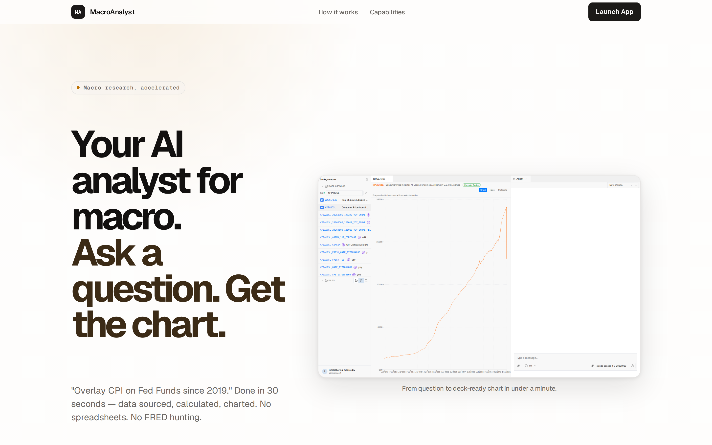

# Boring UI


Boring UI is an opinionated framework for building apps around an agent.

Traditional SaaS is built around workflows users drive by hand — buttons, forms, pages, dashboards.

Agents change that.

When software can understand intent and act, the app collapses to three surfaces:

- **Chat** — tell the agent what to do.
- **Workbench** — inspect, steer, and refine the results.
- **Sandbox** — the file read/write substrate the agent works against.

That's the core. 

Every Boring UI app gets these three surfaces out of the box.

But every app is different. Different data. Different workflows. Different ways to visualize results and steer the agent.

A data app needs charts. A docs app needs side-by-side previews. A code app needs diffs. The agent's skills and tools must match the domain.

That's where the plugin system comes in. 

Plugins let you fully customize both the agent and the workspace:

- **Agent plugins** — add skills, tools, prompts, and server routes.
- **UI plugins** — add panels, views, commands, and surface resolvers.

You bring the domain logic. Boring UI brings the surfaces and the extension points to shape them.

---

## What it looks like


The core ships one shell with three surfaces:

- **Chat** (centre) — you steer, the agent calls tools
- **File tree** (left) — the filesystem the agent reads and writes
- **Workbench** (right) — where the agent opens panels: editors, tables, previews, and plugin panes

A **command palette** (`⌘K`) provides keyboard-driven access across all surfaces.

That's the core. Every app starts here.

---

## Quickstart

```bash
npx @hachej/boring-ui-cli
```

Starts a full agent workspace pointed at the current directory — chat, panels, file tree, command palette. No clone. No database. No setup.

Set `ANTHROPIC_API_KEY` or `OPENAI_API_KEY` before running — or skip the env var and the CLI prompts for login on first launch (credentials persist for future runs). More on auth: [packages/cli](packages/cli/README.md).

It opens at `http://localhost:5200`. Try these in chat:

- *"list every TODO in this repo and open them in the editor"*
- *"search package.json for stale dependencies, summarise in a table"*
- *"create a markdown file called notes.md with bullet points of my open files"*

You'll see the agent open files in the workbench, render results into panels, and react to your follow-ups — all from the chat box, against your real directory.

---

## Plugin system

Boring UI is a chassis, not a closed app. 

The shell stays the same; what runs inside changes per app, per user, per surface.

Plugins contribute UI and agent behaviour through a single `package.json` manifest. Once registered, they sit alongside the built-ins.

**What you can add:**

- **Panels** — new panes in the workbench (tables, editors, charts, any React component)
- **Left-tabs** — persistent sidebar surfaces (catalogs, navigators, status)
- **Commands** — entries in the command palette
- **Catalogs** — searchable, faceted data explorers
- **Surface resolvers** — let the agent open your panels via typed open-requests
- **Agent skills, tools, prompts** — what the agent can do and how it reasons
- **Context providers** — React context wrapped around the entire workspace tree

**How adaptation works:**

A plugin is a regular Node package with two manifest blocks:

- `pi.*` — agent side: skills, prompts, tools (loaded by [Pi](https://github.com/earendil-works/pi/tree/main))
- `boring.*` — UI side: panels, commands, catalogs, surface resolvers, server routes

Plugins compose. Use `derivesFrom` to extend an existing plugin instead of forking. Swap a single surface, or add a brand-new pane type. Plugins ship through npm like any other dependency — no patching, no monorepo entanglement required.

Start from [plugins/_template](plugins/_template/README.md). The exact manifest and a working example are in [Plugin shape](#plugin-shape) below.

---

## Built with boring-ui



**[MacroAnalyst](https://boring-macro.fly.dev/)** — an AI analyst for macroeconomic research. Ask in plain English, get charts back in under a minute. 800,000+ economic series from FRED, BLS, BEA, and Treasury, all behind one chat and one workbench.

Production, paying customers, single codebase. Built on `@hachej/boring-core` + `@hachej/boring-agent` + `@hachej/boring-workspace` + custom domain plugins.

More on the same chassis in flight: `boring-accountant`, `boring-design`, `boring-lawyer`.

---

## Repo map

### Packages


| Package                    | Role                             | README                                             |
| -------------------------- | -------------------------------- | -------------------------------------------------- |
| `@hachej/boring-agent`     | Agent runtime, tools, chat UI    | [packages/agent](packages/agent/README.md)         |
| `@hachej/boring-workspace` | Workbench, panels, plugin system | [packages/workspace](packages/workspace/README.md) |
| `@hachej/boring-core`      | Auth, DB, app factory            | [packages/core](packages/core/README.md)           |
| `@hachej/boring-ui-kit`    | Shared UI primitives             | [packages/ui](packages/ui/README.md)               |
| `@hachej/boring-ui-cli`    | Zero-setup local entrypoint      | [packages/cli](packages/cli/README.md)             |


### Plugins


| Plugin                         | What it adds                                                              | README                                                   |
| ------------------------------ | ------------------------------------------------------------------------- | -------------------------------------------------------- |
| `@hachej/boring-ask-user`      | Agent-to-user question/answer surface and `ask_user` tool                 | [plugins/ask-user](plugins/ask-user/README.md)           |
| `@hachej/boring-data-explorer` | Searchable, faceted data tables — the primitive for explorer-style panels | [plugins/data-explorer](plugins/data-explorer/README.md) |
| `@hachej/boring-data-catalog`  | Configurable catalog tab built on `data-explorer`                         | [plugins/data-catalog](plugins/data-catalog/README.md)   |
| Plugin template                | Canonical scaffold for new plugins                                        | [plugins/_template](plugins/_template/README.md)         |


### Reference apps


| App                         | Purpose                                                | README                                                           |
| --------------------------- | ------------------------------------------------------ | ---------------------------------------------------------------- |
| `apps/full-app`             | Production-shaped reference: auth, DB, multi-workspace | [apps/full-app](apps/full-app/README.md)                         |
| `apps/agent-playground`     | `@hachej/boring-agent` alone — no workbench, no DB     | [apps/agent-playground](apps/agent-playground/README.md)         |
| `apps/workspace-playground` | `@hachej/boring-workspace` + plugins — no auth backend | [apps/workspace-playground](apps/workspace-playground/README.md) |


---

## Plugin shape

Plugins are standard Node packages, distributed through npm, loaded by Pi. Each `package.json` declares both halves of the contract:

```json
{
  "name": "my-plugin",
  "keywords": ["pi-package"],
  "pi": {
    "extensions": ["agent/index.ts"],
    "skills": ["agent/skills"],
    "prompts": ["agent/prompts"]
  },
  "boring": {
    "label": "My Plugin",
    "front": "front/index.tsx",
    "server": "server/index.ts",
    "derivesFrom": ["optional-parent-plugin"]
  }
}
```

- `pi.*` — agent side: skills, prompts, tools, system-prompt extensions (loaded by Pi as-is)
- `boring.front` — workbench UI: panels, commands, catalogs, surface resolvers
- `boring.server` — server side: agent tools that need backend state, HTTP routes
- `boring.derivesFrom` — layer on top of an existing plugin

Start from [plugins/_template](plugins/_template/README.md).

---

## Architecture

Boring UI is built around four swappable interfaces:


| Interface      | Owner                      | Responsibility            |
| -------------- | -------------------------- | ------------------------- |
| `Workspace`    | `@hachej/boring-agent`     | Filesystem operations     |
| `Sandbox`      | `@hachej/boring-agent`     | Shell execution           |
| `AgentHarness` | `@hachej/boring-agent`     | Agent runtime             |
| `UiBridge`     | `@hachej/boring-workspace` | Agent → workbench control |


Flow:

```text
chat UI ─► AgentHarness ─► ToolCatalog ─► Workspace + Sandbox

agent / server actions ─► UiBridge ─► workbench UI

session history ─► SessionStore
```

Rules that follow from this shape:

- `Workspace` is the single filesystem interface — agent tools and frontend file routes both go through it
- `Sandbox` is only for execution
- `AgentHarness` doesn't know about files or shells — it only sees tools
- Runtime modes (`direct`, `local`, `vercel-sandbox`) swap the `Workspace` + `Sandbox` pair, not the rest
- `UiBridge` is how the agent opens files, panels, surfaces, and any other workbench UI

---

## Built on Pi

Boring UI uses [Pi](https://github.com/earendil-works/pi/tree/main) as its agent harness. Pi provides the agent loop, tool calling, sessions, skills, and prompts. Boring UI adds the web chat, workbench, plugin system, sandboxed execution (`bwrap` locally, Vercel Sandboxes remotely), and the app shell on top.

Agent authentication options: Pi's [Quick Start](https://github.com/badlogic/pi-mono/tree/main/packages/pi-coding-agent#quick-start) and [Providers docs](https://github.com/badlogic/pi-mono/blob/main/packages/pi-coding-agent/docs/providers.md).

---

## Working in the repo

```bash
pnpm install
pnpm build            # build all packages
pnpm dev              # run all dev servers
pnpm typecheck        # tsc --noEmit across all packages
pnpm test             # vitest across all packages
pnpm lint:invariants  # plugin contract + agent isolation lint
pnpm ci               # lint + typecheck + test + invariants + e2e
```

Scoped commands during development:

```bash
pnpm --filter @hachej/boring-workspace test
pnpm --filter @hachej/boring-agent test:watch
pnpm --filter full-app dev
```

Apps that consume `@hachej/boring-workspace` source need the workspace built once first:

```bash
pnpm --filter @hachej/boring-workspace build && pnpm --filter workspace-playground test
```

---

## License

MIT