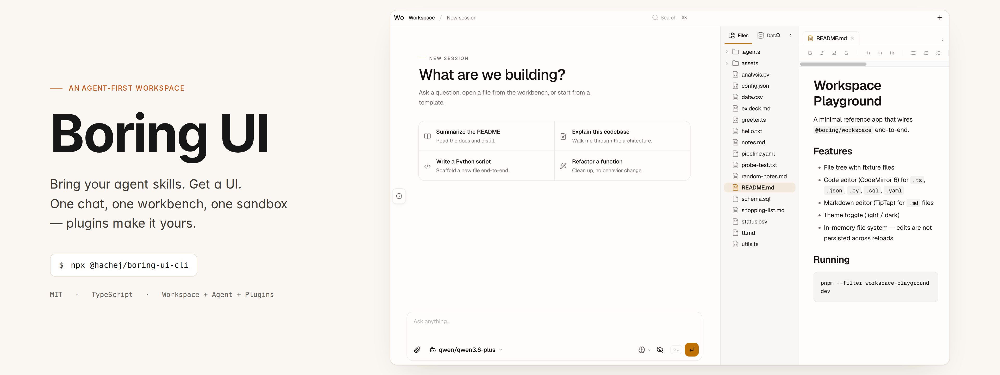
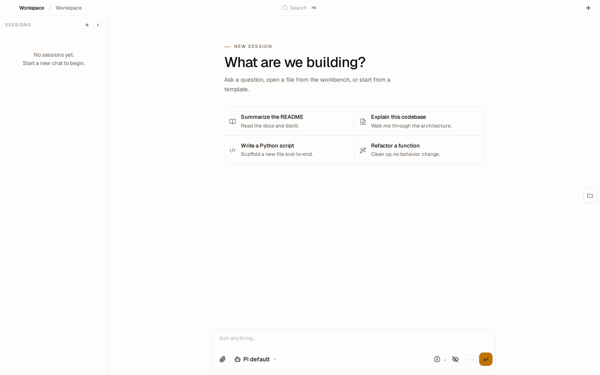
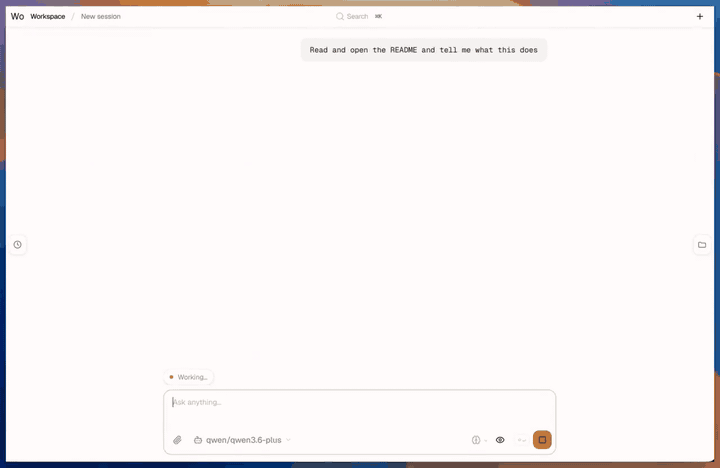
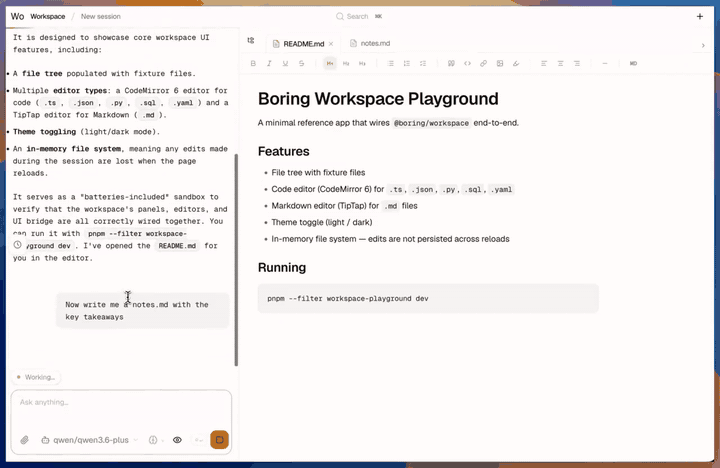
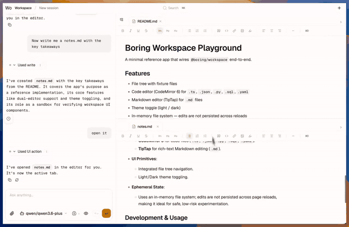

# Boring UI




Boring UI is an opinionated framework for building agent-centric apps, built on [Pi](https://pi.dev).

Traditional SaaS is built around workflows users drive by hand: buttons, forms, pages, dashboards.

Agents change that.

When software can understand intent and act, every app collapses to two surfaces:

- **Chat** — tell the agent what to do.
- **Workbench** — inspect, steer, and refine the results.

That's what the Boring UI core provides: a shell the agent can control and reshape.

Give it a try:

```bash
npx @hachej/boring-ui-cli
```

Starts a full agent workspace pointed at the current directory — chat, panels, file tree, command palette. No clone. No database. No setup.

Set `ANTHROPIC_API_KEY` or `OPENAI_API_KEY` before running. See [Pi providers](https://pi.dev/docs/latest/quickstart#configure-a-provider) for LLM setup.



A real session: ask the agent for a summary → it opens the README in the workbench → ask it to take notes → a new `notes.md` appears in the tree → search for it via the command palette. Chat in, workspace out.

| Agent opens files | Agent edits files | Command palette |
|---|---|---|
|  |  |  |
| Read · render · explain | Write · diff · save | ⌘K · search · jump |

---

But of course every app, every workflow, every use case is different.

Different data. Different visualisations. Different agent skills.

That's why the plugin system exists. 

Boring builds on Pi's plugin system and extends it with UI-aware surfaces.

Pi handles the agent loop (tool calling, sessions, skills, prompts). 

Boring adds the workbench, panels, and commands on top. 

The two halves are fully compatible — any Pi package works out of the box.

In practice, a plugin is a Node package with two manifest blocks:

- `pi.*` — agent side: skills, prompts, tools (loaded by [Pi](https://pi.dev))
- `boring.*` — UI side: panels, commands, catalogs, surface resolvers

**What you can add:**

- **Panels** — arbitrary React panes in the workbench (editors, charts, tables, anything)
- **Left tabs** — persistent sidebars (data catalogs, file navigators, status views)
- **Commands** — entries in the command palette, triggered by user or agent
- **Catalogs** — searchable, faceted data explorers the agent can surface
- **Agent tools** — new capabilities the model can call, with schema-defined parameters
- **Skills + prompts** — domain knowledge and reasoning patterns the agent follows

### Plugins


| Plugin           | Description                                                                                   |
| ---------------- | --------------------------------------------------------------------------------------------- |
| ask-user         | Agent-to-human Q&amp;A with a UI prompt                                                       |
| data-explorer    | Searchable, faceted data tables                                                               |
| data-catalog     | Catalog tab built on data-explorer                                                            |
| coming: llm-wiki | [LLM powered second brain](https://gist.github.com/karpathy/442a6bf555914893e9891c11519de94f) |
| coming: tasks    | Task tracking, Kanban boards the agent can read and update |
| coming: workflows| Multi-step agent orchestration — chain steps, define branches, trigger sub-agents |


### Plugin shape

Each `package.json` declares both halves:

```json
{
  "name": "my-plugin",
  "keywords": ["pi-package"],
  "pi": {
    "extensions": ["agent/index.ts"],
    "skills": ["agent/skills"],
    "prompts": ["agent/prompts"]
  },
  "boring": {
    "label": "My Plugin",
    "front": "front/index.tsx",
    "server": "server/index.ts",
    "derivesFrom": ["optional-parent-plugin"]
  }
}
```

- `pi.extensions` / `pi.skills` / `pi.prompts` — agent-side capabilities
- `boring.front` — workbench UI: panels, commands, catalogs, surface resolvers
- `boring.server` — server side: tools that need backend state, HTTP routes
- `boring.derivesFrom` — layer on top of an existing plugin

Start from [plugins/_template](plugins/_template/README.md).

See [Pi extensions docs](https://pi.dev/docs/latest/extensions) for the full Pi plugin surface.

---

## Built with boring-ui


| App                                                                                           | Status |
| --------------------------------------------------------------------------------------------- | ------ |
| [MacroAnalyst](https://boring-macro.fly.dev/) — macroeconomic research, charts from live data | Live   |
| boring-accountant — accounting workflows                                                      | Coming |
| boring-design — design review and iteration                                                   | Coming |
| boring-lawyer — legal research and document review                                            | Coming |


---

## Repo map

### Packages


| Package                    | Role                             | README                                             |
| -------------------------- | -------------------------------- | -------------------------------------------------- |
| `@hachej/boring-agent`     | Agent runtime, tools, chat UI    | [packages/agent](packages/agent/README.md)         |
| `@hachej/boring-workspace` | Workbench, panels, plugin system | [packages/workspace](packages/workspace/README.md) |
| `@hachej/boring-core`      | Auth, DB, app factory            | [packages/core](packages/core/README.md)           |
| `@hachej/boring-ui-kit`    | Shared UI primitives             | [packages/ui](packages/ui/README.md)               |
| `@hachej/boring-ui-cli`    | Zero-setup local entrypoint      | [packages/cli](packages/cli/README.md)             |


### Plugins


| Plugin                         | What it adds                                                              | README                                                   |
| ------------------------------ | ------------------------------------------------------------------------- | -------------------------------------------------------- |
| `@hachej/boring-ask-user`      | Agent-to-user question/answer surface and `ask_user` tool                 | [plugins/ask-user](plugins/ask-user/README.md)           |
| `@hachej/boring-data-explorer` | Searchable, faceted data tables — the primitive for explorer-style panels | [plugins/data-explorer](plugins/data-explorer/README.md) |
| `@hachej/boring-data-catalog`  | Configurable catalog tab built on `data-explorer`                         | [plugins/data-catalog](plugins/data-catalog/README.md)   |
| Plugin template                | Canonical scaffold for new plugins                                        | [plugins/_template](plugins/_template/README.md)         |


### Reference apps


| App                         | Purpose                                                | README                                                           |
| --------------------------- | ------------------------------------------------------ | ---------------------------------------------------------------- |
| `apps/full-app`             | Production-shaped reference: auth, DB, multi-workspace | [apps/full-app](apps/full-app/README.md)                         |
| `apps/agent-playground`     | `@hachej/boring-agent` alone — no workbench, no DB     | [apps/agent-playground](apps/agent-playground/README.md)         |
| `apps/workspace-playground` | `@hachej/boring-workspace` + plugins — no auth backend | [apps/workspace-playground](apps/workspace-playground/README.md) |


---

## Architecture

Boring UI is built around four swappable interfaces:


| Interface      | Owner                      | Responsibility            |
| -------------- | -------------------------- | ------------------------- |
| `Workspace`    | `@hachej/boring-agent`     | Filesystem operations     |
| `Sandbox`      | `@hachej/boring-agent`     | Shell execution           |
| `AgentHarness` | `@hachej/boring-agent`     | Agent runtime             |
| `UiBridge`     | `@hachej/boring-workspace` | Agent → workbench control |


Flow:

```text
chat UI ─► AgentHarness ─► ToolCatalog ─► Workspace + Sandbox

agent / server actions ─► UiBridge ─► workbench UI

session history ─► SessionStore
```

Rules that follow from this shape:

- `Workspace` is the single filesystem interface — agent tools and frontend file routes both go through it
- `Sandbox` is only for execution
- `AgentHarness` doesn't know about files or shells — it only sees tools
- Runtime modes (`direct`, `local`, `vercel-sandbox`) swap the `Workspace` + `Sandbox` pair, not the rest
- `UiBridge` is how the agent opens files, panels, surfaces, and any other workbench UI

---

## Working in the repo

```bash
pnpm install
pnpm build            # build all packages
pnpm dev              # run all dev servers
pnpm typecheck        # tsc --noEmit across all packages
pnpm test             # vitest across all packages
pnpm lint:invariants  # plugin contract + agent isolation lint
pnpm ci               # lint + typecheck + test + invariants + e2e
```

Scoped commands during development:

```bash
pnpm --filter @hachej/boring-workspace test
pnpm --filter @hachej/boring-agent test:watch
pnpm --filter full-app dev
```

Apps that consume `@hachej/boring-workspace` source need the workspace built once first:

```bash
pnpm --filter @hachej/boring-workspace build && pnpm --filter workspace-playground test
```

---

## License

MIIT