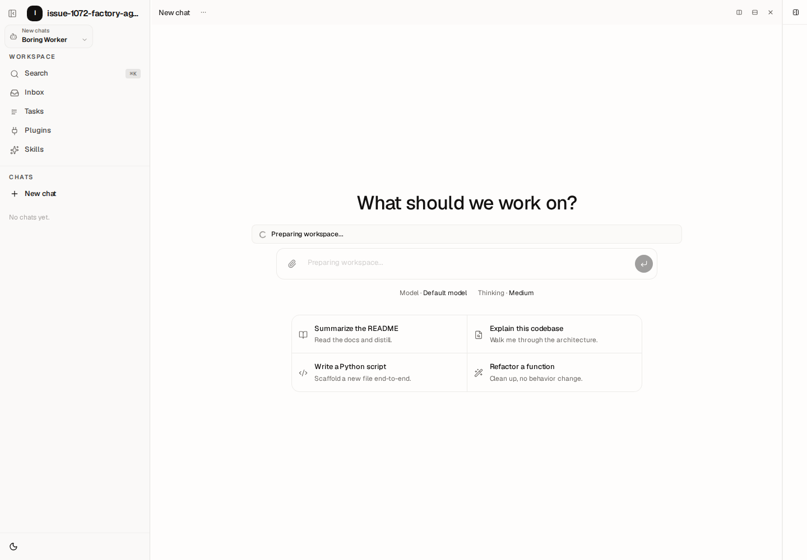
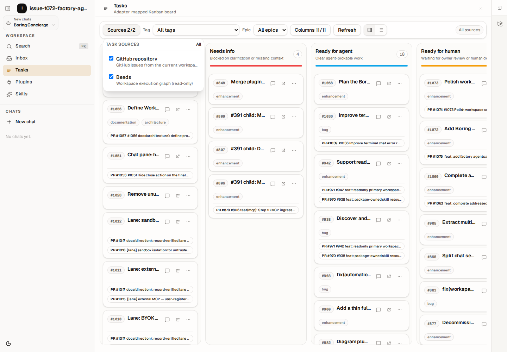
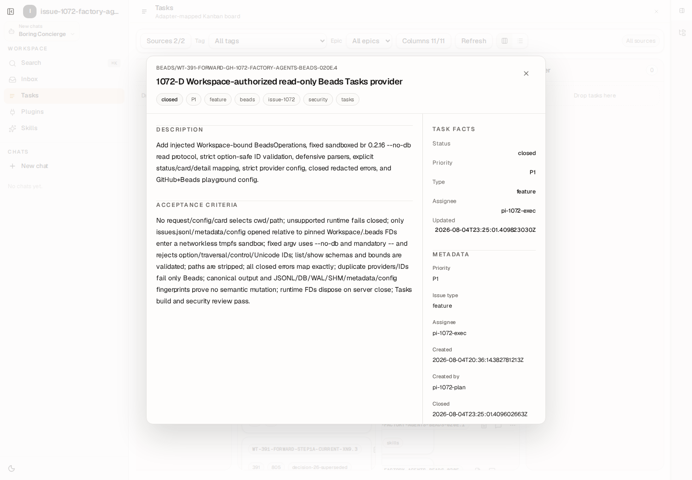
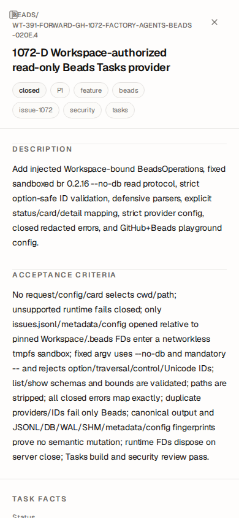

# Issue #1072 final proof

Date: 2026-08-05

## Quality gates

| Surface | Tests | Typecheck | Build |
| --- | ---: | --- | --- |
| `@hachej/boring-agent` | 1,785 passed; 17 skipped | passed | passed; artifact assertion passed |
| `@hachej/boring-workspace` | 1,825 passed; 10 skipped | front/server passed | passed; 19 artifact assertions passed |
| `@hachej/boring-tasks` | 68 passed | passed | passed |
| `workspace-playground` | 8 passed | passed | passed |

Repository gates passed:

```text
pnpm audit:imports
pnpm lint:invariants
git diff --check
```

The first convergence run exposed one raw `CONFIG_INVALID` invariant in the new
trusted-composition test. The implementation and test now use
`ErrorCode.enum.CONFIG_INVALID`; the Agent test suite and repository invariants
passed after the fix.

After the PR base advanced, the branch merged `origin/main` at `0aec55901`.
The one conflict preserved upstream showcase workspace routing and this change's
factory Agent selector. Post-merge suites, typechecks, builds, repository gates,
and browser proof passed. One Agent suite run hit the existing 5-second
insufficient-credit replay timeout under load; the focused canonical test and
the complete current-head suite with a 15-second timeout both passed.

## Trusted factory agents

Live AgentHost inventory exposed exactly:

```text
boring-concierge
boring-triage
boring-steward
boring-worker
boring-reviewer
```

Browser assertions confirmed all five selector options, selected
`boring-worker`, persisted that future-session selection across reload, and
observed the Tasks "Open chat" future-session POST at
`/api/v1/agents/boring-worker/sessions`. Existing addressed panes remained owned
by their original Agent.



## GitHub + Beads Tasks

Browser assertions confirmed both configured sources remained visible together.
A synthetic retryable Beads timeout left a real GitHub issue visible; retry and
stale behavior are covered by component tests. Real Beads cards contained no
host path fields.



## Accessible Bead detail

A real detail request for
`wt-391-forward-gh-1072-factory-agents-beads-020e.4` confirmed:

- description, acceptance criteria, metadata, and ordered relations rendered;
- raw host paths and `source_repo_path` did not render;
- loading, typed failure, and retry-to-success worked;
- focus began and remained in the dialog;
- first Escape closed despite Workspace shortcuts;
- focus returned to the exact card trigger;
- desktop layout was bounded at 832 × 768;
- mobile adapted to a 390 × 844 full-screen, single-scroll layout.





## Read-only Beads proof

`pnpm --filter @hachej/boring-tasks proof:beads-readonly` runs the supported
`br 0.2.16` list/show protocol for every Bead ID, exercises the actual
Workspace-bound sandbox adapter, and records canonical output plus byte-level
JSONL/DB/WAL/SHM/metadata/config fingerprints in
[`beads-readonly.json`](./beads-readonly.json). It also proves an uninitialized
store is rejected without creating files.

## Reviews

- A independent trust-boundary review: pass.
- B addressed-session/fleet review: pass.
- C DTO/source-isolation review: pass.
- D repeated security/path reviews after sandbox and lifecycle hardening: pass.
- E code, accessibility, and high-taste review after drag/stale-content fixes:
  pass.
- Tier-2 cross-lane review found one major (`stale` dropped at the HTTP adapter)
  and several focused moderates. The accepted fixes preserve `stale`, use
  per-source request generations, reject unsupported platforms before reading,
  remove duplicate Escape handling, and use the canonical Agent error enum.
  Focused re-review: pass with no blocker or major.

No merge was performed.
