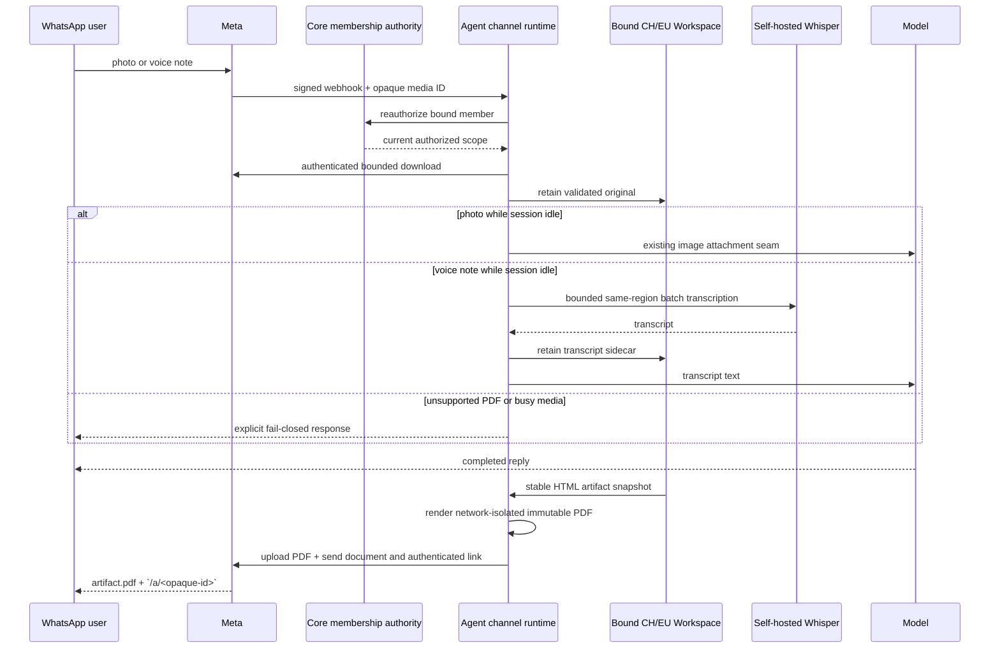

# WhatsApp Slices 4 and 5 — what changed, visually

**Code/proof revision:** `8720992e7a0a4b0e14a01a0d056e218d25dfa415`  
**Base:** `e848867995a4d2e1a5236c0ca48dee845ad6cd4a`  
**PR:** [#1575](https://github.com/hachej/boring-ui/pull/1575)

## Files and ownership

```diff
 packages/
 ├── agent/src/server/channels/
+│   ├── channelArtifactDeliveryService.ts  # stable capture, isolated PDF, authenticated share
+│   ├── channelInboundMediaService.ts      # authorize, validate, retain, transcribe, attach
+│   └── channel{Inbound,Outbound}Service.ts # durable admission and delivery integration
 ├── channels/whatsapp/src/
+│   └── index.ts                           # Meta download, PDF upload, document/link sends
 └── core/src/app/server/
+    └── whatsappChannelComposition.ts      # app authority and real adapter composition

 plugins/live-transcription/src/server/
+├── dictation.ts                           # bounded self-hosted batch-file transcription
+└── index.ts                               # supported server export

 apps/full-app/
+├── src/server/whatsapp.ts                 # owner-configured media/artifact runtime wiring
+└── Dockerfile                             # transcription + Chromium production runtime
```

## Calls and fail-closed decisions

```diff
 assistant message-end
+  HTML file part (default/user Workspace binding only)
+    ChannelOutboundService.publishArtifacts
+      ChannelArtifactDeliveryService.publish
+        current bound Workspace → stat/read/stat stable snapshot
+        offline/JS-disabled/DNS-blocked headless Chromium → immutable PDF bytes
+        current-membership reauthorization per effect → authenticated ShareEntryStore → safe live-file attachment at `/a/<opaque-id>`
+        WhatsAppCloudAdapter → private media upload → document + HTTPS link

 signed WhatsApp webhook
-  normalized text → durable queue → prompt/follow-up
+  normalized text + opaque media descriptor → durable queue
+    current Core membership authorization (before media effects)
+      bounded bearer-auth Meta download (no redirect/untrusted host)
+      MIME + magic-byte validation
+      bound CH/EU Workspace retention
+        image → existing Workspace-relative attachment + idle-only prompt
+        audio → retained original + same-region loopback Whisper + transcript prompt
+        PDF → explicit unsupported reply; no download
+        busy image/audio → explicit resend reply; no download or attachment
```

## Shipped flow



## Deliberate boundaries

```text
owner-only      Meta permissions · credentials · target deployment · deploy/release authority
not introduced  public unauthenticated links · capability secrets in URLs · US media processor
rollback        revert PR and keep BORING_AGENT_CHANNELS disabled; no migration or deletion
UI evidence     N/A: base-to-head has no browser UI source change; behavior is headless transport
```
