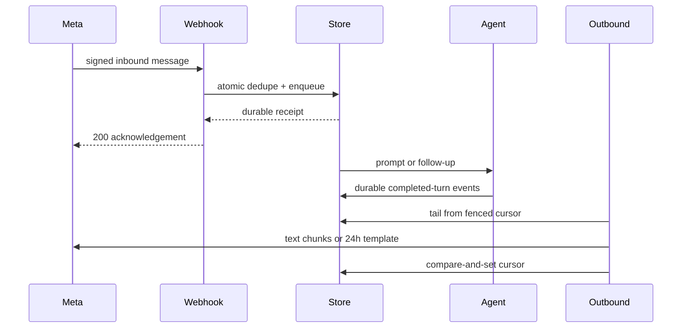

# WhatsApp Channel — what changed at `d970f93e`

## Runtime shape

```diff
+ apps/full-app
+ ├─ config + credential lease ───────────────────────────────┐
+ └─ /api/channels/whatsapp/webhook                           │
+                                                            ▼
+ packages/core app host ── packages/agent channel runtime ── Meta edge
+   ├─ durable binding, inbound queue, dedupe, leases
+   ├─ completed-turn assembly + cursor-fenced outbound
+   ├─ in-chat approval claim/answer routing
+   └─ restart reconciliation + fail-closed revocation
+
+ packages/channels/whatsapp
+   ├─ raw-byte HMAC + challenge verification
+   ├─ WhatsApp parse/render + 4096-safe chunking
+   └─ Graph text/template sends + bounded retry
```

## Shipped flow



## Delivered repository shape

```diff
+ packages/agent/                 # durable channel runtime and storage
+ packages/channels/whatsapp/     # thin Meta Cloud API edge
+ packages/core/                  # app-host composition
+ apps/full-app/                  # opt-in configuration and webhook route
+ docs/issues/1127/               # plan and exact-head owner visuals

 build:packages
+  build packages/channels/* before Core/full-app composition checks
```

## Review boundaries

```diff
+ Provisioned senders only; unknown/removed senders fail closed
+ Feature unreachable when BORING_AGENT_CHANNELS is off
+ Inbound: durable exactly-once enqueue by provider message ID
+ Outbound: at-least-once send, cursor fenced after delivery
+ Outside 24h: approved utility template fallback
+ Owner approval: claim-fenced answer routing in chat
- Self-serve channel signup
- Horizontal adapter scale-out
- Live Meta pilot before owner App Review clears
```

## Exact-head proof

PR #1550 at `d970f93e05b4d021bff7e69fe42e446578573d56` has successful Lint, Typecheck, Unit Tests Changed, Unit Tests, Invariants, E2E, bundle budgets, UI Review, reference/remote-worker smoke, workflow invariants, and PR Fast Summary checks. Exact-SHA adversarial review approved with no findings.
