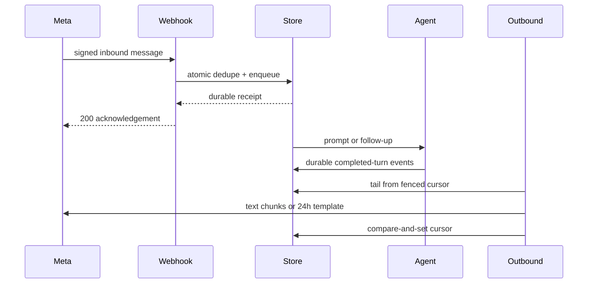

# WhatsApp Channel — what changed at `e45248ade`

## Runtime shape

```diff
+ apps/full-app
+ ├─ config + credential lease ───────────────────────────────┐
+ └─ /api/channels/whatsapp/webhook                           │
+                                                            ▼
+ packages/core app host ── packages/agent channel runtime ── Meta edge
+   ├─ durable binding, inbound queue, dedupe, leases
+   ├─ completed-turn assembly + cursor-fenced outbound
+   ├─ in-chat approval claim/answer routing
+   └─ restart reconciliation + fail-closed revocation
+
+ packages/channels/whatsapp
+   ├─ raw-byte HMAC + challenge verification
+   ├─ WhatsApp parse/render + 4096-safe chunking
+   └─ Graph text/template sends + bounded retry
```

## Shipped flow



## Clean-install CI shape

```diff
 build:packages
   build packages/agent
+  build packages/channels/*
   build packages/core

 lint
+  resolve @hachej/channel-whatsapp from its built package entry
+  validate the intentional Agent Host channel-runtime exports
```

## Review boundaries

```diff
+ Provisioned senders only; unknown/removed senders fail closed
+ Feature unreachable when BORING_AGENT_CHANNELS is off
+ Inbound: durable exactly-once enqueue by provider message ID
+ Outbound: at-least-once send, cursor fenced after delivery
+ Outside 24h: approved utility template fallback
+ Owner approval: claim-fenced answer routing in chat
- Self-serve channel signup
- Horizontal adapter scale-out
- Live Meta pilot before owner App Review clears
```

## Exact-head proof

PR #1550 is green at `e45248adec55254e60ed94fa74b3a67239a09f49`: Lint, Typecheck, Unit Tests Changed, Unit Tests, Invariants, E2E, bundle budgets, UI Review, and PR Fast Summary all completed successfully.
