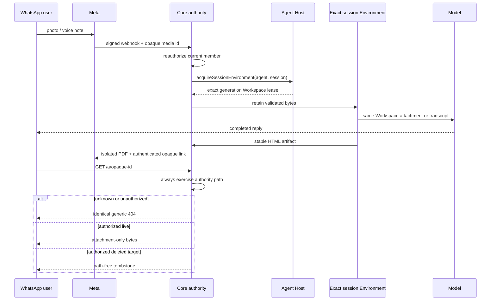

# WhatsApp Slices 4 and 5 — what changed, visually

**Code/proof revision:** `f34405ba48c409d1859e9f7630019cfb0aff72ba`

**Current main:** `75b3d051157a32c3f960fa452da54704451fb049`
**PR:** [#1575](https://github.com/hachej/boring-ui/pull/1575)

## Files and ownership

```diff
 packages/
 ├── agent/src/server/channels/
+│   ├── channelArtifactDeliveryService.ts  # stable capture, isolated PDF, authenticated share
+│   ├── channelInboundMediaService.ts      # validate, retain, transcribe, attach
+│   └── channel{Inbound,Outbound}Service.ts # durable session admission and delivery
+├── agent/src/server/http/routes/deepLink.ts # opaque, membership-gated attachment route
 ├── channels/whatsapp/src/index.ts          # Meta download, PDF upload, document/link sends
 └── core/src/app/server/
+    ├── whatsappChannelComposition.ts       # Core authority + exact session Environment lease
+    └── coreAgentHostEnvironmentRoutes.ts   # lazy share authorization with denial parity

 plugins/live-transcription/src/server/
+└── dictation.ts                            # bounded self-hosted batch transcription

 apps/full-app/
+├── src/server/whatsapp.ts                  # owner-configured channel policy
+└── Dockerfile                              # transcription + Chromium runtime
```

## Calls and fail-closed decisions

```diff
 /a/<opaque-id>
- unknown id -> immediate 404
- existing id -> Core membership -> 401/403 (existence oracle)
+ unknown id -> same Core authority path using an impossible empty workspace binding -> generic 404
+ existing id + anonymous/nonmember -> real workspace membership denial -> identical status/body/headers
+ existing id + member -> exact active runtime Workspace -> attachment-only bytes
+ deleted target + member -> path-free tombstone
+ Workspace outage/permission/transport failure -> operational 5xx, never a false tombstone

 signed WhatsApp webhook
+ durable binding/session allocation
+ Core reauthorizes current membership
+ AgentHost.acquireSessionEnvironment(agentTypeId, sessionId)
+   exact provider generation Workspace
+     photo bytes -> workspace:// attachment -> model reads the same bytes
+     voice bytes -> same-region transcript -> model

 assistant HTML artifact
+ addressed session Environment -> stable snapshot -> network-isolated PDF
+ per-effect membership reauthorization -> opaque authenticated link
```

## Shipped flow



## Risk and boundaries

```text
protected triggers  authentication · membership · tenant disclosure · media retention/residency
                    public Agent/Core contract · 1,043 package production changed lines (>500)
package arithmetic  966 additions + 77 deletions = 1,043
excluded numerically tests/docs/generated/snapshots (still reviewed)
owner-only          Meta permissions · credentials · target deployment · deploy/release authority
rollback            revert PR and keep BORING_AGENT_CHANNELS disabled; no migration or deletion
UI evidence         N/A: no browser UI behavior or appearance changed; this is a server/channel surface
```
