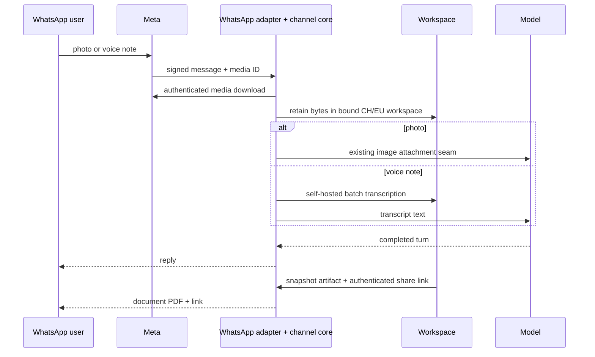

# WhatsApp Slices 4 and 5 — plan, visually

**Gate 1 candidate · Epic `epic-whatsapp-channel-1ve3` · branch `epic/whatsapp-channel`**

## Structure

```text
packages/
├── agent/src/server/channels/       # artifact/media orchestration; durable inbound/outbound
├── channels/whatsapp/               # Meta media download + document/image/audio wire format
├── workspace share-resource seam    # authenticated link to bound workspace artifact
└── plugins/live-transcription/      # supported self-hosted batch-file transcription seam

docs/issues/1127/
├── delivery-plan-slices-4-5.md
├── proof + browser/runtime evidence
└── present-pr.html
```

## Behavior



## Dependency and change shape

```diff
 [WhatsApp Slices 4 and 5] Epic
+├── Complete Meta App Review (.1, owner-only, parallel)
+├── Decide/perform app-host deploy (.2, owner-only, parallel)
+└── Add artifact share-link + PDF (.3)
+    └── Add inbound photos + voice notes (.4)
+        └── Reconcile main, prove, review, open PR, route (.5)

- text and approval messages only
+ authenticated snapshot links + WhatsApp PDF documents
+ photos through the existing image attachment seam
+ retained voice notes through self-hosted batch transcription
+ explicit fail-closed handling for unsupported/mid-turn media
```

## Boundaries

```text
Owner-only: Meta account permissions · credentials · target environment · deploy authority
Engineering: repository code/tests · exact-SHA sandbox proof · review · PR preparation
Forbidden: credential values in chat · public unauthenticated links · US media processing
           force-push · self-merge · proof waiver · deleting files
```
