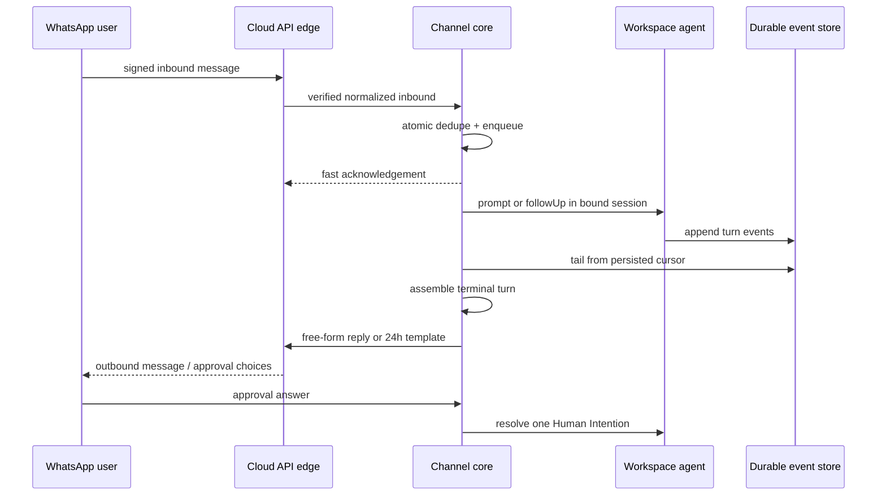

# WhatsApp Channel — plan, visually

**Status:** Gate 1 candidate
**Epic:** `whatsapp-channel` · `wt-391-forward-1127-channels-plan-4fv`
**Canonical plan:** `plan-whatsapp.md` r4.1, with `plan.md` r2.1 and `references/*`
**TL;DR:** Add one channel-neutral registry/core, prove it end-to-end with a fake channel, then connect a thin provisioned-only WhatsApp Cloud API edge.

## Structure — where responsibility lives

```text
packages/
├── agent/src/server/channels/     # registry, descriptors, bindings, inbound/outbound workers
├── agent/src/server/events/       # existing durable stream consumed by channel tail
├── agent/src/server/pi-chat/      # session turns and exported stream-path resolver
└── channels/whatsapp/             # thin Meta verify/parse/send adapter only

docs/issues/1127/
├── plan.md                         # r2.1 durable channel foundation
├── plan-whatsapp.md                # r4.1 owner-ruling delta and WhatsApp execution plan
└── references/                     # provider/auth research provenance
```

## Behavior — one durable conversation through two asynchronous directions



## Change shape — dependency-correct execution graph

```diff
 [WhatsApp Channel] Epic
+├── Land the reviewed plan (.9)
+│   └── Build channel core, bindings, inbound (.2)
+│       └── Build durable tail, turn assembly, outbound, 24h (.3)
+│           ├── Enable in-chat owner approval (.5)
+│           └── Build thin Cloud API adapter (.8)
+└── Complete Meta App Review submission (.1, owner-owned, parallel)
```

Meta approval gates only the live pilot receipt; recorded fixtures keep adapter implementation and proof unblocked.

## Decisions and boundaries

| Decision | v1 choice | Why |
|---|---|---|
| Identity | Provisioned pilot bindings; unknown senders fail closed | Avoids open-signup/auth and abuse risk |
| Durability | Direct durable-store tail with persisted cursor | UI replay is retention-window bounded |
| Delivery | Outbound at-least-once; cursor CAS after send | Meta has no idempotency key; no-loss is honest |
| 24-hour rule | Free-form inside window, one approved utility template outside | Matches Cloud API constraints |
| Approval | `ask_user` choices and exactly-once answer through channel | Owner can approve without opening Workspace |
| Provider edge | Thin in-house adapter behind generic core | Keeps provider behavior out of session orchestration |
| Scope | No self-serve signup, media, artifact drop, or human takeover | Those are phase 2/v2 |

## Proof and risk

| Risk | Mitigation / proof |
|---|---|
| Duplicate or lost inbound | Atomic dedupe+enqueue, restart and create-race tests |
| Long-offline outbound gaps | Durable replay test from persisted cursor |
| Duplicate outbound after crash | Explicit at-least-once contract; CAS prevents cursor divergence |
| Expired WhatsApp reply window | Template-fallback test |
| Cross-tenant identity error | Provisioned-only lookup, fail-closed unknown sender test |
| Meta review delay | Fixture-backed exchange; owner-owned review lane runs in parallel |

Gate 2 requires workspace and agent suites green, invariants green, a recorded fake-channel end-to-end run, and a live pilot-number exchange receipt if Meta review has cleared.
