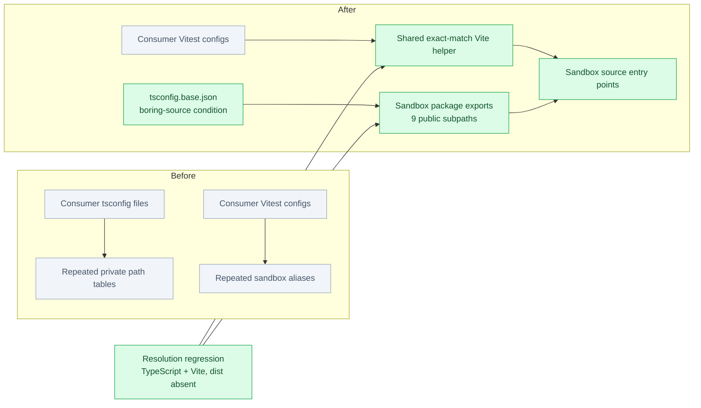
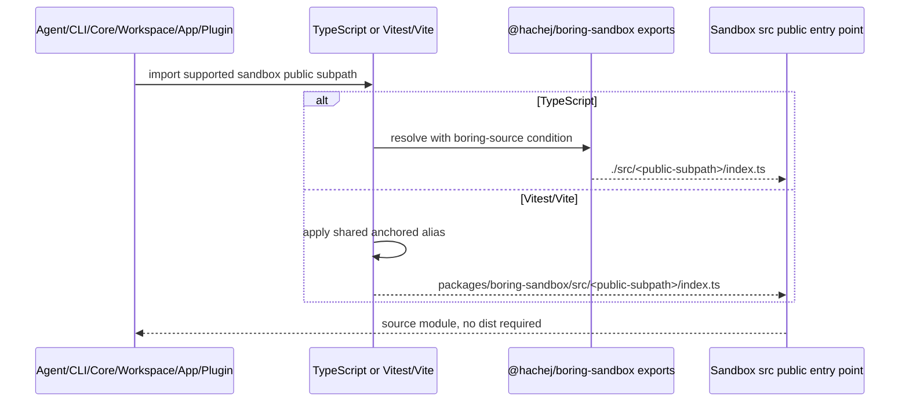

# [Sandbox Alias Cleanup] What changed, visually

**Status:** reviewed and CI-green · **Risk:** PROTECTED · **UI:** N/A

**Issue:** [#1240](https://github.com/hachej/boring-ui/issues/1240) · **PR:** [#1256](https://github.com/hachej/boring-ui/pull/1256) · **Bead:** `wt-391-forward-o56o.3`

**Base:** `68dcb7db8822f721c6b45d0731e01a46fa364f28` · **Reviewed code head:** `67f17095ec0ff068c86ed247dd2d5d627a610aab`
**TL;DR:** Sandbox source resolution is now declared by the sandbox package and consumed through one exact public-subpath alias instead of repeated private path tables.

## Changed-component map



## Actual shipped shape

```diff
 source resolution
-├── packages/{agent,cli,core,workspace}/tsconfig*.json
-│   └── repeated @hachej/boring-sandbox/* → ../boring-sandbox/src/* mappings
-├── apps + packages + plugin vitest.config.ts
-│   └── repeated provider-specific source aliases
+├── tsconfig.base.json
+│   └── customConditions: ["boring-source"]
+├── packages/boring-sandbox/package.json
+│   └── boring-source targets for exactly 9 declared public subpaths
+├── scripts/vite-sandbox-alias.ts
+│   └── one anchored exact-match alias over those same 9 subpaths
+└── packages/boring-sandbox/src/__tests__/sourceResolution.test.ts
+    ├── TypeScript package-export resolution with dist absent
+    ├── real Vite resolver coverage for every supported subpath
+    └── package root + private/deep subpaths remain unreplaced
```

The shipped code does **not** add the rejected runtime descriptor registry, host-policy coupling, runtime-mode widening, or remote-worker behavior changes from the earlier branch shape. Those concerns were removed while preserving current-main behavior.

## Resolution flow



## Annotated walkthrough

<details>
<summary><code>packages/boring-sandbox/package.json</code> — package-owned contract</summary>

Adds `boring-source` only to the nine already-declared public subpath exports. The package root is intentionally unchanged; `vite` is added as a development dependency for the real resolver regression.
</details>

<details>
<summary><code>scripts/vite-sandbox-alias.ts</code> — shared test/build resolver</summary>

Exports one provider-agnostic alias generated from the same nine supported subpaths. Anchors prevent accidental rewriting of package-root or private deep imports.
</details>

<details>
<summary><code>tsconfig.base.json</code> and consumer tsconfigs — TypeScript path subtraction</summary>

Enables the package export condition and removes repeated sandbox source path arrays from Agent, CLI, Core, Workspace, apps, and Automation consumers.
</details>

<details>
<summary>Consumer Vitest configs — shared alias adoption</summary>

Imports the helper and removes duplicated provider-specific sandbox aliases while preserving each consumer's unrelated local aliases.
</details>

<details>
<summary><code>packages/boring-sandbox/src/__tests__/sourceResolution.test.ts</code> — boundary proof</summary>

Invokes TypeScript and Vite's actual resolvers for all supported subpaths and verifies root/private imports are not captured.
</details>

## Risks

| Risk | Likelihood | Impact | Mitigation |
|---|---:|---:|---|
| A supported package export condition changes public package resolution | Low | High | PROTECTED owner route; exact-subpath allowlist; package-owned exports; independent abstraction PASS |
| Consumers accidentally resolve private sandbox paths | Low | High | Anchored alias plus negative root/private/deep-path tests |
| Source-only builds fail without generated `dist` | Low | High | Exact-SHA sandbox ran with `packages/boring-sandbox/dist` absent; focused 10-test resolver suite and affected typechecks passed |
| Current-main behavior is lost during salvage | Low | High | Base is the exact merge-base/ancestor; merge-tree is conflict-free; runtime/remote-worker paths are absent from the diff |

## Test coverage

| Area | Tests added/changed | Automated verification | Gaps |
|---|---|---|---|
| Sandbox package exports | 10-case source-resolution suite | TypeScript + real Vite resolution, root/private rejection | None known |
| Downstream consumers | Config migration | Agent, CLI, Core, Workspace front/server, Automation, full-app, and agent-playground typechecks | No behavioral UI scenario needed |
| Repository gates | N/A | Invariants, import audit, build/bundle, E2E, affected unit tests, reference image/remote-worker smoke | None open |
| UI | None | CI UI Review passed | Before/after video N/A because no UI behavior or appearance changed |

## Reviewer checklist

- [ ] Are `boring-source` exports limited to the nine already-public sandbox subpaths?
- [ ] Does the Vite alias use exact matches and leave root/private/deep imports alone?
- [ ] Do consumers retain all unrelated aliases while deleting only sandbox duplication?
- [ ] Is the rejected runtime/authority redesign absent from the base-to-head diff?
- [ ] Is the owner comfortable approving the public package-resolution condition at reviewed SHA `67f17095e`?

## Proof links

- [CI run 34159604603 — SUCCESS](https://github.com/hachej/boring-ui/actions/runs/34159604603)
- [Workflow Invariants 34159604515 — SUCCESS](https://github.com/hachej/boring-ui/actions/runs/34159604515)
- Final independent review: session `bfd3a5f6-5ee2-4f35-b906-f18edce14859`, `openai-codex:gpt-5.6-sol`, exact SHA `67f17095ec0ff068c86ed247dd2d5d627a610aab`, APPROVED; standards/spec PASS, thermo PASS, explicit cross-package abstraction PASS.
- Package-production churn: **151 lines** (`+50/-101` across 12 production files under `packages/`; focused test excluded).
- Historical read-only lineage: `wt-391-forward-pr-1256-r2-research-reconcile-e9t9`.

## Owner validation

From a clean checkout of the delivered branch head:

```bash
mv packages/boring-sandbox/dist /tmp/boring-sandbox-dist-pr1256 2>/dev/null || true
pnpm --filter @hachej/boring-sandbox exec vitest run src/__tests__/sourceResolution.test.ts
pnpm --filter @hachej/boring-sandbox typecheck
mv /tmp/boring-sandbox-dist-pr1256 packages/boring-sandbox/dist 2>/dev/null || true
```

Expected: the focused suite passes **1 file / 10 tests**, sandbox typecheck passes, all nine public subpaths resolve to source, and package-root/private imports are not rewritten.

## Rollback

Before merge, decline/close PR #1256. After merge, revert the PR's merge commit as one unit; this restores the per-consumer TypeScript/Vitest mappings and removes the `boring-source` export condition/helper. There is no runtime flag and no data migration. A release/publish, if any, remains a separately authorized action.
