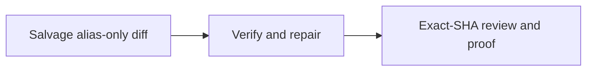

# [Sandbox Alias Cleanup] Plan, visually

**Status:** Gate 1 approved; implementation in progress
**Epic:** `pr-1256-sandbox-alias-cleanup` · **PR:** #1256 · **Current head:** `2d82adf`
**TL;DR:** Keep the alias cleanup; remove the mixed runtime authority refactor; validate the narrowed PR against current main.

## What changes shape

```diff
 PR #1256 today (94 files; two concerns)
 ├── alias/source resolution
 │   ├── tsconfig.base.json: boring-source condition
 │   ├── packages/boring-sandbox/package.json: source exports
 │   ├── scripts/vite-sandbox-alias.ts
 │   └── consumer tsconfig/Vitest alias deletions
-└── runtime authority + mechanism refactor
-    ├── SandboxRuntimeModeDescriptorV1 registry
-    ├── provider descriptors carrying host policy
-    ├── Agent/Core/Workspace/Governance policy consumers
-    └── remote-worker V0/V1 mode widening
+
+PR #1256 after salvage
+└── alias/source resolution only
+    ├── one TypeScript export condition
+    ├── one provider-agnostic Vitest helper
+    └── fewer duplicated consumer aliases
```

## Why the split is required

```mermaid
flowchart LR
  Config[Consumer build/test config] -->|supported package export| Sandbox[@hachej/boring-sandbox]
  Sandbox --> Mechanism[Provider mechanism facts]
  Host[Host application] --> Policy[Deployment/admission policy]
  Policy --> Runtime[Runtime composition]
  Mechanism --> Runtime
  Mixed[PR-added mixed descriptor] -. rejected by R-33-15 .-> Policy
  classDef keep fill:#dcfce7,stroke:#16a34a,color:#14532d;
  classDef remove fill:#fee2e2,stroke:#dc2626,color:#7f1d1d;
  class Config,Sandbox,Mechanism,Host,Policy,Runtime keep;
  class Mixed remove;
```

R-33-15 says Sandbox may describe mechanism facts, while production admission, scope issuance, extensions, company-context access, provisioning, and persistence remain explicit host/deployment policy. The current PR mixes those classes.

## Delivery flow

```mermaid
sequenceDiagram
  participant W1 as Salvage Worker
  participant Main as origin/main
  participant W2 as Verification Worker
  participant R as Independent Reviewer
  participant PR as PR #1256
  W1->>Main: merge current main without force-push
  W1->>W1: retain alias cleanup; remove rejected runtime half
  W1-->>W2: committed narrow candidate + handoff
  W2->>W2: typecheck, tests, invariants, source-resolution proof
  W2-->>R: exact committed SHA
  R->>R: standards/spec + thermo + abstraction review
  R-->>PR: PASS verdicts, CI/proof, present-pr artifact
  PR-->>PR: exact-SHA protected merge card if required
```

## Dependency graph



## Decisions

| Decision | Chosen | Why |
|---|---|---|
| Existing PR or new PR | Existing PR #1256 | Owner forbids opening another PR |
| Alias cleanup | Keep | Mechanical subtraction with clear proof seams |
| Runtime descriptor registry | Remove/revert from this PR | Contradicts ratified authority/mechanism split |
| Runtime-mode catalog | Exclude | Avoid widening `remote-worker` before V0/V1 collapse |
| Current-main reconciliation | Merge, never force-push | Preserve branch history and main's later hardening |
| UI video | N/A unless final diff changes UI | Planned scope is config/package resolution only |

## Risks

| Risk | Likelihood | Impact | Mitigation |
|---|---:|---:|---|
| Merge resolution drops current-main remote-worker/Agent Seats behavior | Medium | High | Narrow salvage, inspect semantic conflicts, run current-main integration tests |
| Removing PR-added files exceeds owner deletion constraint | Certain | Medium | Gate 1 explicitly requests permission only for PR-added rejected runtime files |
| Source exports fail when sandbox `dist` is absent | Medium | High | Clean source-resolution simulation plus real consumer checks |
| Final diff still crosses package/public boundary | Medium | High | Exact-SHA abstraction review and protected Gate 2 |
| Stale CI appears green but no longer matches main | High | High | Re-run at final SHA and validate integration candidate against then-current main |

## Proof path

1. Confirm conflict-free merge with current `origin/main` on `fix/1240-alias-cleanup`.
2. Inventory final base-to-head diff and verify rejected runtime symbols/behavior are absent.
3. Run affected package build/typecheck/unit suites, `pnpm lint:invariants`, import checks, and sandbox-source resolution with `dist` absent.
4. Obtain fresh exact-SHA standards/spec and thermo review with explicit abstraction **PASS**.
5. Push only the existing branch; attach CI, proof comment, and `.agents/skills/present-pr/` deliverable.

**References:** [Plan](plan.md) · PR #1256 · issue #1240 · lineage `wt-391-forward-pr-1256-r2-research-reconcile-e9t9` · ratified R-33-15.
