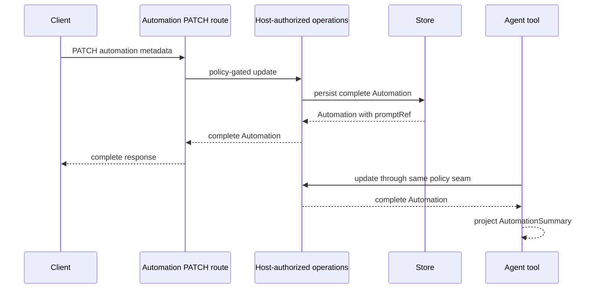

# Durable Factory Dispatch Retry — what changed

Exact code SHA: `699312febf52fd58164bfa576cc2e61da11f9495`  
Base: `e848867995a4d2e1a5236c0ca48dee845ad6cd4a`

## Contract and control-flow diff

```diff
 PATCH /automations/:id
- operations.update(): Promise<AutomationSummary>
- return automationSummary(automation)  # promptRef lost
+ operations.update(): Promise<Automation>
+ return automation                     # complete public response
+ agent tool applies automationSummary  # promptRef remains withheld there

 accepted dispatch ambiguity
- outcome-unknown could occupy forever
+ confirmed cancel settles matching occupancy
+ stale ambiguity reconciles after a bounded five-minute interval

 standing factory seeds
- active records could retain stale host model
+ host policy reconciles model only
+ operator title/enabled/timezone edits remain intact

 loaded CLI test
- assert mount count before React effect completes
+ wait for the required mount effect
+ retain exact 5-plugin / 1-mount / 0-unmount assertions
```

## Shipped flow



## Proof shape

```text
origin/main e84886799
  └── exact head 699312feb
      ├── tracker: 653 records / 653 unique / 0 duplicates
      ├── GitHub CI 34413527746: PASS
      ├── Workflow Invariants 34413527745: PASS
      ├── standards/spec: PASS
      ├── thermo: PASS
      └── package abstraction: PASS
```

Risk route: protected owner review because the PR changes the public `Automation` response contract and automation/host authority behavior. Rollback is a forward revert; never rewrite history.
