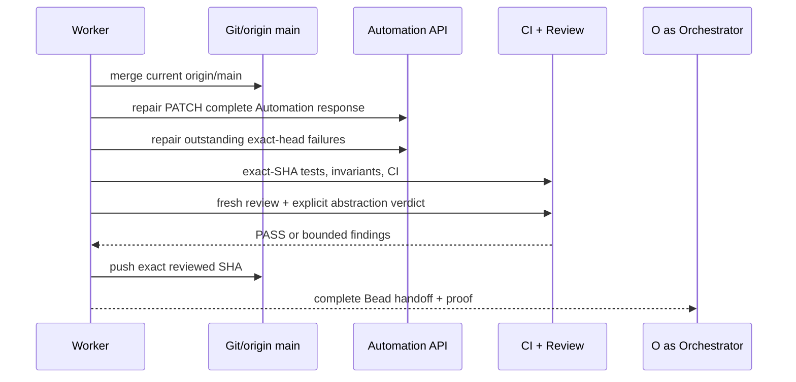

# Durable Factory Dispatch Retry — plan, visually

## Structure

```text
PR #1288 / br-1276-orchestrator-plugin
├── merge origin/main                 # conflict-free integration base
├── plugins/boring-automation/
│   ├── server/routes + operations    # PATCH complete Automation contract
│   ├── store/reconciliation          # bounded durable occupancy behavior
│   └── tests                         # parent-red contract + channel regressions
├── exact-SHA checks + GitHub CI
├── independent fresh review          # standards + thermo + abstraction PASS
└── present-pr + final risk route
```

## Behavior



## Change shape

```diff
 PR #1288
-  conflict-dirty at 14e64561f
-  PATCH may return AutomationSummary and drop promptRef
-  exact-head unit/channel CI red
-  latest abstraction review BLOCKED
+  current origin/main merged normally and pushed
+  PATCH returns complete Automation with regression proof
+  all exact-head CI green without weakened assertions
+  fresh independent standards/thermo review
+  Abstraction review: PASS at the exact final SHA
+  durable present-pr proof and final risk classification
```
