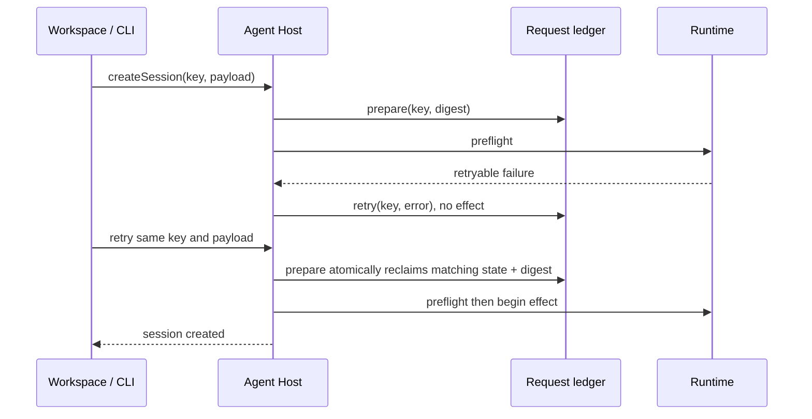

# [Agent Package Lifecycle] Revalidated current-head candidate

**PR:** [#1310](https://github.com/hachej/boring-ui/pull/1310)
**Previously approved head (invalidated by drift):** `dbdcdf41ee9992f6ec4ec7d4ad31a04f65c3e87e`
**Externally advanced head:** `63295636ce286e9df6c2d53378aa01c13fd7fcc9`
**Reviewed code/integration candidate:** `a10ab3f5274d13d15a1db41d1f0090ec40502499`
**Integrated main:** `65c1059e7d5f0282dae4f988fbdff1bc29373b63`
**Route:** **PROTECTED** — public Agent API and package-boundary contracts changed; owner Gate 2 must be re-raised for the new artifact head.

## External drift — what advanced after approval

```diff
 approved PR head dbdcdf41
+ fc597fcd  changed-workspace verification (main)
+ a35727d0  Factory host polling (main)
+ a8180e43  WhatsApp channel runtime (main)
+ 0889bf79  Bead ledger union merge (main)
+ 17d9d03c  toast delivery (main)
+ 3a594dce  plugin singleton exports (main)
+ 63295636  merge dbdcdf41 + main@3a594dce (external branch push)
+ 65c1059e  transcription quality (subsequent main drift)
+ a10ab3f5  merge current main@65c1059e (this revalidation)
```

The `dbdcdf41..63295636` delta is **main integration, not a docs-only or new PR-authored feature delta**: six commits authored by Julien Hurault were integrated by merge commit `63295636` authored by hachej. It includes broad product code from main (Agent channel/runtime composition, WhatsApp, CLI/core singleton exports, UI toast delivery, Factory host and changed-workspace tooling) plus tests/docs/metadata. The follow-up `a10ab3f5` integrates the later main commit `65c1059e` without source conflicts.

## Structure — the PR-owned boundary remains unchanged against current main

```diff
 Workspace / CLI / standalone composition
   discover package descriptors
   @hachej/boring-agent/server
-    one invalid configured package can abort unrelated Agents
+    invalid packages are diagnosed/excluded while valid siblings boot
+    absent fleet config falls back; malformed present config stays fatal
     Agent catalog
-      version may disappear or gain a fabricated digest
+      version remains; digest appears only when supplied/computed
     AgentGateway
-      retryable preflight can permanently occupy a request key
+      retryable pre-effect state is atomically reclaimable
       AgentRequestLedger (public contract)
+        prepare(key, payloadDigest) + retry(key, error)
         ├── in-memory implementation
         └── SQLite state-qualified CAS implementation
```

## Sequence — same-key retry before effects



## Deterministic classification

```text
Complete candidate diff: 65c1059e...a10ab3f5
Package production:      144 additions + 41 deletions = 185
Excluded from size only: 533 additions + 109 deletions = 642
                         (tests, fixtures, package docs)
Size trigger:             185 <= 500 -> does not match
Protected triggers:       public Agent API/contracts + package-boundary behavior
Result:                   PROTECTED -> owner Gate 2 required
```

The production count includes the published gateway conformance helper. Tests, fixtures, docs, generated output, and `.beads` are excluded only from the numerical threshold; they remain reviewed. No auth, billing, permissions, secrets, migration, deletion-heavy, shared-design-system, release, or policy-authority trigger was found in the PR-owned current-main diff.

## Exact-SHA proof and review

- Sandbox `6bfe0dd6-8be1-46c8-b20b-c35be739337a` verified `.factory-sha` and HEAD `a10ab3f5`.
- Agent lifecycle/gateway/standalone/conformance plus main-overlap suites: **10 files, 128 passed / 6 skipped, no type errors**.
- Agent playground gateway smoke: **1 passed**.
- CLI Agent-host composition: **12 passed** after building its normal Workspace/tasks package artifacts; the first attempt's missing built package was an environment setup failure, not an assertion failure.
- Workspace server/package-discovery consumers: **2 files, 69 passed**.
- Agent, CLI, and Workspace typechecks: **PASS**.
- `pnpm audit:imports`, `pnpm lint:invariants`, `git diff --check 65c1059e...a10ab3f5`, and merge-base/ancestry checks: **PASS**; branch was `0 behind / 22 ahead` at proof time.
- Independent exact-head review: fresh session `45b928aa-20f3-4b8d-af9e-1395c0a46d5b`, model `openai-codex/gpt-5.6-sol`, brief digest `sha256:c5d8e3fdd70c573443871e713715bca00b57da0e60f28bd3703f853291e2f8cc`. Standards/spec and thermo found no code defect; **cross-package abstraction PASS** after inspecting real Agent producers and Workspace/CLI/standalone/playground consumers. Its sole blocking finding was stale proof/artifacts, fixed by this document, the refreshed presentation, and the revision-bound PR proof.

## Owner validation

1. Open `.handoff/pr-1310-presentation.html` and confirm the external-head/current-main drift is explicit.
2. Inspect the public ledger and fleet flow above against the linked production paths.
3. Confirm final artifact-head CI is green and GitHub reports `MERGEABLE/CLEAN`.
4. Approve or request changes only for the exact artifact head named in the refreshed PR body.

**Rollback:** before merge, defer/close the PR. After merge, revert the PR merge commit through protected main. No publish, release, deployment, migration, or deletion is authorized.
