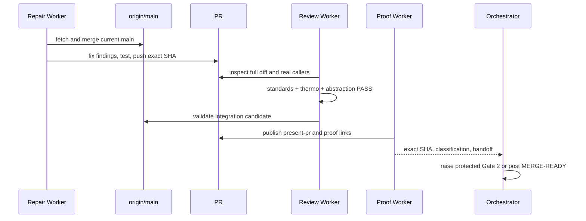

# [Agent Package Lifecycle] Plan, visually

**Status:** Ready for Gate 1 · **Epic:** `wt-391-forward-0ms8` · **PR:** #1310  
**TL;DR:** Repair the existing package lifecycle PR against current main, independently prove its public seams, then prepare one revision-bound delivery decision.

## 1. Structure — where the work lands

```text
packages/
├── agent/
│   ├── src/server/agentDefinition/   # fleet discovery, seating, defaults
│   ├── src/server/agent-host/        # catalog, describe, effect lifecycle
│   └── docs/                         # public Agent package contracts
├── cli/src/server/                   # real Agent-host consumer proof
└── workspace/src/                    # real server/discovery consumer proof
apps/workspace-playground/src/server/ # startup behavior regression proof
docs/issues/1310/                     # plan and revision-bound proof views
```

## 2. Behavior — dependency and review flow



## 3. Diff-shaped target — what changes from today's state

```diff
 PR #1310 @ 370e1ba
-78 commits behind current origin/main
-stale review/proof tied to earlier revisions
-unresolved absent-config/per-package isolation finding
-retryable response may replay permanent same-key rejection
-version disappears when digest is unavailable
+current-main merge with no force-push
+ratified sibling-survival and absent-config behavior restored
+real idempotency retry contract covered
+version-only catalog projection preserved
+affected package checks and GitHub CI green
+exact-SHA standards, thermo, and abstraction PASS
+canonical present-pr + revision-bound proof + risk route
```

## Beads

| Bead | Slice | Depends on | Exit evidence |
|---|---|---|---|
| `wt-391-forward-0ms8.1` | Repair lifecycle contracts and tests | — | pushed SHA, tests/checks, complete handoff |
| `wt-391-forward-0ms8.2` | Review abstraction and integration candidate | `.1` | exact-SHA review PASS and current-main validation |
| `wt-391-forward-0ms8.3` | Package proof and delivery handoff | `.2` | present-pr, proof links, deterministic classification |

## Decisions and risks

| Decision / Risk | Chosen mitigation |
|---|---|
| Conflicting fleet-failure interpretations | Follow ratified #1107 per-package isolation; Gate 1 ratifies this plan |
| Public package/API seam | Treat as protected unless final exact-diff review proves otherwise |
| Main drift | Merge current main first and revalidate before delivery |
| Stale review after fixes | Review and all proof bind to the exact final SHA |
| Review budget | Maximum four rounds; ordinary findings return to repair |
| Destructive operations | No file deletion, force-push, merge, or branch replacement |

## Proof path

Affected Vitest suites and package typechecks → import/invariant checks → GitHub CI → independent standards/thermo/abstraction review → current-main integration validation → canonical present-pr and final risk classification.
