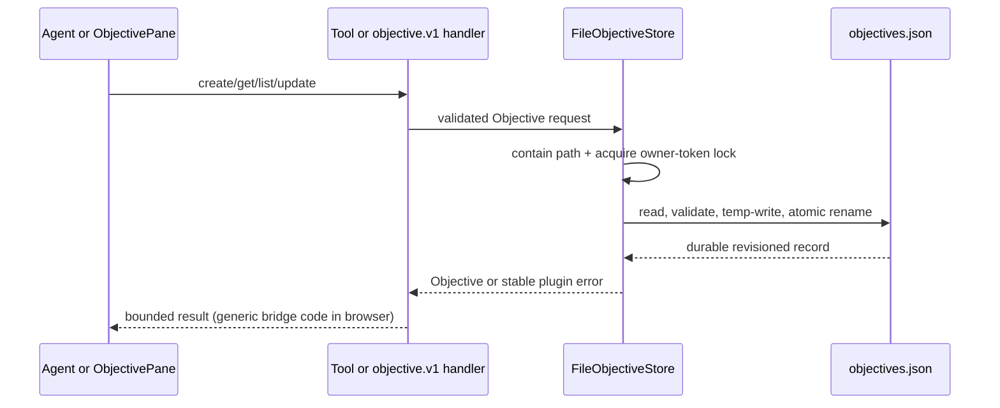

# [Objectives Plugin] What changed, visually

Revisions: base `68dcb7db8822f721c6b45d0731e01a46fa364f28` → reviewed code `1a6c4158dde1872e9b5bd989f27aa3d9f63d2b5c`.

## Structure

```diff
 plugins/objectives/
+├── src/shared/                 # Objective schema, bridge contract, stable error codes
+├── src/server/
+│   ├── objectiveStore.ts       # durable revisions, containment, locking, atomic commit
+│   ├── objectiveTools.ts       # four bounded agent operations
+│   └── objectiveBridgeHandlers.ts # objective.v1 trusted handlers
+└── src/front/
+    ├── client.ts               # paginated bridge client
+    └── ObjectivePane.tsx       # rehydrating workbench surface
+
+evals/factory/                  # real composition and objective behavior checks
+docs/issues/1382/               # plan, deterministic UI runner, revision proof
```

## Shipped call flow

```diff
 user / agent
+  objective_create | objective_update | objective_get | objective_list
+    createObjectiveTools
+      FileObjectiveStore
+        validate complete record and path containment
+        acquire owner-token lock
+        write temp JSON → atomic rename
+
 ObjectivePane
+  createObjectivesClient
+    objective.v1.get / objective.v1.list
+      Workspace generic bridge registry
+        createObjectiveBridgeHandlers
+          FileObjectiveStore
```

## Stable failure boundary

```diff
 raw filesystem/path failure
-  Node message and absolute path could escape a direct/tool seam
+  ObjectiveError(OBJECTIVE_STORE_IO | OBJECTIVE_PATH_ESCAPE | OBJECTIVE_LOCK_TIMEOUT)
+    public message: stable and path-free
+    cause: retained for trusted diagnostics only
+  WorkspaceBridge: canonical BRIDGE_HANDLER_FAILED / BRIDGE_INVALID_REQUEST
```

## Runtime sequence


