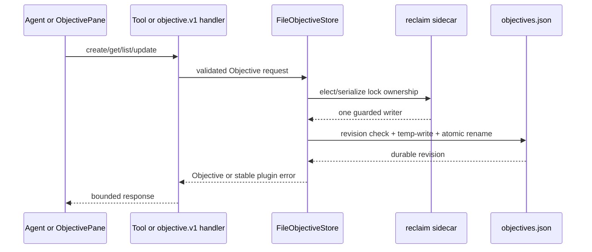

# [Objectives Plugin] What changed, visually

Revisions: authoritative base/current main `68dcb7db8822f721c6b45d0731e01a46fa364f28` → reviewed code `20c13de549a5871c09622bc93b66a77871510f20` → evidence assets `ddf4093e320fd3deb948147853a7f09f3e024c45`.

## Structure

```diff
 plugins/objectives/
+├── src/shared/                    # Objective schema, bridge contract, stable errors
+├── src/server/
+│   ├── objectiveStore.ts          # durable revisions, containment, guarded lock/commit
+│   ├── objectiveTools.ts          # four bounded agent operations
+│   └── objectiveBridgeHandlers.ts # objective.v1 trusted handlers
+└── src/front/
+    ├── client.ts                  # paginated bridge client
+    └── ObjectivePane.tsx          # rehydrating workbench surface
+
+evals/factory/                     # real composition and Objective behavior checks
+docs/issues/1382/                  # plan, deterministic UI runner, revision proof
+assets/objectives-plugin-final/    # preserved historical and post-race WebM/JSON proof
```

## Durable mutation and stale-lock serialization

```diff
 mutate Objective
   acquire main owner-token lock
-    concurrent stale reclaimers could each replace the lock
+    acquire `.lock.reclaim` with atomic `open("wx")`
+    only the elected reclaimer may replace the stale main lock
+  keep guard through token check + revision check + atomic commit + release
+  loser retries within the bounded acquisition loop
   validate complete UTF-8 Objective record
   temp write → atomic rename
   return durable revision
```

## Stable failure boundary

```diff
 raw filesystem/path failure
-  Node diagnostics or absolute paths could cross public seams
+  plugin-owned ObjectiveError with stable, path-free public message
+  raw diagnostics retained only in trusted Error.cause
+  generic WorkspaceBridge BRIDGE_HANDLER_FAILED / BRIDGE_INVALID_REQUEST at browser edge
```

## Runtime sequence



## Deterministic race proof

```text
stale lock + writer A + writer B
  elected reclaimer pauses before rename
  losing reclaimer returns false and retries
  writer A commits under guard
  writer B rereads revision and commits under guard
  final revision = 3; Seed + Writer A + Writer B all remain
```
