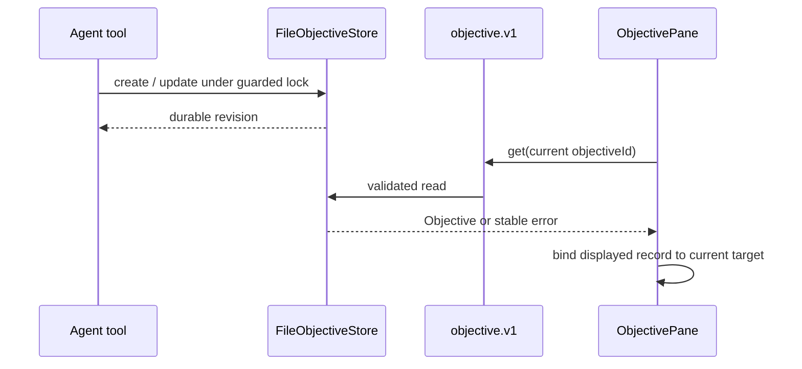

# [Objectives Plugin] What changed, visually

Revisions: authoritative base/current main `68dcb7db8822f721c6b45d0731e01a46fa364f28` → final code `422b2b12ce266ee8c829264050ad718fb8a0a7d9`.

## Target-bound display state

```diff
 ObjectivePane target A → B
   foreground get(B) starts
   background get(B) supersedes it
-  background failure preserved displayed A
-  foreground response was ignored, leaving A under target B
+  displayed records carry the objectiveId that loaded them
+  render accepts a record only when displayed.objectiveId === current objectiveId
+  background failure leaves B empty + error; A can never render under B
+  same-target background failure still preserves the current record + warning
```

## Exact combined schedule regression

```text
load A → display A
switch target to B → foreground B pending; A hidden immediately
visibility refresh → background B pending and newer generation
background B fails → loading clears; B error shown; A absent
foreground B succeeds late → ignored by generation; A and B both absent
```

## Durable Objective flow remains plugin-owned



## Boundary shape

```diff
 plugins/objectives/src/front/ObjectivePane.tsx
+ target-bound displayed state; request-generation guard unchanged
 plugins/objectives/src/front/__tests__/ObjectivePane.test.tsx
+ exact cross-target foreground/background failure interleaving
+ retained same-target background failure regression
 packages/**
  no production changes
 WorkspaceBridge / host composition
  unchanged; remains generic and host-owned
```
