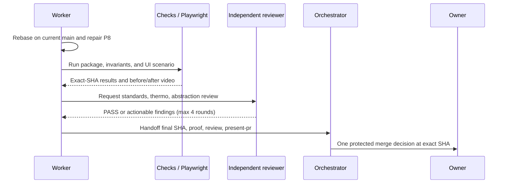

# [Objectives Plugin] Plan, visually

## Structure — what this lane touches

```text
PR #1382 · weekend/objectives-plugin
├── plugins/objectives/        # Objective store, bridge, tools, pane, tests
├── evals/factory/             # existing PR content; inspect/rebase conflicts
├── package.json / lockfile    # only if repair requires it
├── Playwright proof           # base/final scenario + before/after video
└── delivery evidence          # independent review, present-pr, PR proof
```

## Behavior — how delivery reaches an owner decision



## Diff-shaped target — what changes from today

```diff
 PR #1382 @ 9fcadae0
-  behind current main
-  Runtime Refactor P8: FAIL
-  prior proof/review not bound to current candidate
+  rebased onto current origin/main without force-push
+  P8 + package checks + invariants: PASS
+  Playwright before/after video + deterministic assertions
+  independent standards/thermo review
+  explicit package-abstraction: PASS
+  current-main integration validation
+  present-pr + one exact-SHA protected merge card
```
