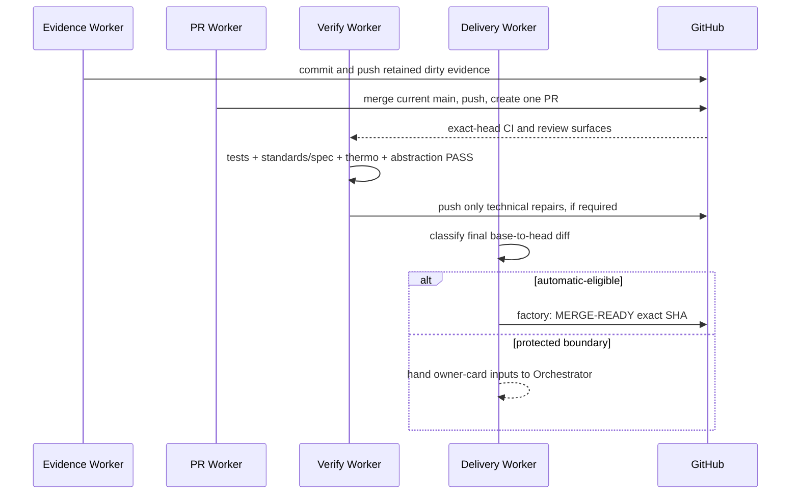

# [Command Palette Replay Delivery] Plan, visually

## Structure — delivery only; implementation is already complete

```text
epic/command-palette-replay @ 0dea40589
├── prior implementation + 5/5 replay evidence   # preserve, do not redo
├── dirty issue/Beads evidence                    # inspect, commit, 0 duplicate IDs
├── origin/main                                   # merge, no force-push
└── PR delivery
    ├── exact-head CI + independent review
    ├── present-pr + retained proof
    └── risk route: MERGE-READY or one owner card
```

## Behavior — dependency-correct path to the terminal state



## Diff shape — from stranded branch to auditable delivery

```diff
 epic/command-palette-replay
   completed command-palette replay fix
   retained 5/5 exact-source evidence
+  commit real pending planning/Beads evidence (never delete)
+  merge current origin/main and push without force
+  create the single main-targeting PR with present-pr artifact
+  bind CI, independent review, thermo, and abstraction PASS to final SHA
+  classify full final diff under protected-boundary policy
+  finish at MERGE-READY, or exactly one merge-approval card if protected
-  redo implementation or review from scratch
-  create another branch/PR, force-push, or merge
```

## Bead graph

```text
[Command Palette Replay Delivery] Epic · wt-391-forward-amnk
  .1 Preserve delivery evidence
    ↓ blocks
  .2 Integrate main and open PR
    ↓ blocks
  .3 Verify exact PR head
    ↓ blocks
  .4 Classify and hand off PR
```
