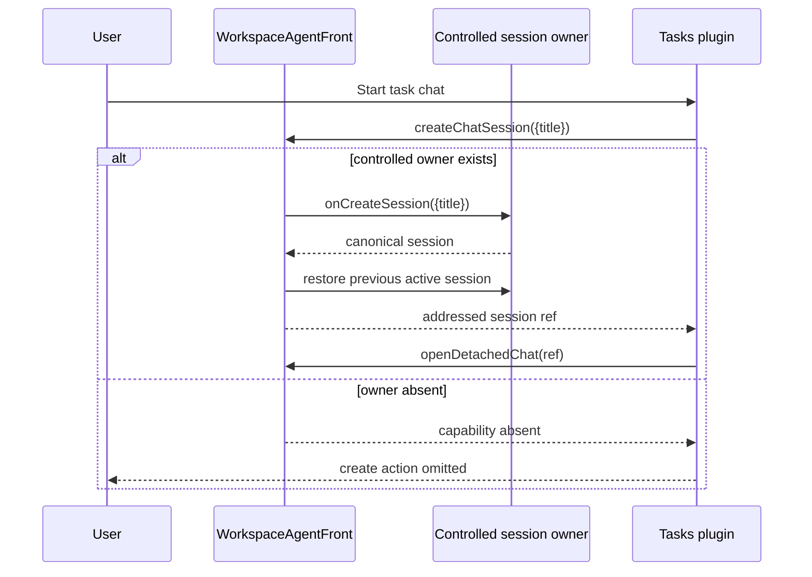

# PR 1577 — show me

Code revision: `1c16bc171219783098659c48e7b7c7ac2333d4d0`  
Base: `75b3d051157a32c3f960fa452da54704451fb049`

## Component and authority shape

```diff
 <WorkspaceAgentFront>                    # owns session inventory + mutations
+  controlled state? → require onCreateSession
+  validateCreatedSession(result)
+  restore previous active session for detached creation
   <WorkspaceShellCapabilitiesProvider>
-    createChatSession always advertised
+    createChatSession only when an owner exists
     <PluginTabsWorkspaceShell>
-      rail / pane / project / Agent create controls survive without an owner
+      rail / pane / project / Agent create controls omitted without an owner

 <TaskCard>                                # public Workspace capability consumer
-  Start new chat button always rendered
+  Start new chat only when createChatSession exists
```

## Call and file view

```diff
 .github/workflows/ci.yml
+  detect playground paths → bounded E2E job → required fast summary

 apps/workspace-playground/
+  playwright.config.ts                   # one worker, one CI retry, hard bounds
+  e2e/*.spec.ts                          # current shell/session/filesystem contracts

 packages/workspace/src/app/front/
+  WorkspaceAgentFront.tsx                # controlled ownership and canonical result
+  WorkspaceAgentFront.test.tsx           # missing-owner and controlled-owner matrix

 plugins/tasks/src/front/TaskCard.tsx
+  consume optional public create capability

 plugins/diagram/{package.json,tsconfig.json}
+  TypeScript 6 alignment + supported deprecation setting
```

## Shipped-flow sequence



## Current blocked edge

```diff
 deck palette E2E
- one dispatch must open the deck
+ current test retries the dispatch once
! final review round 4 classified this as masking a dropped first action
! follow-up: wt-391-forward-nhhc.6; PR must not merge until repaired and re-reviewed
```
