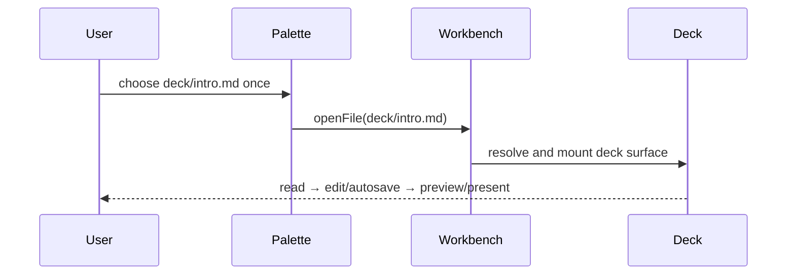

# PR 1577 — show me

Code revision: `73a72c70679b35f724a7523d3d8ddad48e9a346c`  
Base/current main: `75b3d051157a32c3f960fa452da54704451fb049`

## One-shot deck proof

```diff
 deck palette E2E
- retry the real `deck/intro.md` palette selection after a dropped dispatch
+ seed the correct `:workbenchOpen` fixture state
+ wait for the initialized Dockview workbench DOM
+ select `deck/intro.md` exactly once
+ require the deck surface before edit, preview, present, and autosave checks
```

## Required-check flow

```diff
 pull request
   detect playground paths
+  run bounded workspace-playground E2E (60-minute job / 25-minute Playwright)
+  retain failure artifacts
+  require E2E in PR Fast Summary
```

## Controlled creation seam

```diff
 <WorkspaceAgentFront>                    # owns session inventory + mutations
+  controlled state? → require onCreateSession
+  validate canonical created session
+  restore previous active session for detached creation
   <WorkspaceShellCapabilitiesProvider>
-    createChatSession always advertised
+    createChatSession only when an owner exists
     <PluginTabsWorkspaceShell / TaskCard>
-      create controls survive without an owner
+      every create control is omitted without the public capability
```



## Exact-revision evidence

- GitHub CI run [34479642382](https://github.com/hachej/boring-ui/actions/runs/34479642382) at `73a72c706`: E2E PASS (workspace playground 34 passed / 4 skipped; deck had no retry), PR Fast Summary PASS, Typecheck/Unit/Invariants/Action Pins/UI Review PASS.
- Independent review: `65bb06de-fa7f-4043-9479-ee58b3262151`, `openai-codex/gpt-5.6-sol`, digest `sha256:bea233215c0ae0cb0a79afdcf60aebee5a941fdae9934b6d1f8beeac55d47e02`: standards/spec PASS, thermo PASS, explicit package-abstraction PASS.
- Package production churn: 149 additions + 97 deletions = 246; tests/docs/generated/snapshots excluded from the number only.
- Risk route: protected required-check automation; owner Gate 2 remains required.
- Rollback: revert the PR commits; no migration, deployment, or data side effect.
