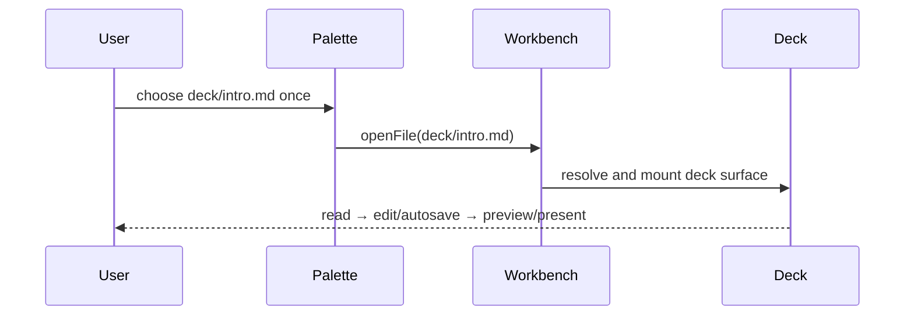

# PR 1577 — show me

Integration candidate: `f75797846a2a58f513d92f4a828ec2faa8859463`  
Reviewed code ancestor: `73a72c70679b35f724a7523d3d8ddad48e9a346c`  
Base/current main: `75b3d051157a32c3f960fa452da54704451fb049`

## Current-main reconciliation

```diff
 origin/main @ 75b3d0511
= already an ancestor of prior artifact head 37c37ab9d
+ preserve Beads closure/handoff state and claim wt-391-forward-nhhc.7
+ verify 676 records / 676 unique ids / 0 duplicates
+ push exact integration candidate f75797846 without force
```

## Shipped behavior retained

```diff
 deck palette E2E
- retry the real `deck/intro.md` palette selection after a dropped dispatch
+ seed the correct `:workbenchOpen` fixture state
+ wait for the initialized Dockview workbench DOM
+ select `deck/intro.md` exactly once
+ retain edit / autosave / preview / popup / present assertions

 controlled creation
- Workspace and Tasks advertise create actions without an owner
+ Workspace owns controlled session creation
+ Tasks consumes only the public optional Workspace capability
+ create controls are absent when no owner exists
```



## Exact integration proof

- GitHub CI [34489961762](https://github.com/hachej/boring-ui/actions/runs/34489961762) at `f75797846`: rerun attempt 2 PASS, including E2E and PR Fast Summary. Attempt 1 failed only `agent-host-golden-route` during shell/session readiness; the unchanged rerun passed. Workspace playground result: 34 passed / 4 skipped.
- Exact-SHA sandbox `7f7fa4a7-938a-4651-a5fe-37ca56fe7dde`: playground typecheck and 36 tests PASS; Workspace typecheck PASS; focused `WorkspaceAgentFront` 104 tests PASS; Tasks typecheck and 180 tests PASS; Diagram build and 6 tests PASS; action pins and invariants PASS. The concurrent full Workspace run was resource/timing-red (9 timeouts); its affected front file passed alone and exact-head GitHub Unit Tests Changed passed.
- Independent review round 1 at `f75797846`: `cdf58876-ed63-4073-a99a-29ea605346b7`, `openai-codex/gpt-5.6-sol`, digest `sha256:dcffca9e190d60bf9cd30bf795843a064533159b7ce9eb4a107bc74f20e9f0ff`; standards/spec and thermo PASS; explicit package-abstraction PASS. It correctly requested this artifact/proof refresh and retained the video blocker.
- Package production churn remains 149 additions + 97 deletions = 246; tests/docs/generated/snapshots excluded from the number only.

## Terminal external blocker

The exact evidence sandbox `f544b3ee-1a29-4898-bcd2-f8de591c9db8` previously ran the controlled-create scenario at 1440×900 on reviewed code `73a72c706` and generated a 59,757-byte candidate WebM. This session has the same command-only sandbox API and **no sandbox file-transfer/download/upload surface**. Workspace `upload_file` cannot read a sandbox filesystem. Therefore the generated WebM still cannot reach `.handoff/` or an owner-accessible URL. Existing videos are stale; no screenshot is represented as video and no proof waiver is claimed.

Risk route remains protected required-check automation. Owner Gate 2 must not be raised until an artifact-capable exact-revision recapture/transfer supplies the required candidate video. Rollback is to revert this PR's commits; there is no migration, deployment, or data side effect.
