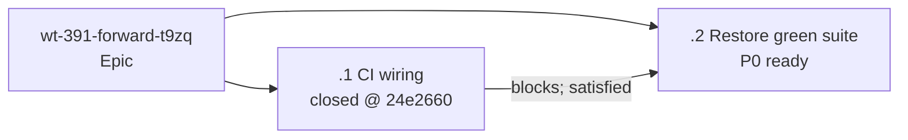

# [Playground E2E CI] Revised plan, visually

## Structure — what was learned and what expands?

```diff
 epic/playground-e2e-ci
-  one planned configuration slice
+  wt-391-forward-t9zq.1 — closed/handed off @ 24e2660
+    .github/workflows/ci.yml             # bounded dual-suite gate + upload
+    playground/playwright.config.ts      # timeout/report/evidence policy
+  wt-391-forward-t9zq.2 — awaiting revised Gate 1
+    merge current origin/main            # no force-push; preserve slice 1
+    playground config + 7 named failures # restore green ordinary suite
+    focused multi-agent proof            # keep repaired split-pane coverage
```

## Behavior — why Gate 1 is being raised again

```mermaid
sequenceDiagram
    participant Owner
    participant Slice1 as CI wiring slice
    participant Suite as Previously unrun suite
    participant Slice2 as Green-suite restoration
    Owner->>Slice1: approve original plan
    Slice1->>Suite: run 40 tests under CI config
    Suite-->>Slice1: 29 pass, 4 skip, 7 fail
    Note over Suite: multi-agent fails early with WORKSPACE_UNINITIALIZED
    Slice1-->>Owner: config handoff @ 24e2660; suite is red
    Owner->>Slice2: revised Gate 1 decision
    Slice2->>Slice2: merge current main; repair enumerated drift
    Slice2->>Suite: full + focused exact-SHA proof
    Suite-->>Owner: green CI gate or explicit blocker handoff
```

## Dependency graph — what can run next?



The revised slice may touch the playground config, seven named failing specs and their fixtures, plus production source only where a reproduced failure proves an actual regression. It may not weaken assertions or exclude ordinary coverage merely to turn CI green.
