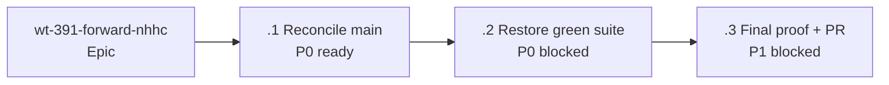

# [Playground E2E CI Retry] Plan, visually

## Structure — what this lane owns

```diff
 epic/playground-e2e-ci
   24e266016                         # existing bounded CI wiring
+  wt-391-forward-nhhc.1             # preserve evidence + merge origin/main
+  wt-391-forward-nhhc.2             # repair seven current suite failures
+  wt-391-forward-nhhc.3             # exact-SHA review, CI, PR, present-pr

 proof surfaces
+  GitHub PR from existing branch     # currently absent
+  .handoff/present-pr artifact
+  explicit abstraction PASS
+  one protected-boundary Gate 2 card
```

## Behavior — delivery flow

```mermaid
sequenceDiagram
    participant Owner
    participant W1 as Reconcile Worker
    participant W2 as Repair Worker
    participant W3 as Delivery Worker
    participant CI as GitHub E2E
    Owner->>W1: approve plan and graph
    W1->>W1: preserve evidence; merge current main
    W1-->>W2: handoff exact reconciled SHA
    W2->>W2: reproduce and repair full suite
    W2-->>W3: green full + focused suite SHA
    W3->>CI: open PR and run exact-head checks
    CI-->>W3: green checks and retained evidence contract
    W3->>W3: standards + thermo + abstraction PASS
    W3-->>Owner: present-pr and one exact-SHA merge decision
```

## Dependency graph — only one slice is ready at a time



The workflow change expands a required E2E gate, so delivery crosses a protected automation boundary. Gate 1 approves this repair graph; Gate 2 later decides merge at the exact independently reviewed SHA.
