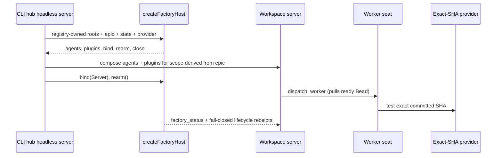

# [Factory Plugin] Plan, visually

## Structure — where authority moves

```diff
 apps/factory-playground/src/server/
-├── factoryFleet.ts              # Factory seats and policy appendices
-├── delegatePlugin.ts            # dispatch_worker, fresh_review, factory_status
-├── supervisionPlugin.ts         # durable supervise
-├── demoPlugin.ts                # demo_sandbox
-├── *Snapshot*.ts                # per-epic exact-SHA state
-├── *Provider.ts                 # local/remote disposable providers
-├── sandboxComposition.ts        # sandbox authority
-├── app.ts                       # assembles every Factory primitive
+├── app.ts                       # createFactoryHost(...) + meta route
 └── dev.ts                       # playground-owned boot (unchanged)
 
+plugins/boring-factory/src/server/
+├── sandbox/                     # exact-SHA leases, providers, snapshots
+├── host/                        # seats, delegation/status, supervision, demos, closure
+└── index.ts                     # createFactoryHost public entry
```

## Behavior — one host contract, multiple compositions



## Dependency shape — move first, then parallel proof

```text
factory-plugin-lqvd.1  move sandbox + snapshots
          |
          v
factory-plugin-lqvd.2  move seats + host tools; createFactoryHost
          |
          +-------------------------+
          v                         v
factory-plugin-lqvd.3           factory-plugin-lqvd.4
right-sized close_epic          registered-workspace proof
(exact merged PR/head;           (CLI headless entry imports host)
 no branch/worktree delete)
```

Rollback is commit-level reversion. Shared Inbox, merge automation, Vercel quota work, `dev.ts`, and sweep scripts remain outside this epic.