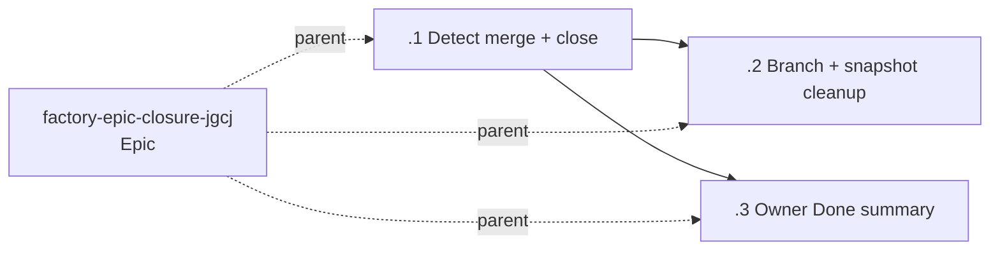

# [Epic Closure] Finish Factory epics automatically after merge

## Problem

Gate 2 approval and a merged epic PR do not currently end a Factory epic. Supervision can continue, Beads remain open, demo sandboxes stay registered, and branch/snapshot resources linger without a durable completion receipt.

## Solution

Teach the host to observe the bound epic branch's GitHub PR state, expose that state through `factory_status`, and grant only the Orchestrator a guarded `close_epic` tool. Closure independently verifies the requested PR is merged, closes child Beads before the epic Bead, stops demos and the calling session's supervision, optionally removes safe-to-delete branch/snapshot resources, and returns a structured receipt. The Orchestrator then raises a final `[Epic Closure] Done` acknowledgement in the Inbox.

## Decisions

| Decision | Chosen | Why |
|---|---|---|
| Merge authority | `gh pr view <branch> --json state,mergedAt,mergeCommit,number,url,headRefName,headRefOid,headRepository,headRepositoryOwner,isCrossRepository` from the shared workspace root, then exact-number recheck in `close_epic` | GitHub is the source of truth; branch, repository, and PR-number matching prevent closure based on stale/local state. |
| `gh` unavailable | `pr: null` plus discriminated `prLookup.status`; refuse `close_epic` with stable codes | Observation must be resilient, while destructive closure must fail closed. |
| Tool grant | `close_epic` is Orchestrator-only | Workers must never close their own work or end supervision. |
| Retry contract | Preflight everything; load Beads with `--all`; already-completed phases are satisfied | A partial failure can be safely rerun without losing evidence or duplicating damage. |
| Close order | Mandatory demos → every non-epic Bead successful/already closed → requested cleanup → epic Bead → calling-session supervision | The umbrella and supervision end only after every required earlier phase succeeds. |
| Resource cleanup | `{ cleanup: true }` defaults true; requested cleanup failure leaves `overall: partial` | Normal closure should leave no debt, while opt-out supports safe recovery/testing. |
| Remote branch guard | Verify repo/head/OID; never delete malformed, main/default, advanced, or app-current refs | Prevent deletion of protected, reused, or actively executing state; already-absent is idempotent success. |
| Final owner notice | Host appendix requires `[Feature Name] Done` only for `overall: complete` | Keeps runtime policy in trusted host text without editing canonical skills. |

## Flag / Abstraction

- Needed?: No feature flag; the action is an explicit Orchestrator tool guarded by verified merged state.
- Path: Extend existing Factory host plugin handles with narrow injectable closure callbacks.
- Rollback: Revert the three implementation commits. Existing Gate 1/Gate 2 flow remains valid without invoking `close_epic`.

## Test Seams

- Highest public seam: Orchestrator `factory_status` and `close_epic` tool results.
- Existing prior art: injected plugin fakes, temporary state registries, and seat-capability assertions in `apps/factory-playground/src/server/*test.ts`.
- Avoid testing: live GitHub, live Vercel, or a real remote branch in unit tests.
- Required fakes: command runner/`gh`, Beads close runner, demo cleanup, supervision stop, git push, and snapshot invalidation.

## Acceptance

- `factory_status` reports `pr: { number, url, state, mergedAt } | null` and a stable `prLookup.status` (`available | gh-unavailable | not-found | error`) without breaking when `gh` is absent.
- `close_epic({ prNumber })` exists only for the Orchestrator, rechecks exact branch/repository/number/MERGED/SHA, and returns stable refusal codes.
- A successful/retried closure records the merge SHA and involved calling/Worker sessions, stops registered demos through `stopAllDemos`, closes all `epic:epic-closure` children before `factory-epic-closure-jgcj`, and stops only the calling session through `stopSupervision(sessionId)` last.
- Cleanup defaults true, supports `cleanup: false`, rejects cross-repository heads, protects malformed/main/default/current/advanced refs, deletes only with `--force-with-lease=refs/heads/<branch>:<headRefOid>`, treats absent refs idempotently, and invalidates all snapshot entries for the bound epic.
- The JSON receipt identifies `complete | partial` plus every performed, already-complete, skipped, and failed operation; partial results remain safely rerunnable and never trigger Done.
- Trusted Orchestrator appendix text requires one final `[Feature Name] Done` acknowledgement with PR URL, merge SHA, closed Bead IDs, cleanup, and sessions involved; its one required radio field has two schema-valid acknowledgement options, and `.agents/skills` remains untouched.

## Proof

For every slice, from `apps/factory-playground` in a dedicated sandbox booted at the exact committed SHA:

```bash
pnpm exec tsc --noEmit
pnpm exec vitest run
```

Each Worker must also run adversarial `fresh_review` on that SHA, push the epic branch, and record SHA, exact proof, and review provenance in the Bead handoff.

## Slices

### Slice 1: Detect merge and close Beads

**Bead:** `factory-epic-closure-jgcj.1`  
**Delivers:** discriminated PR observation plus guarded Orchestrator-only `close_epic`, complete preflight, host-only stop callbacks, retry-safe ordered closure, session-rich receipt, and failure-injection tests.  
**Blocked by:** None.  
**File scope:** `delegatePlugin.ts`, `supervisionPlugin.ts`, `demoPlugin.ts`, `app.ts`, and directly corresponding tests; excludes `factoryFleet.ts`.  
**Proof:** exact-SHA sandbox typecheck + Vitest + fresh review.  
**Review budget:** Inside one session using existing plugin seams.

### Slice 2: Clean up branch and snapshot

**Bead:** `factory-epic-closure-jgcj.2`  
**Delivers:** default-on/opt-out cleanup, same-repository/ref/atomic force-with-lease deletion, remove-all-for-epic snapshot invalidation, partial/rerun semantics, and fakes.  
**Blocked by:** `factory-epic-closure-jgcj.1`.  
**File scope:** `delegatePlugin.ts`, `snapshotRegistry.ts`, narrowly needed app wiring, and closure/snapshot tests; excludes `factoryFleet.ts`.  
**Proof:** exact-SHA sandbox typecheck + Vitest + fresh review.  
**Review budget:** Inside one session after slice 1.

### Slice 3: Add owner summary to the Inbox

**Bead:** `factory-epic-closure-jgcj.3`  
**Delivers:** third-gate host appendix contract gated on `overall: complete`, valid one-radio/two-option acknowledgement schema, and composition assertions.  
**Blocked by:** `factory-epic-closure-jgcj.1`; may run in parallel with slice 2.  
**File scope:** only `factoryFleet.ts` and `factoryComposition.test.ts`; never `.agents/skills`.  
**Proof:** exact-SHA sandbox typecheck + Vitest + fresh review.  
**Review budget:** Inside one session and disjoint from slice 2.

## Dependency Graph



## Risks

| Risk | Likelihood | Impact | Mitigation |
|---|---:|---:|---|
| False-positive merge closes active work | Low | High | `close_epic` re-queries exact PR and requires matching repo/head, `MERGED`, and merge SHA. |
| Partial closure leaves mixed state | Medium | Medium | Preflight plus idempotent phases; failures return `partial`; epic/supervision stop last; rerun tests cover every phase. |
| Cleanup deletes unsafe branch | Low | High | Repository, validated-ref, main/default/current, and expected-OID guards with unit tests. |
| Concurrent slices overlap | Low | Medium | Slice 3 owns only fleet appendix/tests; slice 2 excludes those files. |
| External CLI/provider unavailable | Medium | Low | Status tolerates absence; closure fails closed or records cleanup errors. |

## Out of Scope

- Automatically merging PRs or changing Gate 2 approval.
- Editing `.agents/skills` or redefining canonical gate behavior outside the host appendix.
- Closing unrelated Beads, deleting local branches/worktrees, or deleting `main`.
- Live GitHub/Vercel calls in unit tests.

## Open Questions

None. Owner intent, dependency order, cleanup default, and proof commands are explicit.

## Review Record

- Reviewer: `gpt-5.6-sol` / T1 cross-model via `codex exec`, reasoning `xhigh`, read-only.
- First verdict: **REVISE**. Full record: `docs/issues/1517/adversarial-review-sol.txt`.
- Folded findings: exact ref/repository/atomic `--force-with-lease` deletion guards; discriminated PR lookup; stable refusal codes; preflight and idempotent partial/rerun phases with all child closures required before epic closure; host-only stop-all/per-session/remove-all callbacks; session-rich receipts; schema-valid Done acknowledgement gated on `overall: complete`.
- Owner constraints retained: skip app-current/main branch deletion, three named slices, slice 2 and 3 parallelism, and no `.agents/skills` edits.
- First re-review: **REVISE** with two remaining precision findings (atomic force-with-lease and child-close success gating), both folded into the plan and Beads. Record: `docs/issues/1517/adversarial-rereview-sol.txt`.
- Final re-review: **CLEAN**, no material findings. Record: `docs/issues/1517/adversarial-final-sol.txt`.
- Residual proof risks: normalize origin identity across SSH/HTTPS forms; validate live remote permissions; child handoff richness remains procedural and must be checked before Gate 2.

## Graph Validation

- `br dep cycles --blocking-only --json`: `0` active cycles.
- `bv --robot-insights`: computed `2026-09-03T20:02:19Z`, data hash `3363f9fa36eeddf2`; no epic-local cycle was reported.
- Ready-state check: only `factory-epic-closure-jgcj.1` is ready and unassigned; `.2` and `.3` are blocked by `.1` and become parallel-ready together.
