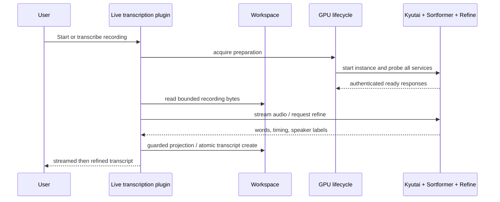

# [Transcription Quality] Show me

Functional repair: `201a16e17aa01866a0bfb4a4c8128dcf27841125`  
Current-main integration candidate before this document: `51b3f848ce0e433b76830cb5d24d5212e2a785d4`

## Structure

```diff
 plugins/live-transcription/
+├── services/refine/          # authenticated faster-whisper + medical lexicon refinement
 ├── services/sortformer/      # steadier multi-speaker confirmation
-├── services/lifecycle/       # live-stream readiness only
+├── services/lifecycle/       # waits for Kyutai, Sortformer, and refine HTTP health
 └── src/
-    ├── front/                # raw worklet forwarding
+    ├── front/                # explicit AGC + anti-aliased 16 kHz diarizer feed
     └── server/
-        └── manager.ts        # live stream only
+        ├── manager.ts        # live stream + atomic no-overwrite file transcription
+        ├── projector.ts      # guarded post-finalize replacement
+        └── refine.ts         # bounded multipart refinement and response-body deadline
```

## Behavior

```diff
 audio input
-  one stream → recognizer + diarizer with lag-sensitive labels
+  explicit browser AGC → recognizer
+  anti-aliased 16 kHz feed → lag-compensated diarizer
+  stable speaker confirmation → projected live transcript

 completed recording
-  no offline quality pass
+  Workspace binary read + size guard
+  GPU lifecycle waits for all three services
+  faster-whisper + medical lexicon correction
+  atomic create or explicit overwrite
```

## Sequence



## Contract

```ts
transcribeFile({ path, title?, overwrite? })
  path: Workspace-relative file under live-transcripts/
  overwrite false: Workspace.createBinaryFile (EEXIST → revision conflict)
  overwrite true: Workspace.writeFileWithStat
  lifecycle: readiness includes refine /v1/health
```
