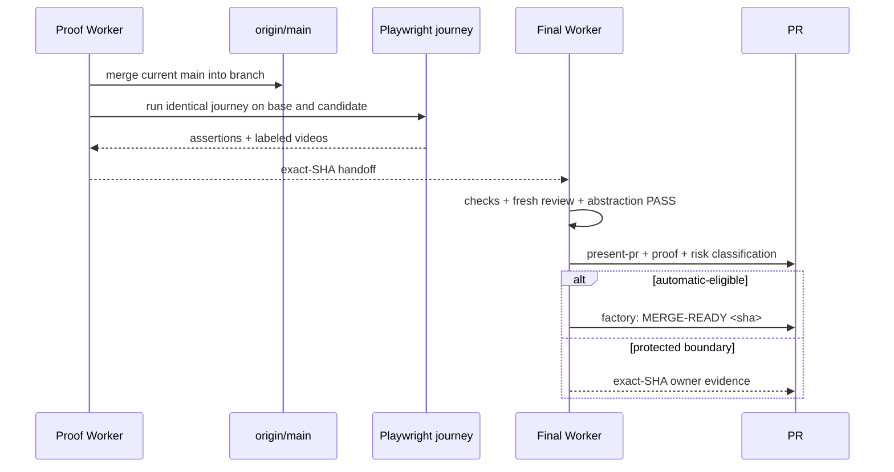

# [Transcription Quality] Plan, visually

**Status:** Awaiting plan approval  
**Epic:** `pr-1524-transcription-quality` · **Bead:** `wt-391-forward-2o4d`  
**TL;DR:** Refresh the existing green PR against main, add exact-revision UI video proof, then independently re-review and route the unchanged candidate.

## Structure — what this lane touches

```diff
 PR #1524 · feat/transcription-diarization-quality
 ├── plugins/live-transcription/        # existing reviewed product diff
+├── Playwright before/after evidence   # missing admission proof
+├── .handoff/pr-1524-presentation.html # owner-facing review surface
+└── PR proof comment                    # SHA-bound checks, review, risk route
```

## Behavior — delivery flow



## Dependency shape

```text
wt-391-forward-2o4d  [Epic]
  └─ wt-391-forward-2o4d.1  integrate main + capture UI proof
       └─ wt-391-forward-2o4d.2  re-verify + present + classify
```

## Risk view

| Risk | Likelihood | Impact | Mitigation |
|---|---:|---:|---|
| Main integration changes behavior | Medium | High | Merge without force-push; rerun affected checks and UI journey |
| Video is stale or not reproducible | Medium | High | Bind base/head SHA, fixture, viewport, command, assertions, and recordings |
| Prior review no longer applies | High after merge | High | Fresh independent standards/spec, thermo, and explicit abstraction review |
| Wrong merge route | Low | High | Recompute protected triggers and `packages/` production churn on final diff |

## Proof path

- Existing green CI: run `34108801575`; Workflow Invariants: `34108801629`.
- Existing review: session `0a688055-601f-4fb9-94f4-926bf3a02554` at `aa959cfd3b7721d7cb42a4d43a7e6ed2562cd542`.
- Required new proof: real base/candidate Playwright videos, exact-SHA sandbox checks, fresh review, present-pr HTML, and current-main classification.
- Independent plan-review mechanism was not exposed to this Orchestrator; the owner decides at Gate 1 with this plan and visual.
