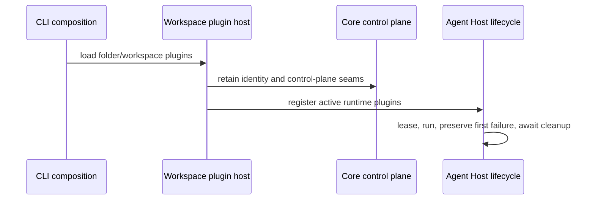

# [Package Cleanup] What changed, visually

- Implementation revision: `59f1934f72ef641b6af01227c15ee17d7de21096`
- Base revision: `68dcb7db8822f721c6b45d0731e01a46fa364f28`
- PR: [#1540](https://github.com/hachej/boring-ui/pull/1540)
- Historical lineage: `wt-391-forward-clu5.7`

## Review shape

```diff
 packages/
 ├── agent/
-│   ├── bare UI primitives, server-skills hook, slash suggestions
-│   ├── readiness/env/session-identity helpers
-│   └── runtime/trusted-session binding lifecycles
+│   └── active Agent Host lifecycle test preserves first-failure cleanup behavior
 ├── boring-bash/
-│   └── empty plugin and route forwarders
 ├── boring-sandbox/
-│   └── uncalled circuit-breaker and OIDC-refresh implementations
 ├── cli/
-│   └── unmounted runtime diagnostics component
+│   └── documentation points to the active diagnostics surface
 ├── core/
-│   └── private fixture/scaffold and PostHog adapter paths
 └── workspace/
-    └── digest and front-registration forwarders
+    └── canonical owners and active package entry points remain
```

The change is deletion-heavy: the strict package production count is **0 additions + 1,849 deletions**. That count conservatively includes the one-line package support script; excluding it still leaves 1,848 changed production lines. Tests, docs, manifests, lockfile metadata, and Bead/planning records are excluded from this numerical trigger, but remain in review scope.

## Ownership flow retained



No public package export or supported package entry was removed. The deleted paths were private, forwarding-only, unmounted, or test-only; the independently reviewed real callers continue through the canonical owners shown above.

## Proof transition

```diff
- b9774a46d: GitHub checks green, but required local simulation red
- CLI 21 failures; Core 14 failures; Workspace 92 failures
+ 59f1934f7: current main merged without force push
+ controlled environment separates credential/build/shared-host contamination
+ affected package suites green in GitHub isolated CI
+ Agent 2282 | Bash 90 | Sandbox 599 | CLI 145 | Core 1483 | Workspace 2309
+ Typecheck | Lint | Invariants | E2E | UI Review | budgets | smokes green
+ independent T1 standards, thermo, and package-abstraction PASS
```

The final CI run initially caught one CLI async-mount scheduling failure at `packages/cli/src/front/App.test.tsx:255` (144/145 runnable CLI tests). The unchanged rerun passed 145/145; no assertion, timeout, skip, or product file was changed to obtain green.

## Protected boundary

This candidate is **not automatic-eligible**. It matches the `boring-loop.md` protected shared-package threshold because 1,849 added-plus-deleted production lines under `packages/` exceeds 500. It also deserves explicit deletion/package-boundary scrutiny even though the abstraction review found ownership and public contracts unchanged. Existing rollout restrictions remain stricter, so merge requires explicit owner approval bound to the final presented revision and normal branch protection.

## Rollback and validation

Rollback is a normal revert of the original cleanup commit `b9774a46dbd9aaee1222e2368b855151da71a453` (plus conflict resolution if main has moved); it restores private files and removed direct dependencies without a data migration. Do not revert the intervening merges from `main`.

Human validation:

1. Open the presentation at `.handoff/pr-1540-presentation.html` and inspect review history before diffs.
2. Confirm package nodes match the six intended packages and begin with Agent lifecycle coverage and canonical import changes.
3. Open [CI run 34157324226](https://github.com/hachej/boring-ui/actions/runs/34157324226) and confirm the exact head and successful rerun.
4. Confirm PR #1540 still reports local head = remote branch head = PR head before approval or merge.

UI video: N/A. This cleanup did not change a mounted UI behavior; the removed CLI diagnostics component was unmounted and its documentation now names the active surface.
