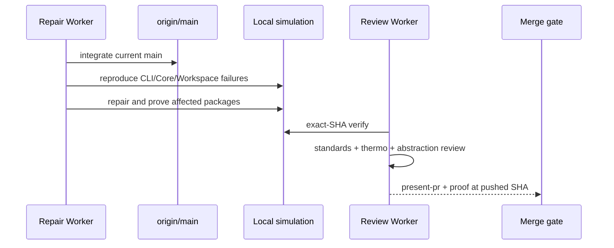
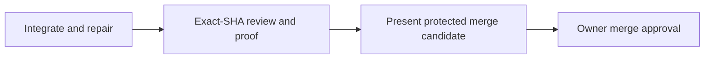

# [Package Cleanup] Plan, visually

**Status:** Awaiting Gate 1 · **PR:** #1540 · **Head:** `b9774a46d` · **Target:** `origin/main` (`aaa713a19`)

## Structure — what this lane touches

```diff
 packages/
 ├── agent/           # deleted private modules; retained lifecycle regression
 ├── boring-bash/     # removed unused route/plugin forwarders
 ├── boring-sandbox/  # removed dead Vercel helpers
 ├── cli/             # removed unmounted diagnostics UI
 ├── core/            # removed private fixtures/telemetry
 └── workspace/       # removed orphan resource/plugin helpers
+docs/issues/1540/    # plan and revision-bound owner review visuals
+.handoff/            # generated present-pr artifact (gitignored)
```

## Behavior — delivery sequence



## Dependency graph



## Diff-shaped outcome

```diff
- head b9774a46d: 12 commits behind main; local CLI/Core/Workspace matrix red
+ final head: current-main compatible; affected package matrix green
+ independent exact-SHA standards/spec review
+ independent exact-SHA thermo review
+ explicit package-abstraction PASS
+ present-pr artifact and one protected merge decision
```

## Risks

| Risk | Likelihood | Impact | Mitigation |
| --- | --- | --- | --- |
| Deleted code still has a hidden caller | Medium | High | inspect exports/imports and real callers; abstraction review |
| Environment setup masks real regression | Medium | High | clean frozen install and deterministic local simulation |
| Main drift invalidates proof | High | Medium | integrate current main first; bind all proof to final SHA |
| Review repair widens deletion scope | Low | High | no additional deletion without written permission |

## Proof path

Clean frozen install → package build → six affected typechecks/tests → invariants/import checks → independent exact-SHA standards/thermo/abstraction review → current-main candidate checks → present-pr artifact → exact-SHA owner merge gate.
