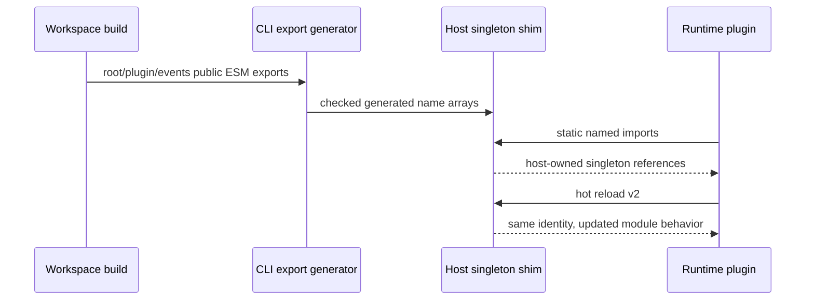

# Plugin Exports — what changed, visually

## Owner Review

Bead / PR / issue: `wt-391-forward-civu.3` / [PR #1543](https://github.com/hachej/boring-ui/pull/1543) / issue #1543
Lineage: `wt-391-forward-clu5.2`
What changed / why: Runtime-loaded plugins now receive every public named export from the workspace root, plugin, and events entrypoints while continuing to share the host's singleton values. Browser-path repairs also preserve hot reload, expose actionable request failures, and prevent a failed module evaluation from being executed a second time.
Why you are needed: The complete diff changes the CLI↔workspace package-boundary mechanism and therefore matches the protected **Shared core/contracts** boundary. It does not qualify for the automatic route even though package production churn is below the numerical threshold. The rollout also retains the existing owner gate.
Recommendation / alternatives: Approve the exact reviewed implementation. The alternative is to keep the manual export list, which can silently fall behind public workspace exports and break plugin ESM linking.
Scope / base / implementation head SHA: `68dcb7db8822f721c6b45d0731e01a46fa364f28` / `f63472c2a2dc5bb96b95299955923b16fb329114`
What approval authorizes: Merge of the reviewed PR revision through the protected route after current-main integration validation; it does not authorize publish/deploy or bypass branch protection.
Risk / rollback: The main residual is that the focused real-Chromium runtime test is not in ordinary CI; it passed 2/2 in the exact-SHA sandbox. Roll back by reverting the PR's feature commits (or the eventual merge commit) and rebuilding the CLI; no migration or stored-data rollback is required.
Proof / independent review / abstraction verdict links: [`final-package-proof.md`](./final-package-proof.md); final GitHub checks on PR #1543; reviews `f8e16b02-c9d4-4067-a956-f222e68c39de` and `34f78583-c595-465b-8a0a-5e5d910626f7`, both APPROVE with thermo PASS and explicit abstraction PASS.
Artifact: `.handoff/pr-1543-presentation.html`

Please test:
1. Check out PR head and use pnpm `10.33.2`; run `CI=true pnpm install --frozen-lockfile`.
2. Run `pnpm --filter @hachej/boring-ui-cli... --workspace-concurrency=4 run build` and `pnpm --filter @hachej/boring-core... --workspace-concurrency=4 run build`.
3. Run `pnpm --dir packages/cli exec vitest run --project cli src/__tests__/runtimePluginBrowser.integration.test.ts`; expect 2/2 passing for plugin load and reload.
4. Run `pnpm --dir packages/workspace exec vitest run src/server/pluginImports/importServerModule.test.ts`; expect 5/5 passing, including no retry after jiti evaluation rejection.
5. Run `pnpm --filter @hachej/boring-ui-cli typecheck`, `pnpm --filter @hachej/boring-workspace typecheck`, `pnpm lint:invariants`, and `pnpm audit:imports`; expect all green.

Decision: `approve | request changes | defer | reject`

## Show me

```diff
 @hachej/boring-workspace build outputs
-  manually copied root / plugin / events export lists
+  deterministic generator reads public ESM entrypoints
+  CLI build fails when generated metadata is stale
          │
          ▼
 CLI host singleton shim
-  omitted public names could fail plugin ESM linking
+  148 root + 18 plugin + 16 events names
+  each served name resolves to the host-owned singleton value
          │
          ▼
 Runtime plugin
+  static named imports link with exact host reference identity
+  Chromium load v1 → reload v2 passes (2/2)
```



```diff
 importServerModule(hotReload=true)
-  jiti evaluation rejection → native import retry
-  a side-effecting module could execute twice
+  jiti unavailable → native import fallback
+  jiti evaluation rejection → propagate once, no retry
```

## Handover

- PR: https://github.com/hachej/boring-ui/pull/1543
- Complete diff: 9 files, +431/-161 at implementation head; package production code is **416 additions + deletions**.
- Production count includes `packages/cli/package.json` (3), generator (63), runtime shim (157), and generated metadata (193). It excludes 111 test/harness lines from the numerical trigger only; docs are outside `packages/`.
- Route: **protected owner review**, because the package-boundary mechanism changed. The >500 size trigger is not met, but that does not negate the semantic boundary trigger. Unknown/automatic fallback is not permitted.
- Current-main integration: base/main `68dcb7db8822f721c6b45d0731e01a46fa364f28` is an ancestor of implementation head; GitHub reported OPEN, MERGEABLE, CLEAN with all final-head required checks green.
- UI video: N/A; no visual appearance/interaction changed. The user-observable runtime path is covered by deterministic real-Chromium assertions.
- Remaining action: owner decides the protected merge gate on the exact final PR revision; Orchestrator validates current-main combination and merges only through the authorized route.
