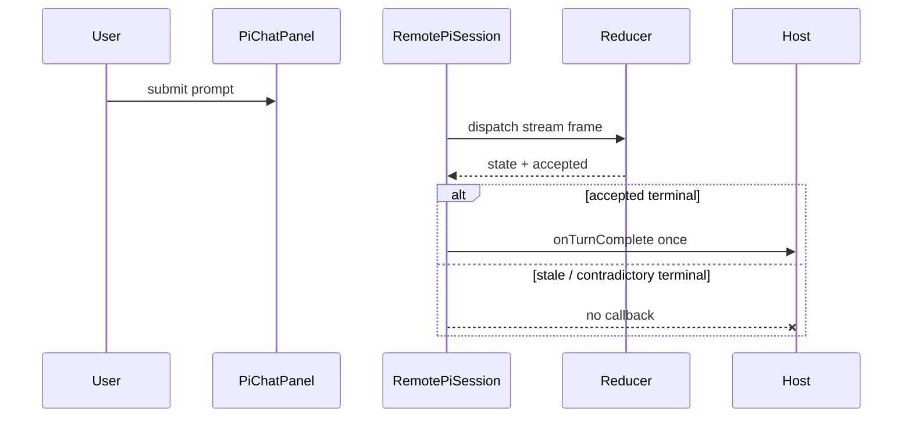

# PR 1544 context



```diff
 RemotePiSession.onFrame
-  infer acceptance from cursor advance
-  notify host callback
+  ask reducer/store for semantic acceptance
+  notify only when accepted and stream still owns generation
```

The PR fixes ownership at the event reduction seam: canonical sequence consumption is no longer mistaken for semantic acceptance. `PiChatPanel` keeps the existing host callback contract, while `RemotePiSession` now reports only reducer-accepted events. Earlier commits also fence Resume state by transport identity and preserve first-prompt startup policy. It does not widen public exports, move package ownership, contact a real model in proof, or change shared design components. Review `piChatReducer.ts`, `piChatStore.ts`, and `remotePiSession.ts` first, then the real caller and revision-bound browser evidence.

## Key files

- packages/agent/src/front/chat/pi/piChatReducer.ts
- packages/agent/src/front/chat/pi/piChatStore.ts
- packages/agent/src/front/chat/pi/remotePiSession.ts
- packages/agent/src/front/chat/__tests__/PiChatPanel.test.tsx
- docs/issues/1544/browser-proof/report.html

## Why

- packages/agent/src/front/chat/pi/piChatReducer.ts | make reducer-owned semantic acceptance explicit while preserving canonical cursor consumption
- packages/agent/src/front/chat/pi/piChatStore.ts | expose the reducer acceptance result to the transport without widening package exports
- packages/agent/src/front/chat/pi/remotePiSession.ts | gate unchanged callbacks on accepted reduction and active stream ownership
- packages/agent/src/front/chat/PiChatPanel.tsx | fence Resume pending/error ownership to the selected transport object
- packages/agent/src/front/chat/piChatPanelHooks.ts | preserve first-prompt stream startup with hydration disabled
- packages/agent/src/front/chat/**/__tests__/** | lock reducer, transport, Resume, startup, and real-caller behavior
- docs/issues/1544/browser-proof/** | preserve exact-base/candidate desktop/mobile Playwright scenario, recordings, checksums, and report
- docs/issues/1544/{plan.md,show-me-plan.md,plan-review.html} | retain the approved repair/proof scope and plan gate
- .beads/issues.jsonl | durable Factory task, claim, and handoff state

## Review history

- 2026-09-05 | pi/code review | PASS | Sol xhigh / T1 | Original five-file repair at `3121722a`; 104 directly affected tests and typecheck rerun.
- 2026-09-07 | fix round | FAIL -> fixed | Sol / fresh review `3b53b181` | Strong Resume owner map retained transports; fixed with weak transport identity tokens by `c3a72150`.
- 2026-09-07 | thermo review | PASS with open callback finding | Sol / fresh review `6dc9126c` | Resume, thermo and abstraction clean; separately found cursor advance was not semantic acceptance.
- 2026-09-07 | fix round | PASS | Worker + sandbox `b74d16a2` | Callback finding fixed at `1f91c319`; 184 focused tests, typecheck, invariants, imports, isolation green.
- 2026-09-07 | thermo review | PASS | Sol / fresh review `c6da10cd` | Exact code SHA approved; explicit package-abstraction PASS across producer, reducer/store, transport and PiChatPanel caller.
- 2026-09-07 | UI review | PASS | Playwright / sandbox `eb74e455` | Exact base and candidate desktop/mobile journey; base reaches 3 callbacks, candidate exactly 1. Videos and report committed.
- 2026-09-07 | re-verify | PASS | GitHub Actions runs `34132862549`, `34132862575` | Code SHA CI and workflow invariants green; later docs/proof-head checks remain visible on the PR.
- 2026-09-07 | re-verify | FAIL -> fixed | sandbox `99069467` | Base desktop exceeded 30s during cold transform; assertion/event timings unchanged and bounded test timeout raised to 90s, then all four runs passed.
- 2026-09-07 | re-verify | FAIL -> passed on later head | GitHub Actions run `34138817908` | Unrelated `boring-factory` detached-process liveness test failed at line 239; no Agent/product code changed, and the same affected matrix passed on final-head run `34140413673`, disposition: nondeterministic unrelated flake, closed by clean rerun.
- 2026-09-07 | UI review | FAIL -> fixed | Sol / fresh review `961fbd2c` | Requested final-SHA report binding, fresh present-pr generation, and mandatory CI-failure history; all three corrected in the final artifact round.
- 2026-09-07 | pi/code review | PASS | Sol / fresh review `f38fbd83` | Clean cap-reaching round 4/4 at `bceb2fd11`: standards/spec, thermo, and explicit abstraction review all PASS with no findings.
- 2026-09-07 | re-verify | PASS | integration Worker | Merged current main `d19b04d35` without conflict; exact combined candidate reruns the focused package, invariant, import, isolation, presentation, integrity, and privacy checks in a remote sandbox.
