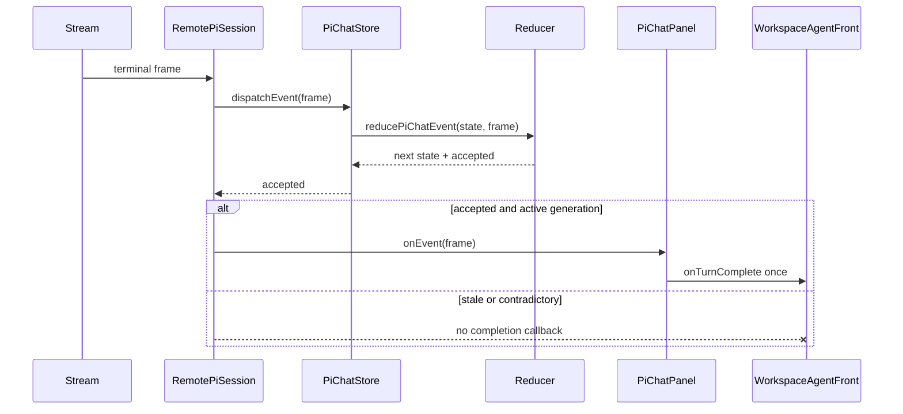

# Chat Event Ownership — what changed

Production code: `1f91c319958f0a2d37b2badb13174b4068234055`  
Reviewed code + proof: `bceb2fd111100ab577bb1f02311fb66a4949ff23`  
Actual browser base: `3db6a237d0ace94c83fb4967e43407d65202706e`

## Event ownership

```diff
 RemotePiSession.onFrame
-  infer acceptance when the canonical sequence cursor advances
-  notify the host before knowing whether state accepted the event
+  dispatch through PiChatStore into the reducer
+  receive reducer-owned semantic acceptance
+  notify the unchanged host callback only when accepted and still stream owner
```

## Component and caller view

```diff
 <WorkspaceAgentFront>                   # real public-package consumer
   <PiChatPanel onTurnComplete={refresh}>
     <RemotePiSession>
-      onEvent(frame) ───────────────────────────────► onTurnComplete
-      store.dispatch(frame)                         # may reject terminal
+      accepted = store.dispatchEvent(frame)
+        reducePiChatEvent(frame) → { state, accepted }
+      accepted terminal ───────────────────────────► onTurnComplete once
+      stale / contradictory terminal ──────────────x no callback
```

## Files and responsibilities

```diff
 packages/agent/src/front/chat/
 ├── PiChatPanel.tsx
+│   └── fence Resume state to the selected transport identity
 ├── piChatPanelHooks.ts
+│   └── preserve first-prompt startup when hydration is disabled
 └── pi/
     ├── piChatReducer.ts
+    │   └── distinguish sequence consumption from semantic acceptance
     ├── piChatStore.ts
+    │   └── return internal reducer acceptance to the transport
     └── remotePiSession.ts
+        └── deliver callbacks only after accepted reduction
```

## Shipped sequence


