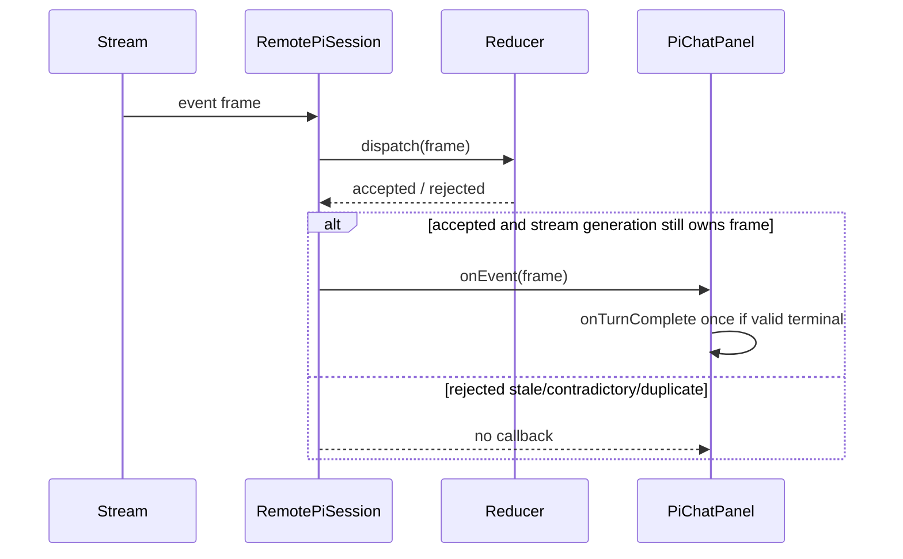

# [Chat Event Ownership] Plan, visually

Status: **Gate 1 candidate**  
Epic: `pr-1544-chat-event-ownership` · Epic Bead: `wt-391-forward-3brt` · PR: #1544

## Structure — what owns the repair

```diff
 packages/agent/src/front/chat/
 ├── PiChatPanel.tsx                 # consumes accepted callbacks
 ├── __tests__/PiChatPanel.test.tsx  # proves completion behavior
 └── pi/
     ├── piChatReducer.ts            # owns state-machine acceptance
     ├── remotePiSession.ts          # dispatches, then notifies iff accepted
     └── __tests__/
         └── remotePiSession.test.ts # rejected/accepted stream events
+
+exact-SHA proof
+├── Playwright before/base + after/candidate video
+├── present-pr owner artifact
+└── independent spec + thermo + abstraction PASS
```

## Behavior — the risky flow



## Delivery shape — dependency-correct Beads

```text
wt-391-forward-3brt.1  repair semantics + current main
  -> wt-391-forward-3brt.2  exact-SHA browser proof + present-pr
    -> wt-391-forward-3brt.3  independent final review + abstraction PASS
      -> wt-391-forward-3brt.4  integration validation + risk route
```

The existing public callback intent is preserved unless implementation proves a real contract change is unavoidable; that protected decision must return to the owner rather than being inferred.
