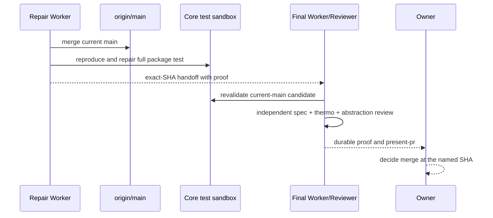

# [Invite Idempotency] Plan, visually

## Structure — what this lane touches

```text
PR #1547 · epic/invite-idempotency
├── packages/core/
│   ├── src/server/middleware/idempotency.ts  # atomic request claim/replay
│   ├── src/server/routes/invites.ts          # invite side-effect boundary
│   ├── src/server/db/schema.ts               # protected schema
│   ├── drizzle/0028_*.sql                    # protected migration
│   └── **/*idempotency*.test.ts              # focused + PostgreSQL proof
├── docs/issues/1547/                          # plan/show-me/proof presentation
└── PR #1547                                   # existing integration surface only
```

## Behavior — delivery flow



## Diff-shaped plan

```diff
 PR #1547 @ 4ff283b
-  focused tests green; full Core package suite red in clean sandbox
-  prior review cannot approve
+  current origin/main integrated without force-push
+  full Core package suite green at exact committed SHA
+  focused tests, typecheck, build, invariants, and E2E green
+  independent standards/spec review: PASS
+  independent thermo review: PASS
+  package-abstraction review: explicit PASS
+  present-pr + proof linked from the existing PR
+  one protected-boundary owner merge decision at exact final SHA
```
