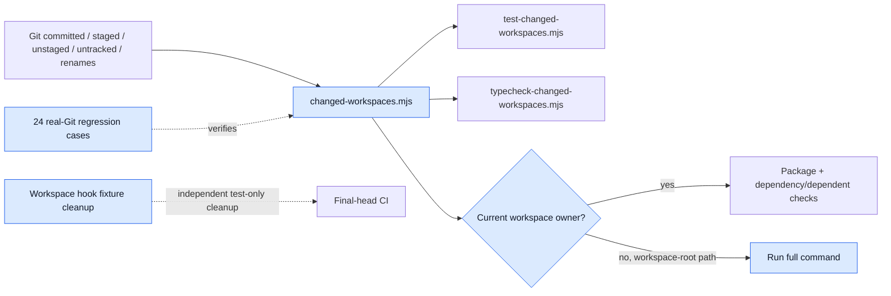
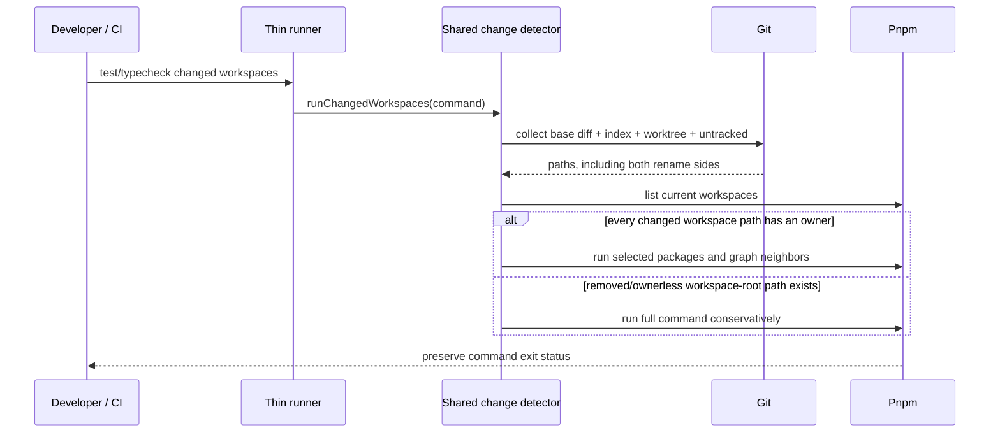

# [Changed Workspace Verification] What changed, visually

**PR #1551 · reviewed head `97b3c3f1e0a6d85d392eabdf543a31b0faf9d19a` · base `d19b04d357ea7d2caae20a44a657edb3ee4c582e` · CI green · Protected**

The changed-workspace commands now discover every relevant Git state and conservatively run full verification when a removed workspace no longer has a current owner.

## Changed-component map



## Shipped flow



## Diff-shaped walkthrough

```diff
 scripts/
+├── lib/changed-workspaces.mjs       # single Git discovery/selection owner
+├── lib/changed-workspaces.test.mjs  # 24 real-repository regression cases
 ├── test-changed-workspaces.mjs
-│   └── duplicated discovery logic
+│   └── thin call into shared runner
 └── typecheck-changed-workspaces.mjs
-    └── duplicated discovery logic
+    └── thin call into shared runner
```

```diff
 changed path classification
- no current workspace owner → possibly report a successful skip
+ no current owner under packages/plugins/apps/tools → run full command
+ removed workspace regression → proves both test and typecheck take fallback
```

```diff
 Workspace filesystem hook test teardown
+ unmount hooks
+ cancel queries and clear QueryClient
+ drain queued notifications
+ restore real timers
  existing 23 assertions remain intact
```

## Risks

| Risk | Likelihood | Impact | Mitigation |
|---|---:|---:|---|
| Removed workspace silently skips verification | Low after fix | High | Conservative full fallback plus two real-Git tests |
| Shared runner changes test/typecheck semantics | Low | High | 24 cases cover selection, fallback, skips, renames, and exit codes |
| Fixture cleanup hides failures | Low | Medium | Existing assertions unchanged; focused 23/23 and exact-head CI pass |
| Sandbox timing failures obscure a regression | Low | Medium | All 2,320 tests executed; exact-head GitHub Unit Tests and independent review pass |

## Test coverage

| Area | Evidence | Result | Gap |
|---|---|---:|---|
| Changed-workspace runners | `pnpm test:changed-workspaces` | 24/24 pass | None |
| Filesystem hook cleanup | focused Vitest | 23/23 pass | None |
| Workspace contracts | dependency build + typecheck | Pass | None |
| Architectural invariants | `pnpm lint:invariants` | Pass | None |
| Full Workspace sandbox | 178 files / 2,320 tests | 2 timing failures; 2,307 pass / 11 skip | Covered by exact-head GitHub Unit Tests pass |
| Final-head CI | CI run 34146269604 + invariants 34146269429 | All 18 applicable checks pass | 3 conditional jobs skipped as designed |

## Independent review

- Round 1 found the removed-workspace successful-skip bug; fixed at `89f8c8455`.
- Round 2 approved that fix with explicit abstraction PASS.
- Round 3 approved final head `97b3c3f1e`; standards/spec and thermo clean.
- Final reviewer: `openai-codex/gpt-5.6-sol`, session `843e43f9-313c-4fc8-a76a-033fb4457cc2`.
- **Abstraction review: PASS.** No package public API, deep import, cycle, ownership inversion, permission expansion, or substitution change.

## Risk route

Protected owner route: the PR changes repository verification/workflow instructions, matching the automation-rules boundary. Package production additions + deletions: **0**; the sole `packages/` change is test-only.

## Reviewer checklist

- Does ownerless workspace-root fallback eliminate the removed-package skip without narrowing ordinary selection?
- Do both thin runners preserve command failures and shared behavior?
- Are the 24 real-Git cases non-vacuous and free of weakened assertions?
- Is the explicit abstraction PASS sufficiently grounded in callers and contracts?
- Is revert of the PR merge an adequate rollback with no persisted-state action?

## Proof links

- PR: https://github.com/hachej/boring-ui/pull/1551
- CI: https://github.com/hachej/boring-ui/actions/runs/34146269604
- Workflow invariants: https://github.com/hachej/boring-ui/actions/runs/34146269429
- Prior batch lineage review: https://github.com/hachej/boring-ui/pull/1551#issuecomment-5559946667
- Bead: `wt-391-forward-76c7.1`
