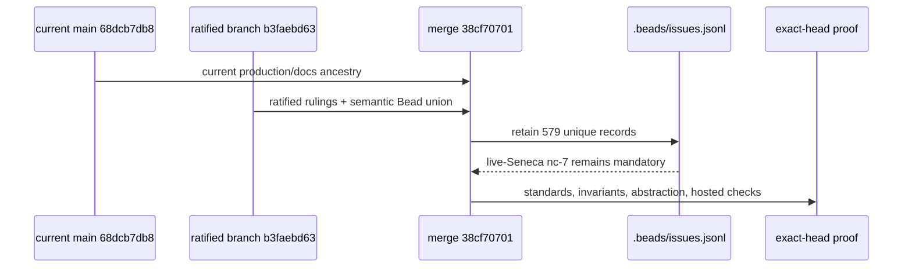

# PR #1561 show me · current-main integration at `38cf70701`

## What changed

```diff
 PR #1561 integration state
- branch carried a semantic JSONL union but did not contain current main ancestry
- GitHub reported CONFLICTING / DIRTY in .beads/issues.jsonl
+ merge commit has current main `68dcb7db8` as its second parent
+ conflict resolution keeps the branch semantic union: 579 unique Bead records
+ GitHub can evaluate the PR as a clean current-main candidate
```

```diff
 acceptance authority preserved through integration
- risk: a stale metadata export could restore fixture-only nc-7 closure
+ nc-7 still requires the live Seneca mathematics tutor
+ the Seneca curator creates it for a second authorized learner
+ real domain operations and a bounded Job Thread must retain a result or
+ decision after chat and browser closure
+ fixture-only evidence still cannot close nc-7 or epic #1562
```

## Integration sequence



## Review status

- Current-main integration: `38cf70701a8488a05c570aff4695f97cae9f7701` contains `68dcb7db8822f721c6b45d0731e01a46fa364f28` as parent 2; a fresh `git merge-tree --write-tree origin/main HEAD` is conflict-free.
- Metadata union: **PASS** — 579 parsed rows and 579 unique IDs; the branch keeps all ratification records and the non-overlapping current-main updates.
- Live-Seneca acceptance: **PRESERVED** — fixture evidence remains supporting-only and cannot close nc-7 or #1562.
- Package abstraction: pending exact-head independent re-review; branch-only package production churn remains `0/0` and the only package-path diff is documentation.
- Thermo: docs/metadata-only exemption for this Bead; inherited current-main code is not authored by this PR.
- UI/video: **N/A**; this Bead changes integration ancestry and metadata only.
