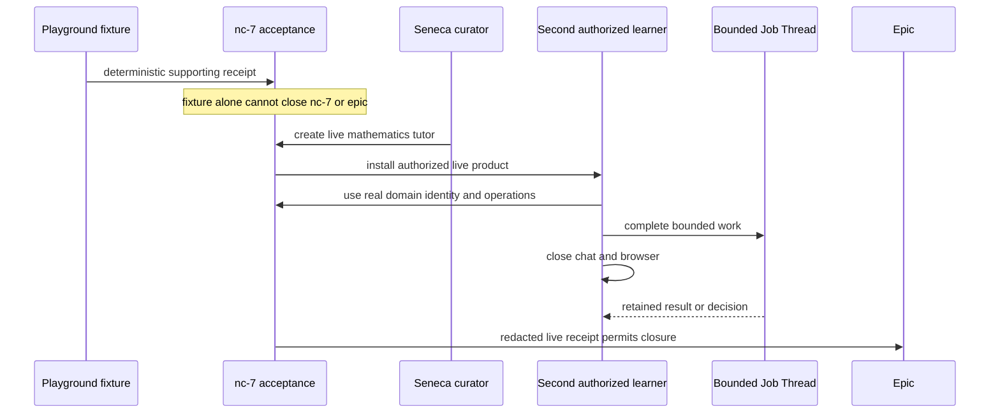

# PR #1561 show me · live-Seneca acceptance at `7ad0b20d1`

## What changed

```diff
 native-creation acceptance authority
- fixture-only wording remained in the owner plan artifact, committed nc-7,
- sole-current DIRECTION done-bar, and roadmap summary
+ fixture receipt is deterministic supporting evidence only
+ nc-7 remains the only epic closer, but cannot close on fixture evidence
+ live Seneca mathematics tutor is created by the Seneca curator
+ second authorized learner installs and uses the tutor
+ real domain identity/operations and a bounded Job Thread retain a
+ result or decision after chat and browser closure
```

```diff
 docs/issues/1562/plan-review.html
- “First journey proven on a math-tutor fixture”
+ owner-facing Gate 1 summary distinguishes supporting fixture proof
+ mandatory live Seneca acceptance is explicit

 .beads/issues.jsonl · wt-391-forward-nc-7-first-journey-acceptance-sdnl
- stale export regressed nc-7 to fixture-only acceptance
+ live-Seneca title, workflow, proof path, and acceptance restored

 docs/direction/DIRECTION.md + docs/roadmap/README.md
- sole dispatch authority and roadmap still described fixture-only closure
+ both require the complete E1b live-consumer proof before closure
```

## Acceptance sequence



## Review status

- Standards/spec: **CLEAN** at `7ad0b20d188d2ab04eedc50f7ff1778d6b557522`; all acceptance surfaces align with ratified `RECONCILIATION.md` §13(g) and `LIFECYCLE.md` E1b.
- Package abstraction: **PASS** — no package source, contract, import, caller, manifest, dependency, ownership, or runtime seam changed; package production churn is `0/0`.
- Thermo: **exempt** under `MODEL-CARD.md` because the PR is documentation/metadata only.
- UI/video: **N/A**; no runtime behavior or visual surface changed.
- Residual risk: the live tenant-side acceptance is mandatory future execution work and is not claimed by this documentation PR.
