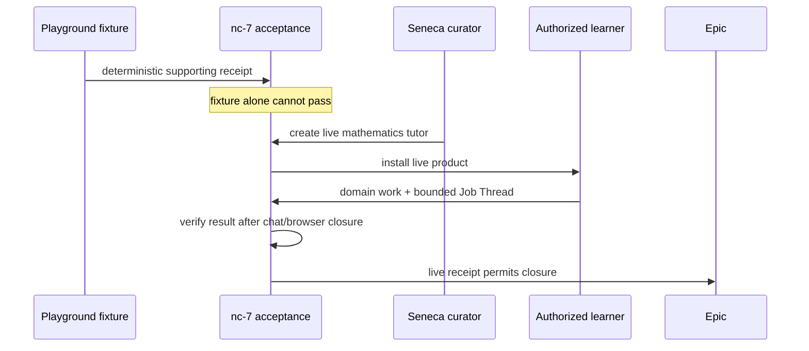

# PR #1561 show me · acceptance repair at `961e1d6c1`

## What changed

```diff
 #1562 epic-closing contract
- playground math-tutor fixture proves the first journey
- live Seneca tutor acceptance happens after nc-7
+ playground fixture provides deterministic supporting evidence
+ nc-7 remains the only epic closer
+ nc-7 cannot close until the live Seneca mathematics tutor passes
+ required live proof: Seneca curator → second authorized learner
+ real domain identity/operations + bounded Job Thread after chat/browser closure
```

```diff
 docs/issues/1562/plan.md
- fixture script receipt is the epic-level acceptance
+ fixture receipt is supporting evidence only
+ live Seneca acceptance receipt is mandatory before epic closure

 .beads/issues.jsonl · wt-391-forward-nc-7-first-journey-acceptance-sdnl
- title and acceptance stop at a second fixture user
+ title and acceptance require the live Seneca tutor and authorized learner
+ fixture-only evidence explicitly cannot close nc-7 or #1562
```

## Acceptance sequence



## Review status

- Ratified `RECONCILIATION.md` §13(g) and `LIFECYCLE.md` E1b are unchanged.
- Blocking dependency graph remains cycle-free; the same nc-7 Bead remains the sole epic closer.
- Package abstraction: **PASS** — this acceptance repair changes no package code, contract, import, caller, or ownership seam; package production churn is `0/0`.
- Thermo/UI: **N/A** — documentation and Bead metadata only.
- Open review finding: the pre-existing `docs/issues/1562/plan-review.html` still says fixture proof is sufficient. That file is outside this supervisor-authorized repair scope, so Gate 2 remains blocked pending authorization to regenerate it.
