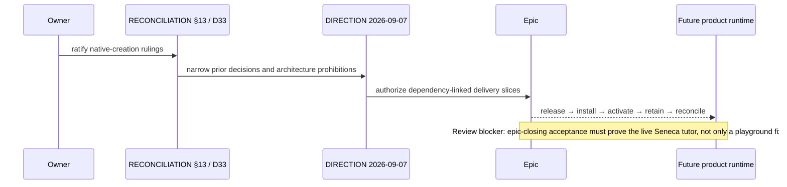

# [Native Creation Ratification] What changed, visually

**Reviewed implementation candidate:** `d3cee3dbb3f1f2965c0090d67235a0581040cc20`

**Base:** `aaa713a19cd4a4236a27f96b5c3eb77261a15ebb` · **PR:** [#1561](https://github.com/hachej/boring-ui/pull/1561)

## File and authority shape

```diff
 docs/
+├── DECISIONS.md                         # D33 and narrowed D25/D28/D29/D30 authority
+├── direction/DIRECTION.md               # 2026-09-07 sole dispatch amendment
+├── plans/long-term/ratified/
+│   ├── RECONCILIATION.md                # §13 owner-ratified lifecycle and boundaries
+│   ├── ARCHITECTURE-PLAN.md              # dated supersession banner
+│   ├── V2-IMPLEMENTATION-SPEC.md         # aligned Thread/Session and runtime wording
+│   ├── V2-PORT-HANDBOOK.md               # aligned contracts and repaired fence
+│   └── VISION.md                         # first complete journey
+├── plans/native-creation/                # ratified pack, lifecycle, coverage, audit map
+└── issues/1562/                          # downstream 18-bead delivery plan
+packages/workspace/docs/PLUGIN_SYSTEM.md  # current runtimeBackend drift is explicit
+.beads/issues.jsonl                       # dependency-linked downstream execution graph
```

## Decision and control flow

```diff
 native product delivery
- expert method remains prose; first complete journey waits behind K9/M8
- plugin server path conflicts with server-disabled architecture text
- release, installation, activation, and undo have no single trusted record path
+ owner ruling → RECONCILIATION §13 + DECISIONS D33
+ DIRECTION 2026-09-07 → sole current dispatch authority
+ immutable release → installation → CAS activation receipt → undo as activation
+ host brokers one installed-product runtime; sandbox remains disposable build machinery
+ downstream #1562 graph sequences the implementation work
```

## Ratification sequence



## Review outcome at this candidate

- Cross-package abstraction: **PASS** — package production churn is `0/0`; the only package path is documentation.
- Thermo: **exempt** — documentation/metadata-only change.
- Standards/spec: **BLOCKED** — independent review found that `docs/issues/1562/plan.md` and `nc-7` currently let fixture-only acceptance close the epic, while the ratified contract requires the live Seneca mathematics tutor as first consumer.
- Owner Gate 2 must wait until that downstream acceptance record is aligned and the resulting exact SHA is re-proven and re-reviewed.
