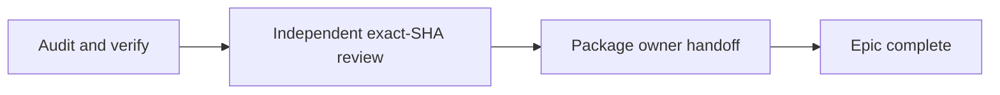

# [Native Creation Ratification] Plan, visually

**Status:** Gate 1 review · **Owner:** Orchestrator · **Date:** 2026-09-07
**Scope:** PR #1561 only · downstream epic #1562 is read-only context
**TL;DR:** Verify the existing ratification exactly as written, independently review the final SHA, then package one precise protected merge decision.

## Structure — what this lane touches

```diff
 PR #1561 · docs/native-creation-reassessment
 ├── ratified strategy and direction docs     # verify; repair only proven defects
 ├── native-creation ratification pack        # verify links, anchors, authority labels
 ├── packages/workspace/docs/PLUGIN_SYSTEM.md # abstraction seam documentation
 ├── docs/issues/1562/**                      # downstream plan; do not dispatch or rewrite
+├── docs/issues/1561/**                      # this lane's plan and revision-bound show-me
+├── .handoff/pr-1561-presentation.html       # owner-facing present-pr artifact
+└── PR proof / Owner Review comment          # exact SHA, checks, review, rollback
```

## Behavior — dependency-correct delivery

```mermaid
sequenceDiagram
    participant W1 as Audit worker
    participant GH as PR / CI
    participant W2 as Independent reviewer
    participant O as Orchestrator
    participant Owner
    W1->>GH: audit comments, runs, diff, links; reconcile main; push repairs
    GH-->>W1: exact candidate SHA and checks
    W1-->>O: complete handoff with proof
    O->>W2: review exact ready SHA
    W2-->>O: standards/spec + explicit abstraction verdict
    O->>W1: repair findings if verdict is revise
    W1->>GH: regenerate present-PR and proof at final SHA
    O->>Owner: one protected merge-approval card
```

## Bead graph



## Guardrails

| Risk | Likelihood | Impact | Mitigation |
|---|---:|---:|---|
| Rulings accidentally rewritten | Low | High | Treat owner-authored rulings as immutable input; only repair independently proven defects. |
| Stale or incomplete proof | Medium | High | Bind checks, review, integration candidate, and artifacts to one exact final SHA. |
| Downstream epic modified | Low | High | Reference `native-creation` / #1562 only; never claim or dispatch its beads. |
| Link/authority drift around #1548 | Medium | Medium | Search every changed doc and classify each occurrence as historical, folded, or stale operative authority. |
| Owner receives duplicate asks | Low | High | Gate 1 now; exactly one Gate 2 merge card after all handoffs. |

## Decision requested

Approve this three-slice repair/delivery plan and Bead graph. Approval authorizes verification, technical repair, independent review, artifact generation, and pushing PR #1561's existing branch. It does not authorize merging, rewriting the rulings, or implementing downstream epic #1562.

## Proof path

- PR review surfaces: `gh pr view 1561 --comments`, reviews API, inline-comments API, checks and run history.
- Documentation: `scripts/check-strategy-docs.sh`, in-repo link/anchor and packaging checks discovered by the worker.
- Integration: candidate validated against the then-current `origin/main`.
- Independent review: exact-SHA standards/spec plus explicit package-abstraction PASS/BLOCKED; docs thermo exemption recorded.
- Owner artifact: `.handoff/pr-1561-presentation.html` plus actual-diff show-me and PR proof comment.
