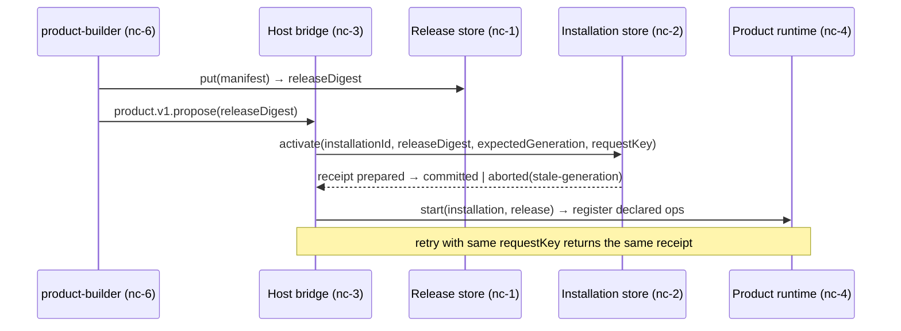
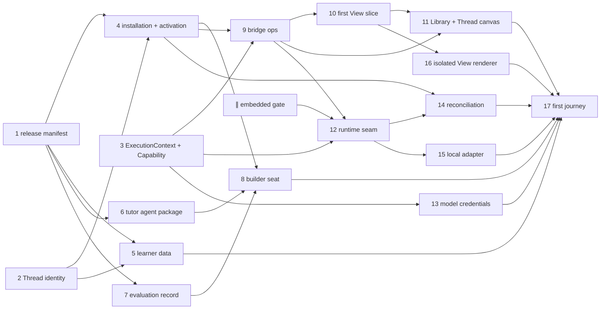

# Show me — gh-1562 native creation, first journey

Three layers, ruled 2026-09-07 — and the three blocks pulled forward the same evening: Thread identity (job root; no session keys anywhere), the first View slice (product canvas = semantic Views), Library placement (product lives in Library, opens as a Thread in Work).

```text
Host (control plane + broker)
  identity · membership · installation records · activation receipts
  WorkspaceBridge: product.v1.* (nc-3) · product.op.<installation>.* (nc-4a)
    │ brokered calls only
    ▼
Product runtime (one per installed product; mode = host policy)
  embedded  → RuntimeBackendRegistry in-process (gated default-off, nc-0)
  local     → bwrap/runsc lease + runtimeEntry.ts (nc-4b)
  remote    → microVM (later)
  serves: declared operations · generated front bundle (iframe, nc-5)
    ▲ built in
Sandbox (disposable lease, D31) — builder works here, never serves from here
```

Release → installation → activation:



Bead graph (second re-cut, spine first):



File layout added by the epic:

```diff
 packages/workspace/src/server/
+├── threads/            # Thread identity + session bindings (nc-t)
+├── views/              # ViewResolver + ViewStore (nc-v)
+├── productLifecycle/   # releases, installations, activation, bridge, reconcile (nc-1..3, nc-r)
+├── productData/        # learner record store + schema (nc-d)
+├── productEvidence/    # evaluation/outcome records (nc-e)
+├── authority/          # ExecutionContext, Capability, effective grants (nc-x)
+├── modelCredentials/   # scoped model capability issuance (nc-c)
+├── productRuntime/     # types, embedded, local, brokeredOps (nc-4a/4b)
 └── runtimeBackend/     # becomes the embedded adapter's engine (nc-0)
 packages/workspace/src/front/
+├── views/              # ViewHost + built-in record/dashboard renderers (nc-v)
+├── shell/library, shell/work  # installed products → Thread canvas (nc-l)
+└── productRuntime/     # isolated iframe renderer + postMessage broker (nc-5)
 packages/core/drizzle/
+├── 0028_product_releases.sql
+├── 0029_product_installations.sql
+├── 0030_threads.sql
+├── 0031_product_records.sql
+└── 0032_product_evidence.sql
+plugins/product-builder/  # builder agent type + tools (nc-6)
 apps/workspace-playground/
+└── fixtures/products/math-tutor/ + scripts/first-journey-acceptance.mjs (nc-7)
```
