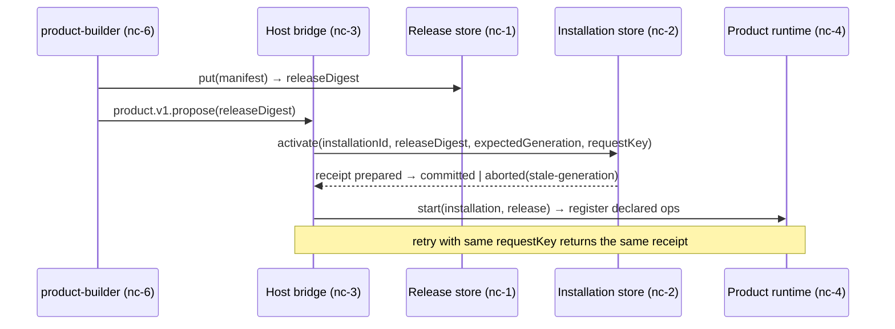
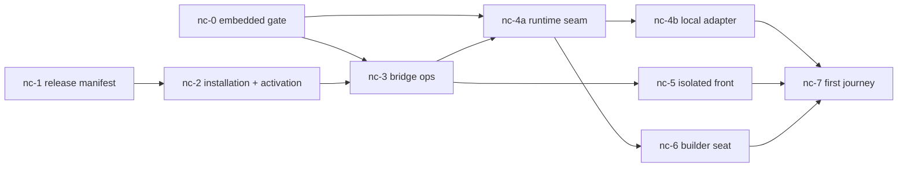

# Show me — gh-1562 native creation, first journey

Three layers, ruled 2026-09-07:

```text
Host (control plane + broker)
  identity · membership · installation records · activation receipts
  WorkspaceBridge: product.v1.* (nc-3) · product.op.<installation>.* (nc-4a)
    │ brokered calls only
    ▼
Product runtime (one per installed product; mode = host policy)
  embedded  → RuntimeBackendRegistry in-process (gated default-off, nc-0)
  local     → bwrap/runsc lease + runtimeEntry.ts (nc-4b)
  remote    → microVM (later)
  serves: declared operations · generated front bundle (iframe, nc-5)
    ▲ built in
Sandbox (disposable lease, D31) — builder works here, never serves from here
```

Release → installation → activation:



Bead graph:



File layout added by the epic:

```diff
 packages/workspace/src/server/
+├── productLifecycle/   # releases, installations, activation, bridge (nc-1..3)
+├── productRuntime/     # types, embedded, local, brokeredOps (nc-4a/4b)
 └── runtimeBackend/     # becomes the embedded adapter's engine (nc-0)
 packages/workspace/src/front/
+└── productRuntime/     # IsolatedProductPanel + postMessage broker (nc-5)
 packages/core/drizzle/
+├── 0028_product_releases.sql
+└── 0029_product_installations.sql
+plugins/product-builder/  # builder agent type + tools (nc-6)
 apps/workspace-playground/
+└── fixtures/products/math-tutor/ + scripts/first-journey-acceptance.mjs (nc-7)
```
