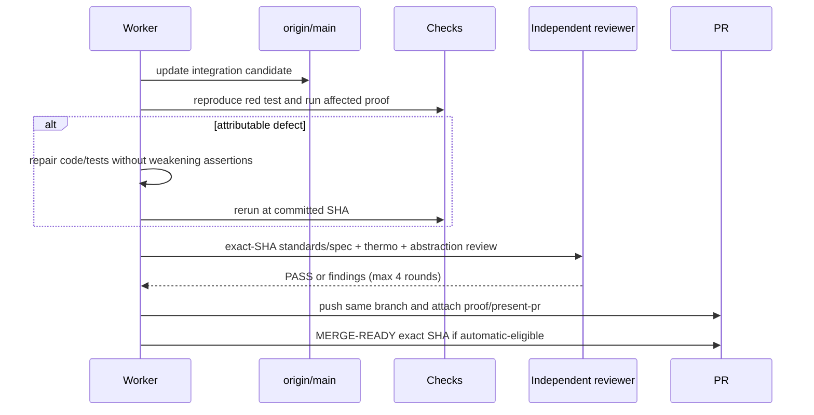

# [Nodemailer Bump] Plan, visually

## Structure — what this lane may touch

```text
PR #1571 · existing Dependabot branch
├── packages/core/
│   ├── package.json          # keep nodemailer ^9.1.1
│   └── mail code/tests       # only if compatibility evidence requires repair
├── packages/agent/
│   └── request-ledger test   # investigate recorded SQLite lock failure; repair only if causal
├── pnpm-lock.yaml            # resolved dependency graph
├── docs/issues/1571/         # plan and revision-bound proof views
└── .handoff/                 # owner-facing present-pr artifact
```

## Behavior — delivery flow



## Diff-shaped target

```diff
 PR #1571
   nodemailer 9.0.4 → 9.1.1
+  current origin/main integrated without force-push
-  red Unit Tests Changed gate
+  exact-head affected checks and GitHub CI green
+  independent standards/spec: PASS
+  independent thermo: PASS
+  package abstraction: PASS
+  non-UI proof + present-pr artifact linked
+  risk classification + current-main candidate recorded
+  factory: MERGE-READY <exact sha> when automatic-eligible
```
